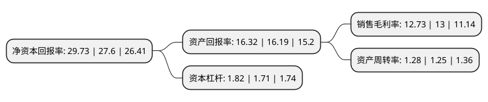

> 本页面由自动化程序生成于 2022年5月20日 01:27
> 内容可能存在错误，如有bug请提交issue至：https://github.com/Eroleice/doc-pi/issues
{.is-warning}

# 上市公司基本情况

## 基本资料

方大特钢科技股份有限公司（以下简称“方大特钢”）成立于1999年09月16日，南昌市。于2003年09月30日在上交所主板上市。

方大特钢注册资本215,595.022万元，主要产品:螺纹钢，汽车板簧，弹簧扁钢，铁精粉等。主营业务:冶金原燃材料的加工，黑色金属冶炼及其压延加工产品及其副产品的制造，销售。以下是详细信息：

- 公司名称: 方大特钢科技股份有限公司
- 股票代码: 600507.SH
- 所在地: 江西 - 南昌市
- 成立日期: 1999年09月16日
- 注册资本: 215,595.022万元
- 法定代表人: 徐志新
- 主营业务: 主要产品:螺纹钢，汽车板簧，弹簧扁钢，铁精粉等主营业务:冶金原燃材料的加工，黑色金属冶炼及其压延加工产品及其副产品的制造，销售
- 公司官网: www.fangda-specialsteels.com
- 公司介绍: 公司是一家钢铁企业，所从事的主要业务是冶金原燃材料的加工、黑色金属冶炼及其压延加工产品及其副产品的制造、销售，主要产品是螺纹钢、汽车板簧、弹簧扁钢、铁精粉等。公司主要生产产品知名度高，保供能力强，品种规格齐全。公司生产的弹簧扁钢和热轧带肋钢筋(俗称螺纹钢)荣获国家产品“金杯奖”，形成了“长力牌”汽车弹簧扁钢和“海鸥牌”建筑钢材等大系列品牌优势。“长力牌”弹簧扁钢荣获全国用户满意产品、苏浙皖赣沪名牌产品50佳、江西省名牌产品，与国内10多家主要汽车生产厂家、板簧厂配套，并且远销30多个国家和地区。公司生产的汽车板簧系列产品拥有“长力”、“红岩”、“春鹰”三大知名品牌，被中国质量管理协会用户委员会、中国汽车工业协会市场贸易委员会列为全国首批“推荐商品”。

## 股东及高管情况

上市公司第一大股东为方大钢铁-中信建投证券-18方钢EB担保及信托财产专户，持股412,630,231股，占比17.6957%，**疑似为**上市公司实际控制人。

截至2022年05月06日，上市公司的前十大股东中，共有1名自然人股东，4名机构股东，3个产品账户，2个海外主体，其中5%以上大股东共有5名。上市公司前十大股东明细如下：

> 未能通过持股比例判定出上市公司实际控制人（持股30%以上）
> 可能存在通过间接持股、联合持股、协议控制等方式拥有实际控制权的主体，具体请参考上市公司定期公告！
{.is-warning}

> 截至2022年05月06日，上市公司前十大股东信息如下：

| 股东名称 | 持股数量（股） | 持股比例 |
| --- | --- | --- |
| 方大钢铁-中信建投证券-18方钢EB担保及信托财产专户 | 412,630,231 | 17.6957% |
| 江西方大钢铁集团有限公司 | 314,843,021 | 13.5021% |
| 江西汽车板簧有限公司 | 175,820,000 | 7.5401% |
| 江西汽车板簧有限公司 | 175,820,000 | 8.16% |
| 方威 | 116,204,114 | 5.39% |
| 香港中央结算有限公司(陆股通) | 101,047,626 | 4.69% |
| 深圳市平石资产管理有限公司-平石T5对冲基金 | 50,405,297 | 2.34% |
| 交通银行股份有限公司-华安策略优选混合型证券投资基金 | 38,316,385 | 1.78% |
| 中国建设银行股份有限公司-华商稳定增利债券型证券投资基金 | 15,905,067 | 0.74% |
| 国联证券股份有限公司 | 13,999,913 | 0.65% |

## 利润表分析

上市公司2021年总收入为216.79亿元，净利润为27.59亿元，实现盈利。

## 杜邦分析

> 数据列示周期：2021年 | 2020年 | 2019年
{.is-info}

上市公司的净资产收益率在近一年有所上升，上升幅度为7.72%，其变化情况分解如下：
- 上市公司的销售毛利率在近一年下降了-2.08%，可能是生产效率的下降、商品原材料价格上涨或商品价格的下跌所致。
- 上市公司的资产周转率在近一年上升了2.4%，可能是源自于更快的销售回款或库存管理效果提升。
- 上市公司的财务杠杆比率在近一年上升了6.43%，可能是增加负债扩大生产规模。

