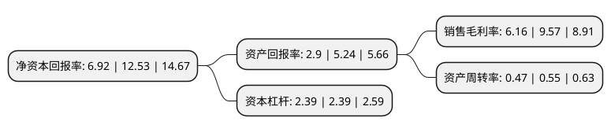

> 本页面由自动化程序生成于 2022年5月20日 01:38
> 内容可能存在错误，如有bug请提交issue至：https://github.com/Eroleice/doc-pi/issues
{.is-warning}

# 上市公司基本情况

## 基本资料

张家港广大特材股份有限公司（以下简称“广大特材”）成立于2006年07月17日，苏州市。于2020年02月11日在上交所科创板上市。

广大特材注册资本21,424万元，公司主营业务为特殊钢材料的研发，生产和销售，现有主要产品包括齿轮钢，模具钢及精密机械部件，2016年公司开始进入高温合金等特殊合金领域并作为未来重点发展产品。公司产品主要应用于新能源风电，轨道交通，机械装备，军工装备，航空航天，核能电力，海洋石化，半导体芯片装备等高端装备制造业。以下是详细信息：

- 公司名称: 张家港广大特材股份有限公司
- 股票代码: 688186.SH
- 所在地: 江苏 - 苏州市
- 成立日期: 2006年07月17日
- 注册资本: 21,424万元
- 法定代表人: 徐卫明
- 主营业务: 公司主营业务为特殊钢材料的研发，生产和销售，现有主要产品包括齿轮钢，模具钢及精密机械部件，2016年公司开始进入高温合金等特殊合金领域并作为未来重点发展产品公司产品主要应用于新能源风电，轨道交通，机械装备，军工装备，航空航天，核能电力，海洋石化，半导体芯片装备等高端装备制造业
- 公司官网: www.zjggdtc.com/index.html
- 公司介绍: 公司是一家以高品质特种合金材料为核心业务的高新技术企业，归属于国家重点扶持的战略新兴产业项下的“先进钢铁材料”产业。公司自成立以来，一直致力于成为行业领先的高端装备先进基础材料制造商，目前已形成合金材料和合金制品两大产品体系，其中合金材料包括高品质齿轮钢、高品质模具钢、特种不锈钢、高温合金和超高强度钢等国家重点鼓励发展的新材料产品；合金制品主要包括以合金材料为基础制成的新能源风电、轨道交通及各类精密机械部件。目前，公司产品广泛应用于新能源风电、轨道交通、机械装备、军工装备、航空航天、核能电力、燃气轮机、海洋石化、半导体芯片装备等高端装备制造业。同时，公司不断强化自主创新能力，截至目前，累计获得专利45项，其中发明专利19项，并1次获评国家火炬计划产业化示范项目，1项产品荣获国家重点新产品，2次承担江苏省科技支撑项目，1次获批江苏省高新技术标准化试点项目，多项产品获得高新技术产品认定。

## 股东及高管情况

上市公司第一大股东为张家港广大投资控股有限公司，持股44,800,000股，占比20.91%，**疑似为**上市公司实际控制人。

截至2022年03月31日，上市公司的前十大股东中，共有4名自然人股东，2名机构股东，4个产品账户，其中5%以上大股东共有2名。上市公司前十大股东明细如下：

> 未能通过持股比例判定出上市公司实际控制人（持股30%以上）
> 可能存在通过间接持股、联合持股、协议控制等方式拥有实际控制权的主体，具体请参考上市公司定期公告！
{.is-warning}

> 截至2022年03月31日，上市公司前十大股东信息如下：

| 股东名称 | 持股数量（股） | 持股比例 |
| --- | --- | --- |
| 张家港广大投资控股有限公司 | 44,800,000 | 20.91% |
| 徐卫明 | 12,050,000 | 5.62% |
| 广东天创私募证券投资基金管理有限公司-天创18号私募证券投资基金 | 5,100,000 | 2.38% |
| 张家港保税区万鼎商务咨询合伙企业(有限合伙) | 4,500,000 | 2.1% |
| 东方证券股份有限公司-中庚价值先锋股票型证券投资基金 | 4,150,008 | 1.94% |
| 诺德基金-招商银行-诺德基金千金113号特定客户资产管理计划 | 3,765,060 | 1.76% |
| 徐辉 | 3,293,792 | 1.54% |
| 俞林林 | 3,244,059 | 1.51% |
| 石娟芬 | 3,000,000 | 1.4% |
| 上海道禾长期投资管理有限公司-上海临港新片区道禾一期产业资产配置股权投资基金合伙企业(有限合伙) | 3,000,000 | 1.4% |

## 利润表分析

上市公司2021年总收入为27.37亿元，净利润为1.68亿元，实现盈利。

## 杜邦分析

> 数据列示周期：2021年 | 2020年 | 2019年
{.is-info}

上市公司的净资产收益率在近一年有所下降，下降幅度为-44.77%，其变化情况分解如下：
- 上市公司的销售毛利率在近一年下降了-35.63%，可能是生产效率的下降、商品原材料价格上涨或商品价格的下跌所致。
- 上市公司的资产周转率在近一年下降了-14.55%，可能是源自于更慢的销售回款或库存管理效果下降。
- 上市公司的财务杠杆比率在近一年下降了0%，可能是减少负债降低财务费用。

