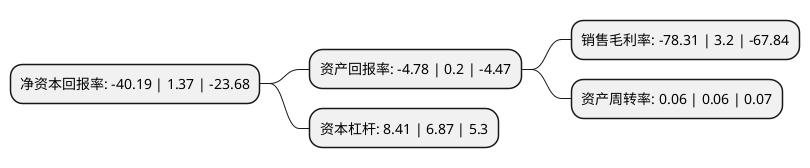

> 本页面由自动化程序生成于 2022年5月20日 01:01
> 内容可能存在错误，如有bug请提交issue至：https://github.com/Eroleice/doc-pi/issues
{.is-warning}

# 上市公司基本情况

## 基本资料

深圳华控赛格股份有限公司（以下简称“华控赛格”）成立于1997年06月06日，深圳市。于1997年06月11日在深交所主板上市。

华控赛格注册资本100,667.146万元，主要业务:节能环保，新材料行业主要产品:环保设备及材料，技术咨询规划服务，电子元器件以下是详细信息：

- 公司名称: 深圳华控赛格股份有限公司
- 股票代码: 000068.SZ
- 所在地: 广东 - 深圳市
- 成立日期: 1997年06月06日
- 注册资本: 100,667.146万元
- 法定代表人: 孙波
- 主营业务: 节能环保，新材料行业主要产品:环保设备及材料，技术咨询规划服务，电子元器件
- 公司官网: www.huakongseg.com.cn
- 公司介绍: 公司是清华控股旗下节能环保业务的资本运作平台。公司旗下北京清控人居环境研究院有限公司为清华控股人居环境产业板块核心研发及建设运营平台，在城市水系统工程研发及建设运营领域处于国内领先水平。公司依托清华大学的品牌优势及研发能力，依托清控人居环境研究院后在城市水系统规划设计、市政及环保规划设计、环保基础设施建设投资及运营等领域形成的行业优势，依托上市公司平台与股权基金、资产证券化、信用贷款等其他金融工具组合培育的全方位融资渠道，将在环保基础设施投资、建设、运营服务领域形成系统全面的竞争力。

## 股东及高管情况

上市公司第一大股东为深圳市华融泰资产管理有限公司，持股266,533,049股，占比26.48%，**疑似为**上市公司实际控制人。

截至2022年03月31日，上市公司的前十大股东中，共有7名自然人股东，3名机构股东，其中5%以上大股东共有2名。上市公司前十大股东明细如下：

> 未能通过持股比例判定出上市公司实际控制人（持股30%以上）
> 可能存在通过间接持股、联合持股、协议控制等方式拥有实际控制权的主体，具体请参考上市公司定期公告！
{.is-warning}

> 截至2022年03月31日，上市公司前十大股东信息如下：

| 股东名称 | 持股数量（股） | 持股比例 |
| --- | --- | --- |
| 深圳市华融泰资产管理有限公司 | 266,533,049 | 26.48% |
| 深圳赛格股份有限公司 | 154,822,846 | 15.38% |
| 深圳市赛格集团有限公司 | 34,077,600 | 3.39% |
| 陈进平 | 7,667,000 | 0.76% |
| 严华开 | 5,237,900 | 0.52% |
| 任建铭 | 4,500,000 | 0.45% |
| 梁庆龙 | 3,849,000 | 0.38% |
| 项英良 | 3,823,700 | 0.38% |
| 欧阳春霖 | 3,820,300 | 0.38% |
| 高玫 | 3,134,569 | 0.31% |

## 利润表分析

上市公司2021年总收入为9.35亿元，净利润为-1.19亿元，**未实现盈利**。

## 杜邦分析

> 数据列示周期：2020年 | 2019年 | 2018年
{.is-info}

上市公司的净资产收益率在近一年有所下降，下降幅度为-3033.58%，其变化情况分解如下：
- 上市公司的销售毛利率在近一年下降了-2547.19%，可能是生产效率的下降、商品原材料价格上涨或商品价格的下跌所致。
- 上市公司的资产周转率在近一年下降了0%，可能是源自于更慢的销售回款或库存管理效果下降。
- 上市公司的财务杠杆比率在近一年上升了22.42%，可能是增加负债扩大生产规模。

