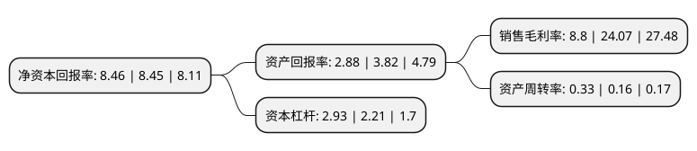

> 本页面由自动化程序生成于 2022年5月20日 01:02
> 内容可能存在错误，如有bug请提交issue至：https://github.com/Eroleice/doc-pi/issues
{.is-warning}

# 上市公司基本情况

## 基本资料

中原环保股份有限公司（以下简称“中原环保”）成立于1996年10月25日，郑州市。于1993年12月08日在深交所主板上市。

中原环保注册资本97,468.449万元，主要产品:固结磨具，涂附磨具，热力供应。主营业务为城镇污水处理和集中供热以下是详细信息：

- 公司名称: 中原环保股份有限公司
- 股票代码: 000544.SZ
- 所在地: 河南 - 郑州市
- 成立日期: 1996年10月25日
- 注册资本: 97,468.449万元
- 法定代表人: 丁青海
- 主营业务: 主要产品:固结磨具，涂附磨具，热力供应主营业务为城镇污水处理和集中供热
- 公司官网: www.cpepgc.com
- 公司介绍: 公司是国有控股上市公司，也是全国国企改革“双百企业”之一。公司以“立足中原、走向世界”的市场战略，积极拓展业务领域，通过项目投资、股权投资、收购兼并等方式不断完善主营业务全产业链，致力于成为生态环境综合服务商。目前，公司业务范围涵盖“大公用、大环保、大生态”等板块，特别是在供水、污水处理、污泥处置、中水利用、集中供热、固废处置、环保设备制造、新能源利用、市政建设、园林绿化及水环境综合治理等方面有着丰富的经验和突出的业绩。公司具有丰富的运营管理经验，技术成熟，管理规范，制度健全，特别是污水运营综合能力达到国内一流水平。公司旗下王新庄污水处理厂、五龙口污水处理厂、马头岗污水处理厂等水务单位多次获得全国“十佳”污水处理厂、全国城镇供排水行业突出贡献、建设美丽河南节能减排竞赛先进等荣誉；公司南三环污水处理厂作为河南省唯一一家半地下式污水处理厂，在行业内具有较高的知名度。另外，公司还荣获国家环保技术评估中心污泥处置适用技术案例推荐、河南省污水垃圾处理设施运营管理工作先进集体、河南省市政公用行业先进集体、河南省五一劳动奖状等多项荣誉。

## 股东及高管情况

上市公司第一大股东为郑州公用事业投资发展集团有限公司，持股669,855,147股，占比68.73%，为上市公司实际控制人。

截至2022年03月31日，上市公司的前十大股东中，共有7名自然人股东，3名机构股东，其中5%以上大股东共有1名。上市公司前十大股东明细如下：

> 截至2022年03月31日，上市公司前十大股东信息如下：

| 股东名称 | 持股数量（股） | 持股比例 |
| --- | --- | --- |
| 郑州公用事业投资发展集团有限公司 | 669,855,147 | 68.73% |
| 河南资产管理有限公司 | 48,246,810 | 4.95% |
| 郑州投资控股有限公司 | 23,646,333 | 2.43% |
| 文能 | 3,333,000 | 0.34% |
| 张育坚 | 2,635,800 | 0.27% |
| 施柏明 | 1,388,888 | 0.14% |
| 王军克 | 1,223,500 | 0.13% |
| 金镇勇 | 1,200,000 | 0.12% |
| 刘秀杰 | 1,177,550 | 0.12% |
| 肖振宇 | 1,060,000 | 0.11% |

## 利润表分析

上市公司2021年总收入为61.4亿元，净利润为5.4亿元，实现盈利。

## 杜邦分析

> 数据列示周期：2021年 | 2020年 | 2019年
{.is-info}

上市公司的净资产收益率在近一年有所上升，上升幅度为0.12%，其变化情况分解如下：
- 上市公司的销售毛利率在近一年下降了-63.44%，可能是生产效率的下降、商品原材料价格上涨或商品价格的下跌所致。
- 上市公司的资产周转率在近一年上升了106.25%，可能是源自于更快的销售回款或库存管理效果提升。
- 上市公司的财务杠杆比率在近一年上升了32.58%，可能是增加负债扩大生产规模。

