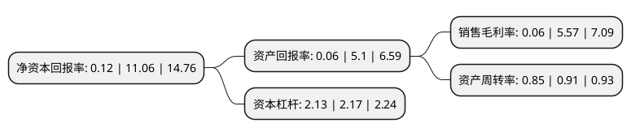

> 本页面由自动化程序生成于 2022年5月20日 01:02
> 内容可能存在错误，如有bug请提交issue至：https://github.com/Eroleice/doc-pi/issues
{.is-warning}

# 上市公司基本情况

## 基本资料

金圆环保股份有限公司（以下简称“金圆股份”）成立于1998年03月04日，长春市。于1993年12月15日在深交所主板上市。

金圆股份注册资本78,078.196万元，主要业务:房地产，水泥制造。以下是详细信息：

- 公司名称: 金圆环保股份有限公司
- 股票代码: 000546.SZ
- 所在地: 吉林 - 长春市
- 成立日期: 1998年03月04日
- 注册资本: 78,078.196万元
- 法定代表人: 赵辉
- 主营业务: 房地产，水泥制造
- 公司官网: www.jysn.com
- 公司介绍: 公司是一家以水泥、商品混凝土生产为主业，集水泥窑协同处置危险固废、稀贵金属综合回收循环利用等多元化经营为一体的跨省市、跨行业发展的大型企业集团，是以建材、环保为双主业，集水泥、商砼、环保为一体的大型上市企业。建材产业主要产品为水泥熟料、水泥产品以及商品混凝土，产品广泛应用于国家基础设施建设，包括铁路、公路、机场、港口、水利工程等大型基建项目，以及城市房地产开发和新农村基础设施和民用建筑建设等。环保产业以无害化、减量化、资源化为目标，大力发展固(危)废无害化处置、废物资源综合利用两大类目，依托专业的焚烧、安全填埋、水泥窑协同、资源综合利用、污泥污水处置五大技术平台，致力于在废物处置和资源综合利用方面打造领军企业。

## 股东及高管情况

上市公司第一大股东为金圆控股集团有限公司，持股231,907,628股，占比29.7%，**疑似为**上市公司实际控制人。

截至2022年03月31日，上市公司的前十大股东中，共有8名自然人股东，2名机构股东，其中5%以上大股东共有2名。上市公司前十大股东明细如下：

> 未能通过持股比例判定出上市公司实际控制人（持股30%以上）
> 可能存在通过间接持股、联合持股、协议控制等方式拥有实际控制权的主体，具体请参考上市公司定期公告！
{.is-warning}

> 截至2022年03月31日，上市公司前十大股东信息如下：

| 股东名称 | 持股数量（股） | 持股比例 |
| --- | --- | --- |
| 金圆控股集团有限公司 | 231,907,628 | 29.7% |
| 赵辉 | 66,137,566 | 8.47% |
| 赵雪莉 | 35,728,688 | 4.58% |
| 邱永平 | 32,570,026 | 4.17% |
| 方文君 | 19,840,936 | 2.54% |
| 中信证券股份有限公司 | 16,342,978 | 2.09% |
| 杜彦璋 | 12,867,800 | 1.65% |
| 方德基 | 12,512,500 | 1.6% |
| 刘剑辉 | 4,787,369 | 0.61% |
| 田峰 | 4,711,408 | 0.6% |

## 利润表分析

上市公司2021年总收入为87.39亿元，净利润为0.05亿元，实现盈利。

## 杜邦分析

> 数据列示周期：2021年 | 2020年 | 2019年
{.is-info}

上市公司的净资产收益率在近一年有所下降，下降幅度为-98.92%，其变化情况分解如下：
- 上市公司的销售毛利率在近一年下降了-98.92%，可能是生产效率的下降、商品原材料价格上涨或商品价格的下跌所致。
- 上市公司的资产周转率在近一年下降了-6.59%，可能是源自于更慢的销售回款或库存管理效果下降。
- 上市公司的财务杠杆比率在近一年下降了-1.84%，可能是减少负债降低财务费用。

