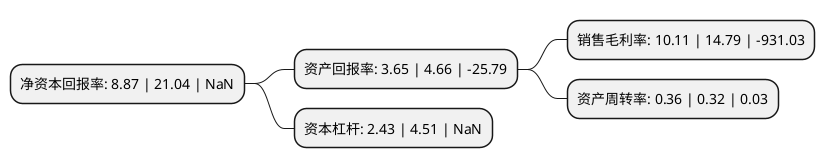

> 本页面由自动化程序生成于 2022年5月20日 01:03
> 内容可能存在错误，如有bug请提交issue至：https://github.com/Eroleice/doc-pi/issues
{.is-warning}

# 上市公司基本情况

## 基本资料

北清环能集团股份有限公司（以下简称“北清环能”）成立于1988年03月21日，南充市。于1998年03月03日在深交所主板上市。

北清环能注册资本24,922.436万元，主要业务:城乡有机废物的无害化处理及资源化高值利用及城市清洁供暖业务，电锅炉成套系统集成设备与D-POWER工业物联网平台软件的销售以下是详细信息：

- 公司名称: 北清环能集团股份有限公司
- 股票代码: 000803.SZ
- 所在地: 四川 - 南充市
- 成立日期: 1988年03月21日
- 注册资本: 24,922.436万元
- 法定代表人: 匡志伟
- 主营业务: 城乡有机废物的无害化处理及资源化高值利用及城市清洁供暖业务，电锅炉成套系统集成设备与D-POWER工业物联网平台软件的销售
- 公司官网: www.000803.cn
- 公司介绍: 2020年，公司通过重大资产重组，已成功收购十方环能100%股权并配套募资2.90亿元、新城热力93%股权并受托管理北控热力。十方环能是环保能源领域的龙头企业，服务区域覆盖全国，拥有包括“厌氧微生物应用”等6项发明专利在内的相关完整技术装备体系，多次获得国家和省部级荣誉。通过此次重组收购，在有机固废无害化处理与资源化利用、生物质能源开发应用领域形成规模化发展格局，已经在环保行业形成了显著竞争优势。新城热力亦是行业的佼佼者，曾荣获第一届热力行业节能环保百强企业荣誉，为北京市供热协会理事单位、中国环境科学学会团体会员、北京市(供热行业)安全生产标准化企业，占据着北京通州新城核心区域的稀缺资源，随着北京市副中心建设的推进，公司“环保+能源”的战略定位的优势将逐步体现。加上国家产业政策的鼓励支持，公司快速建立起了“环保+能源”的战略布局，提升了公司在环保、能源领域的核心竞争力。

## 股东及高管情况

上市公司第一大股东为北京北控光伏科技发展有限公司，持股39,456,429股，占比15.83%，**疑似为**上市公司实际控制人。

截至2022年03月31日，上市公司的前十大股东中，共有1名自然人股东，6名机构股东，3个产品账户，其中5%以上大股东共有2名。上市公司前十大股东明细如下：

> 未能通过持股比例判定出上市公司实际控制人（持股30%以上）
> 可能存在通过间接持股、联合持股、协议控制等方式拥有实际控制权的主体，具体请参考上市公司定期公告！
{.is-warning}

> 截至2022年03月31日，上市公司前十大股东信息如下：

| 股东名称 | 持股数量（股） | 持股比例 |
| --- | --- | --- |
| 北京北控光伏科技发展有限公司 | 39,456,429 | 15.83% |
| 南充市国有资产投资经营有限责任公司 | 15,508,455 | 6.22% |
| 西藏禹泽投资管理有限公司-禹泽红牛壹号私募股权投资基金 | 10,280,373 | 4.12% |
| 福州北控禹阳股权投资合伙企业(有限合伙) | 7,786,541 | 3.12% |
| 甘海南 | 6,114,167 | 2.45% |
| 井冈山江瀚戊辰投资管理合伙企业(有限合伙) | 4,280,821 | 1.72% |
| 上海大朴资产管理有限公司-大朴进取二期私募投资基金 | 3,945,425 | 1.58% |
| 镇江市尊海企业管理合伙企业(有限合伙) | 2,980,821 | 1.2% |
| 北京柘量投资中心(有限合伙) | 2,550,000 | 1.02% |
| 中国农业银行-华夏平稳增长混合型证券投资基金 | 2,502,200 | 1% |

## 利润表分析

上市公司2021年总收入为8.26亿元，净利润为0.83亿元，实现盈利。

## 杜邦分析

> 数据列示周期：2021年 | 2020年 | 2019年
{.is-info}

上市公司的净资产收益率在近一年有所下降，下降幅度为-57.84%，其变化情况分解如下：
- 上市公司的销售毛利率在近一年下降了-31.64%，可能是生产效率的下降、商品原材料价格上涨或商品价格的下跌所致。
- 上市公司的资产周转率在近一年上升了12.5%，可能是源自于更快的销售回款或库存管理效果提升。
- 上市公司的财务杠杆比率在近一年下降了-46.12%，可能是减少负债降低财务费用。

