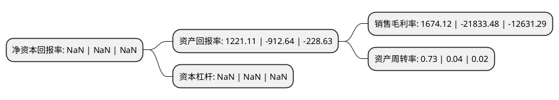

> 本页面由自动化程序生成于 2022年5月20日 01:03
> 内容可能存在错误，如有bug请提交issue至：https://github.com/Eroleice/doc-pi/issues
{.is-warning}

# 上市公司基本情况

## 基本资料

神雾节能股份有限公司（以下简称“*ST节能”）成立于1993年04月02日，南昌市。于1998年06月30日在深交所主板上市。

*ST节能注册资本63,724.522万元，主要业务:钢铁，有色行业节能环保工程咨询，设计，设备供货和EPC总承包业务。以下是详细信息：

- 公司名称: 神雾节能股份有限公司
- 股票代码: 000820.SZ
- 所在地: 江西 - 南昌市
- 成立日期: 1993年04月02日
- 注册资本: 63,724.522万元
- 法定代表人: 吴浪
- 主营业务: 钢铁，有色行业节能环保工程咨询，设计，设备供货和EPC总承包业务
- 公司官网: www.sw-es.cn
- 公司介绍: 公司致力于工业节能环保技术与资源综合利用技术的研发与推广，是工业节能环保与资源综合利用的技术方案提供商和工程总承包商。公司依托三大创新性低碳节能技术：神雾蓄热式转底炉(SRF)直接还原清洁冶炼技术、神雾氢气竖炉(SHSF)直接还原清洁冶炼技术、神雾蓄热式燃气熔分炉(SRGS)技术，对全球黑色、有色矿产资源及其固体废弃物等高能耗、高污染行业的工艺路线进行创新并提供源头解决方案，在大宗工业固废资源综合利用、矿产资源综合利用、节能环保流程再造等领域，提供标本兼治的有效路径，实现工业节能环保和资源综合利用。公司坚持以技术创新为推动力，通过不断构筑核心技术，强化技术壁垒，创造行业竞争优势。江苏省冶金设计院有限公司为旗下全资子公司，是国家住建部认定的甲级工程设计单位，拥有冶金行业甲级工程设计资质，钢铁行业甲级工程项目管理资质，环境专项固废处理处置工程资质，钢铁、有色、机械行业甲级工程咨询资质，电力、建筑行业工程设计资质，特种设备设计资质，对外承包工程资格资质，通过质量、环境、职业健康管理体系认证，是国家高新技术企业、江苏省冶金行业科技成果转化基地。

## 股东及高管情况

上市公司第一大股东为神雾科技集团股份有限公司，持股238,600,000股，占比37.44%，为上市公司实际控制人。

截至2022年03月31日，上市公司的前十大股东中，共有3名自然人股东，5名机构股东，2个产品账户，其中5%以上大股东共有2名。上市公司前十大股东明细如下：

> 截至2022年03月31日，上市公司前十大股东信息如下：

| 股东名称 | 持股数量（股） | 持股比例 |
| --- | --- | --- |
| 神雾科技集团股份有限公司 | 238,600,000 | 37.44% |
| 华创证券有限责任公司 | 34,000,000 | 5.34% |
| 山西证券股份有限公司 | 31,820,462 | 5% |
| 中原证券股份有限公司 | 19,800,000 | 3.11% |
| 长城国瑞证券有限公司 | 16,810,000 | 2.64% |
| 文菁华 | 9,249,876 | 1.45% |
| 陕西省国际信托股份有限公司-陕国投·持盈88号证券投资集合资金信托计划 | 7,917,181 | 1.24% |
| 徐爱卿 | 7,169,803 | 1.13% |
| 周水荣 | 7,000,000 | 1.1% |
| 陕西省国际信托股份有限公司-陕国投·聚宝盆30号证券投资集合资金信托计划 | 4,130,454 | 0.65% |

## 利润表分析

上市公司2021年总收入为1.2亿元，净利润为20.11亿元，实现盈利。

## 杜邦分析

> 数据列示周期：2021年 | 2020年 | 2019年
{.is-info}

上市公司的净资产收益率在近一年有所下降，下降幅度为NaN%，其变化情况分解如下：
- 上市公司的销售毛利率在近一年下降了-107.67%，可能是生产效率的下降、商品原材料价格上涨或商品价格的下跌所致。
- 上市公司的资产周转率在近一年上升了1725%，可能是源自于更快的销售回款或库存管理效果提升。
- 上市公司的财务杠杆比率在近一年下降了NaN%，可能是减少负债降低财务费用。

