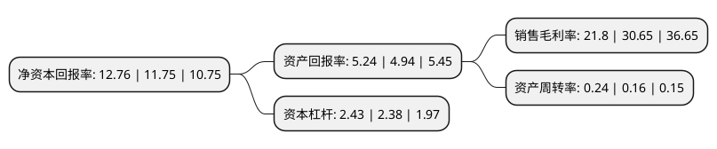

> 本页面由自动化程序生成于 2022年5月20日 01:05
> 内容可能存在错误，如有bug请提交issue至：https://github.com/Eroleice/doc-pi/issues
{.is-warning}

# 上市公司基本情况

## 基本资料

旺能环境股份有限公司（以下简称“旺能环境”）成立于1998年07月07日，湖州市。于2004年08月26日在深交所中小板上市。

旺能环境注册资本42,948.903万元，主要业务:垃圾焚烧发电主要产品:垃圾处理，发电，供热以下是详细信息：

- 公司名称: 旺能环境股份有限公司
- 股票代码: 002034.SZ
- 所在地: 浙江 - 湖州市
- 成立日期: 1998年07月07日
- 注册资本: 42,948.903万元
- 法定代表人: 王学庚
- 主营业务: 垃圾焚烧发电主要产品:垃圾处理，发电，供热
- 公司官网: www.wannaenergy.com
- 公司介绍: 公司从事的主要业务为垃圾焚烧发电、固体废弃物资源综合利用，主要采用BOT、BOO、PPP等投资运营模式，承接全国各地生活垃圾焚烧发电、餐厨垃圾处理、污泥处理处置及其他固体废物资源综合利用等环保项目。作为我国垃圾焚烧发电行业的龙头企业之一，秉持“科学发展，绿色环保，让人与自然和谐共生”的理念，立足于以特许经营的方式从事生活垃圾焚烧发电厂的投资、建设及运营，向餐厨垃圾处理、污泥处理等固废处理领域扩展，致力于打造平台型环保企业。公司连续多年被评为中国固废行业十大影响力企业，公司先后获得了“中国固废行业十大最具影响力企业”、“中国固废行业最具成长性企业”、“固废处理与资源化竞争力领先企业”等荣誉。

## 股东及高管情况

上市公司第一大股东为美欣达集团有限公司，持股142,866,210股，占比33.26%，为上市公司实际控制人。

截至2022年03月31日，上市公司的前十大股东中，共有4名自然人股东，2名机构股东，4个产品账户，其中5%以上大股东共有2名。上市公司前十大股东明细如下：

> 截至2022年03月31日，上市公司前十大股东信息如下：

| 股东名称 | 持股数量（股） | 持股比例 |
| --- | --- | --- |
| 美欣达集团有限公司 | 142,866,210 | 33.26% |
| 单建明 | 74,472,826 | 17.34% |
| 长城(天津)股权投资基金管理有限责任公司-长城国泰-高端装备并购契约型私募投资基金 | 19,824,385 | 4.62% |
| 上海嘉恳资产管理有限公司-新享嘉恳3号私募证券投资基金 | 10,258,854 | 2.39% |
| 鲍凤娇 | 10,140,500 | 2.36% |
| 交通银行股份有限公司-创金合信数字经济主题股票型发起式证券投资基金 | 9,090,440 | 2.12% |
| 华泰证券股份有限公司-中庚价值领航混合型证券投资基金 | 8,145,841 | 1.9% |
| 北京鼎翰投资有限公司-湖州惠赢投资合伙企业(有限合伙) | 7,989,269 | 1.86% |
| 宋娜 | 6,380,000 | 1.49% |
| 陈雪巍 | 5,560,015 | 1.29% |

## 利润表分析

上市公司2021年总收入为29.67亿元，净利润为6.47亿元，实现盈利。

## 杜邦分析

> 数据列示周期：2021年 | 2020年 | 2019年
{.is-info}

上市公司的净资产收益率在近一年有所上升，上升幅度为8.6%，其变化情况分解如下：
- 上市公司的销售毛利率在近一年下降了-28.87%，可能是生产效率的下降、商品原材料价格上涨或商品价格的下跌所致。
- 上市公司的资产周转率在近一年上升了50%，可能是源自于更快的销售回款或库存管理效果提升。
- 上市公司的财务杠杆比率在近一年上升了2.1%，可能是增加负债扩大生产规模。

