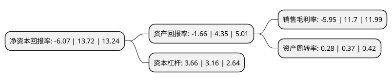

> 本页面由自动化程序生成于 2022年5月20日 01:10
> 内容可能存在错误，如有bug请提交issue至：https://github.com/Eroleice/doc-pi/issues
{.is-warning}

# 上市公司基本情况

## 基本资料

广东长青(集团)股份有限公司（以下简称“长青集团”）成立于1993年08月06日，中山市。于2011年09月20日在深交所中小板上市。

长青集团注册资本74,194.21万元，主营业务为燃气具及配套产品的生产和销售以及生物质发电业务(包括垃圾焚烧发电，秸秆燃烧发电)。主要产品为燃气具及其配套产品。以下是详细信息：

- 公司名称: 广东长青(集团)股份有限公司
- 股票代码: 002616.SZ
- 所在地: 广东 - 中山市
- 成立日期: 1993年08月06日
- 注册资本: 74,194.21万元
- 法定代表人: 何启强
- 主营业务: 主营业务为燃气具及配套产品的生产和销售以及生物质发电业务(包括垃圾焚烧发电，秸秆燃烧发电)主要产品为燃气具及其配套产品
- 公司官网: www.chantgroup.cn
- 公司介绍: 公司是国内最大的燃气具及其配套产品的制造和出口商之一。主营业务为燃气具及配套产品的生产和销售以及生物质发电业务的企业。燃气具业务方面主营烤炉、取暖设备、热水器、燃气灶具及燃气配件等业务，现拥有三大生产基地及国内同行业首家国家认可实验室和欧盟CE认可实验室。公司拥有自主知识产权专利百余项；是燃气热水器、燃气灶具、燃气旋塞阀、调压器等四种产品的行业和国家标准的起草人之一。公司是“中国轻工业五金行业十强企业”；“广东省百强民营企业”；“广东省循环经济试点单位”；“全国企事业知识产权试点工作单位”。

## 股东及高管情况

上市公司第一大股东为何启强，持股191,213,800股，占比25.77%，**疑似为**上市公司实际控制人。

截至2022年03月31日，上市公司的前十大股东中，共有7名自然人股东，1名机构股东，2个产品账户，其中5%以上大股东共有3名。上市公司前十大股东明细如下：

> 未能通过持股比例判定出上市公司实际控制人（持股30%以上）
> 可能存在通过间接持股、联合持股、协议控制等方式拥有实际控制权的主体，具体请参考上市公司定期公告！
{.is-warning}

> 截至2022年03月31日，上市公司前十大股东信息如下：

| 股东名称 | 持股数量（股） | 持股比例 |
| --- | --- | --- |
| 何启强 | 191,213,800 | 25.77% |
| 麦正辉 | 171,101,000 | 23.06% |
| 中山市长青新产业有限公司 | 88,800,000 | 11.97% |
| 广发基金管理有限公司-社保基金四二零组合 | 16,678,112 | 2.25% |
| 张蓐意 | 13,920,000 | 1.88% |
| 郭妙波 | 11,861,200 | 1.6% |
| 黄旺萍 | 10,000,000 | 1.35% |
| 基本养老保险基金一六零四一组合 | 6,405,547 | 0.86% |
| 汤国添 | 4,260,000 | 0.57% |
| 尤国南 | 3,674,400 | 0.5% |

## 利润表分析

上市公司2021年总收入为26.51亿元，净利润为-1.58亿元，**未实现盈利**。

## 杜邦分析

> 数据列示周期：2021年 | 2020年 | 2019年
{.is-info}

上市公司的净资产收益率在近一年有所下降，下降幅度为-144.24%，其变化情况分解如下：
- 上市公司的销售毛利率在近一年下降了-150.85%，可能是生产效率的下降、商品原材料价格上涨或商品价格的下跌所致。
- 上市公司的资产周转率在近一年下降了-24.32%，可能是源自于更慢的销售回款或库存管理效果下降。
- 上市公司的财务杠杆比率在近一年上升了15.82%，可能是增加负债扩大生产规模。

