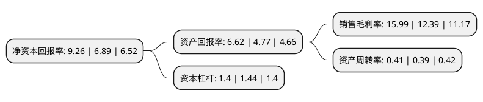

> 本页面由自动化程序生成于 2022年5月20日 01:11
> 内容可能存在错误，如有bug请提交issue至：https://github.com/Eroleice/doc-pi/issues
{.is-warning}

# 上市公司基本情况

## 基本资料

北京雪迪龙科技股份有限公司（以下简称“雪迪龙”）成立于2001年09月24日，北京市。于2012年03月09日在深交所中小板上市。

雪迪龙注册资本63,006.826万元，主要产品:环境监测系统，工业过程分析系统，分析仪器及配套产品，运营维护服务，第三方检测服务，智慧环保服务，环境治理业务。主营业务:事环境监测，工业过程分析，智慧环保及相关服务。以下是详细信息：

- 公司名称: 北京雪迪龙科技股份有限公司
- 股票代码: 002658.SZ
- 所在地: 北京 - 北京市
- 成立日期: 2001年09月24日
- 注册资本: 63,006.826万元
- 法定代表人: 敖小强
- 主营业务: 主要产品:环境监测系统，工业过程分析系统，分析仪器及配套产品，运营维护服务，第三方检测服务，智慧环保服务，环境治理业务主营业务:事环境监测，工业过程分析，智慧环保及相关服务
- 公司官网: www.chsdl.com
- 公司介绍: 公司是专业从事环境监测、工业过程分析、智慧环保及相关服务的国家级高新技术企业。公司业务主要围绕与大气、水、土壤等监测业务相关的“产品+系统应用+服务”展开，着力拓展环境监测、环境信息化、环境大数据、环境治理四大领域业务，积极开展生态环境监测网络项目建设，以专业的监测感知技术、丰富的环保综合应用能力及强大的服务网络为政府及企业提供环境咨询、规划设计、环境监测、环境信息化、环境治理、项目投资、设施运营等“一站式”环境综合服务。

## 股东及高管情况

上市公司第一大股东为敖小强，持股367,660,000股，占比58.35%，为上市公司实际控制人。

截至2022年03月31日，上市公司的前十大股东中，共有8名自然人股东，2个产品账户，其中5%以上大股东共有1名。上市公司前十大股东明细如下：

> 截至2022年03月31日，上市公司前十大股东信息如下：

| 股东名称 | 持股数量（股） | 持股比例 |
| --- | --- | --- |
| 敖小强 | 367,660,000 | 58.35% |
| 北京雪迪龙科技股份有限公司-2021年员工持股计划 | 10,004,247 | 1.59% |
| 王凌秋 | 5,850,000 | 0.93% |
| 郜武 | 4,294,220 | 0.68% |
| 吕会平 | 2,900,400 | 0.46% |
| 赵青 | 2,559,500 | 0.41% |
| 丁思寓 | 2,000,000 | 0.32% |
| 赵爱学 | 1,860,900 | 0.3% |
| 黄小芳 | 1,510,000 | 0.24% |
| 中国工商银行股份有限公司-汇添富中证环境治理指数型证券投资基金(LOF) | 1,508,600 | 0.24% |

## 利润表分析

上市公司2021年总收入为13.8亿元，净利润为2.2亿元，实现盈利。

## 杜邦分析

> 数据列示周期：2021年 | 2020年 | 2019年
{.is-info}

上市公司的净资产收益率在近一年有所上升，上升幅度为34.4%，其变化情况分解如下：
- 上市公司的销售毛利率在近一年上升了29.06%，可能是生产效率的提升、商品原材料价格下跌或商品价格的上涨所致。
- 上市公司的资产周转率在近一年上升了5.13%，可能是源自于更快的销售回款或库存管理效果提升。
- 上市公司的财务杠杆比率在近一年下降了-2.78%，可能是减少负债降低财务费用。

