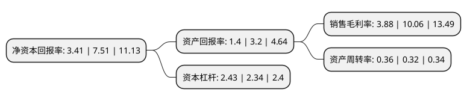

> 本页面由自动化程序生成于 2022年5月20日 01:11
> 内容可能存在错误，如有bug请提交issue至：https://github.com/Eroleice/doc-pi/issues
{.is-warning}

# 上市公司基本情况

## 基本资料

东江环保股份有限公司（以下简称“东江环保”）成立于1999年09月16日，深圳市。于2012年04月26日在深交所中小板上市。

东江环保注册资本87,926.71万元，主要业务:工业和市政废物的资源化利用与无害化处理，配套发展水治理，环境工程，环境检测等业务。以下是详细信息：

- 公司名称: 东江环保股份有限公司
- 股票代码: 002672.SZ
- 所在地: 广东 - 深圳市
- 成立日期: 1999年09月16日
- 注册资本: 87,926.71万元
- 法定代表人: 谭侃
- 主营业务: 工业和市政废物的资源化利用与无害化处理，配套发展水治理，环境工程，环境检测等业务
- 公司官网: www.dongjiang.com.cn
- 公司介绍: 公司是一家专业从事废物管理和环境服务的高科技环保企业。公司致力于工业和市政废物的资源化利用与无害化处理，配套发展水治理、环境工程、环境检测等业务，构建完整产业链，铸造以废物资源化为核心的多层次环保服务平台，为企业的不同发展阶段定制和提供一站式环保服务，并可为城市废物管理提供整体解决方案。公司经过多年发展，通过新设、并购和收购等方式拓展经营，形成了覆盖泛珠江三角洲、长江三角洲及中西部地区的以工业及市政废物无害化处理及资源化利用为业务核心的产业布局。通过不断开发和创新，公司现拥有工业废液、废渣、城市生活垃圾处理、污泥处理、餐厨垃圾处理和资源化利用的多项核心技术，并形成在工业危险废物及城市固体废物处理处置和综合利用等领域丰富的技术储备和研发成果。公司凭借自身先进的技术优势和资深的行业经验，先后被评定为广东省及国家环保骨干企业、“国家资源节约与环境保护重大示范工程”单位、“国家首批循环经济试点单位”和“国家高新技术企业”等。此外，连续多年入选《福布斯》“中国潜力100榜”，并于2017年荣获国家科学技术进步二等奖。

## 股东及高管情况

上市公司第一大股东为广东省广晟控股集团有限公司，持股200,968,294股，占比22.86%，**疑似为**上市公司实际控制人。

截至2022年03月31日，上市公司的前十大股东中，共有4名自然人股东，4名机构股东，2个海外主体，其中5%以上大股东共有3名。上市公司前十大股东明细如下：

> 未能通过持股比例判定出上市公司实际控制人（持股30%以上）
> 可能存在通过间接持股、联合持股、协议控制等方式拥有实际控制权的主体，具体请参考上市公司定期公告！
{.is-warning}

> 截至2022年03月31日，上市公司前十大股东信息如下：

| 股东名称 | 持股数量（股） | 持股比例 |
| --- | --- | --- |
| 广东省广晟控股集团有限公司 | 200,968,294 | 22.86% |
| 香港中央结算(代理人)有限公司 | 200,095,762 | 22.76% |
| 江苏汇鸿国际集团股份有限公司 | 50,087,669 | 5.7% |
| 张维仰 | 26,613,003 | 3.03% |
| 江苏汇鸿创业投资有限公司 | 25,995,038 | 2.96% |
| 邓佑衔 | 17,244,640 | 1.96% |
| 广东塔牌集团股份有限公司 | 13,150,036 | 1.5% |
| 樊崇娇 | 7,239,093 | 0.82% |
| 香港中央结算有限公司(陆股通) | 5,100,899 | 0.58% |
| 王剑峰 | 2,250,000 | 0.26% |

## 利润表分析

上市公司2021年总收入为40.15亿元，净利润为1.55亿元，实现盈利。

## 杜邦分析

> 数据列示周期：2021年 | 2020年 | 2019年
{.is-info}

上市公司的净资产收益率在近一年有所下降，下降幅度为-54.59%，其变化情况分解如下：
- 上市公司的销售毛利率在近一年下降了-61.43%，可能是生产效率的下降、商品原材料价格上涨或商品价格的下跌所致。
- 上市公司的资产周转率在近一年上升了12.5%，可能是源自于更快的销售回款或库存管理效果提升。
- 上市公司的财务杠杆比率在近一年上升了3.85%，可能是增加负债扩大生产规模。

