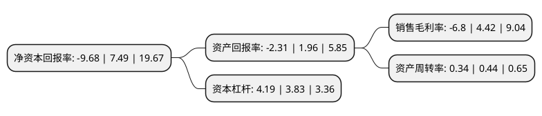

> 本页面由自动化程序生成于 2022年5月20日 01:11
> 内容可能存在错误，如有bug请提交issue至：https://github.com/Eroleice/doc-pi/issues
{.is-warning}

# 上市公司基本情况

## 基本资料

岭南生态文旅股份有限公司（以下简称“岭南股份”）成立于1998年07月20日，东莞市。于2014年02月19日在深交所中小板上市。

岭南股份注册资本168,482.707万元，主要从事生态环境和文化旅游业务。以下是详细信息：

- 公司名称: 岭南生态文旅股份有限公司
- 股票代码: 002717.SZ
- 所在地: 广东 - 东莞市
- 成立日期: 1998年07月20日
- 注册资本: 168,482.707万元
- 法定代表人: 尹洪卫
- 主营业务: 主要从事生态环境和文化旅游业务
- 公司官网: www.lingnan.cn
- 公司介绍: 公司是一家集生态环境与园林建设、文化与旅游、投资与运营为一体的全国性集团化公司。主要从事园林工程施工、景观规划设计、绿化养护及苗木产销等主营业务。公司拥有水利水电施工总承包一级资质、国家风景园林工程设计甲级资质、市政公用工程施工总承包一级资质、水利安全生产标准化一级单位、展览陈列工程设计与施工一体化一级资质等专业能力优势，并在生态及文旅项目中荣获几十个国家级重大奖项。公司获得“国家高新技术企业”称号、“中国优秀园林工程奖大金奖”，并连续多年荣获“中国风景园林优秀管理奖”、“中国优秀园林工程金奖”、“广东省守合同重信用企业”等奖项，企业综合实力及竞争力一直位列全国前茅，被授予“全国城市园林绿化50强企业”、“全国十佳园林工程/设计/科技创新企业”“广东省农业龙头企业”等殊荣。

## 股东及高管情况

上市公司第一大股东为尹洪卫，持股372,318,971股，占比22.1%，**疑似为**上市公司实际控制人。

截至2022年03月31日，上市公司的前十大股东中，共有7名自然人股东，1名机构股东，2个产品账户，其中5%以上大股东共有1名。上市公司前十大股东明细如下：

> 未能通过持股比例判定出上市公司实际控制人（持股30%以上）
> 可能存在通过间接持股、联合持股、协议控制等方式拥有实际控制权的主体，具体请参考上市公司定期公告！
{.is-warning}

> 截至2022年03月31日，上市公司前十大股东信息如下：

| 股东名称 | 持股数量（股） | 持股比例 |
| --- | --- | --- |
| 尹洪卫 | 372,318,971 | 22.1% |
| 深圳市信岭投资合伙企业(有限合伙) | 84,220,880 | 5% |
| 童朝方 | 25,266,217 | 1.5% |
| 毛师琦 | 24,980,365 | 1.48% |
| 上海拓牌资产管理有限公司-拓牌兴丰5号私募证券投资基金 | 20,746,887 | 1.23% |
| 王东岗 | 16,410,432 | 0.97% |
| 北京浩创资产管理有限公司-浩创业荣6号私募证券投资基金 | 15,337,510 | 0.91% |
| 彭外生 | 7,395,000 | 0.44% |
| 封艳 | 6,848,000 | 0.41% |
| 刘勇 | 6,563,806 | 0.39% |

## 利润表分析

上市公司2021年总收入为47.99亿元，净利润为0.51亿元，实现盈利。

## 杜邦分析

> 数据列示周期：2020年 | 2019年 | 2018年
{.is-info}

上市公司的净资产收益率在近一年有所下降，下降幅度为-229.24%，其变化情况分解如下：
- 上市公司的销售毛利率在近一年下降了-253.85%，可能是生产效率的下降、商品原材料价格上涨或商品价格的下跌所致。
- 上市公司的资产周转率在近一年下降了-22.73%，可能是源自于更慢的销售回款或库存管理效果下降。
- 上市公司的财务杠杆比率在近一年上升了9.4%，可能是增加负债扩大生产规模。

