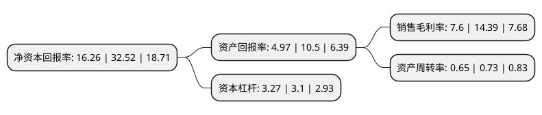

> 本页面由自动化程序生成于 2022年5月20日 01:13
> 内容可能存在错误，如有bug请提交issue至：https://github.com/Eroleice/doc-pi/issues
{.is-warning}

# 上市公司基本情况

## 基本资料

侨银城市管理股份有限公司（以下简称“侨银股份”）成立于2001年11月27日，广州市。于2020年01月06日在深交所中小板上市。

侨银股份注册资本40,866.332万元，主营业务:城乡环卫保洁，生活垃圾处置，市政环卫工程及其他环卫服务。以下是详细信息：

- 公司名称: 侨银城市管理股份有限公司
- 股票代码: 002973.SZ
- 所在地: 广东 - 广州市
- 成立日期: 2001年11月27日
- 注册资本: 40,866.332万元
- 法定代表人: 刘少云
- 主营业务: 主营业务:城乡环卫保洁，生活垃圾处置，市政环卫工程及其他环卫服务
- 公司官网: www.gzqiaoyin.com
- 公司介绍: 公司成立于2001年11月27日，主要从事城乡环境卫生一体化管理服务，具体业务涵盖城乡环卫保洁、生活垃圾处置、市政环卫工程和其他环卫服务，是国内较有影响力的人居环境综合提升服务商，目前已通过ISO9001质量管理体系认证、ISO14001环境管理体系认证、OHSAS18001职业健康安全管理体系认证、SA8000社会责任管理体系认证。公司拥有城市生活垃圾经营性清扫、收集、运输服务许可证、道路运输经营许可证和建筑施工安全生产许可证，具备中国清洁清洗行业国家一级资质、广东省清扫、收集、运输和清洁类环卫服务一级企业资质、广州市环卫行业经营服务A级企业资质、建筑业企业资质(环保工程专业承包三级、市政公用工程施工总承包三级)、有害生物防制服务资质、广东省环境污染治理资质、城市生活垃圾经营性无害化处理服务资质等专业资质。

## 股东及高管情况

上市公司第一大股东为郭倍华，持股154,116,379股，占比37.71%，为上市公司实际控制人。

截至2022年03月31日，上市公司的前十大股东中，共有4名自然人股东，3名机构股东，3个产品账户，其中5%以上大股东共有3名。上市公司前十大股东明细如下：

> 截至2022年03月31日，上市公司前十大股东信息如下：

| 股东名称 | 持股数量（股） | 持股比例 |
| --- | --- | --- |
| 郭倍华 | 154,116,379 | 37.71% |
| 刘少云 | 117,853,701 | 28.84% |
| 珠海横琴珑欣企业管理中心(有限合伙) | 27,197,008 | 6.66% |
| 珠海广发信德环保产业投资基金合伙企业(有限合伙) | 14,762,841 | 3.61% |
| 宁波万彤股权投资有限公司 | 12,555,503 | 3.07% |
| 芜湖卓辉盛景投资管理中心(有限合伙)-芜湖卓辉冠瑞投资管理中心(有限合伙) | 8,056,070 | 1.97% |
| 韩丹 | 3,021,890 | 0.74% |
| 阳军 | 2,523,083 | 0.62% |
| 广东德汇投资管理有限公司-德汇尊享私募证券投资基金 | 1,355,900 | 0.33% |
| 华美国际投资集团有限公司-华美传承1号私募证券投资基金 | 1,170,000 | 0.29% |

## 利润表分析

上市公司2021年总收入为33.31亿元，净利润为2.53亿元，实现盈利。

## 杜邦分析

> 数据列示周期：2021年 | 2020年 | 2019年
{.is-info}

上市公司的净资产收益率在近一年有所下降，下降幅度为-50%，其变化情况分解如下：
- 上市公司的销售毛利率在近一年下降了-47.19%，可能是生产效率的下降、商品原材料价格上涨或商品价格的下跌所致。
- 上市公司的资产周转率在近一年下降了-10.96%，可能是源自于更慢的销售回款或库存管理效果下降。
- 上市公司的财务杠杆比率在近一年上升了5.48%，可能是增加负债扩大生产规模。

