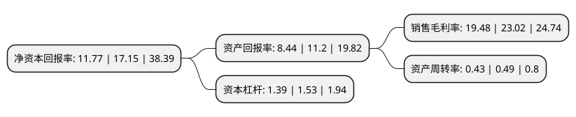

> 本页面由自动化程序生成于 2022年5月20日 01:14
> 内容可能存在错误，如有bug请提交issue至：https://github.com/Eroleice/doc-pi/issues
{.is-warning}

# 上市公司基本情况

## 基本资料

同兴环保科技股份有限公司（以下简称“同兴环保”）成立于2006年06月19日，马鞍山市。于2020年12月18日在深交所中小板上市。

同兴环保注册资本13,253.9万元，主要为钢铁，焦化，建材等非电行业工业企业提供超低排放整体解决方案，包括除尘，脱硫，脱硝项目总承包及低温SCR脱硝催化剂。以下是详细信息：

- 公司名称: 同兴环保科技股份有限公司
- 股票代码: 003027.SZ
- 所在地: 安徽 - 马鞍山市
- 成立日期: 2006年06月19日
- 注册资本: 13,253.9万元
- 法定代表人: 郑光明
- 主营业务: 主要为钢铁，焦化，建材等非电行业工业企业提供超低排放整体解决方案，包括除尘，脱硫，脱硝项目总承包及低温SCR脱硝催化剂
- 公司官网: www.ahtxhb.com
- 公司介绍: 公司是国内知名的非电行业烟气治理综合服务商，主要为钢铁、焦化、建材等非电行业工业企业提供超低排放整体解决方案，包括除尘、脱硫、脱硝项目总承包及低温SCR脱硝催化剂。从工艺设计、设备开发与制造、组织施工、安装调试服务，到配套脱硝催化剂的生产等，公司业务涵盖了烟气治理全过程，是国内为数不多的能够同时提供烟气治理工程服务和低温脱硝催化剂、关键除尘、脱硫及脱硝系统设备的烟气治理综合服务商。公司低温SCR脱硝催化剂整体技术达到国际先进水平，制备技术达到国际领先水平，低温SCR脱硝工艺与装备技术达到国内领先水平。公司已成长成为国内知名的非电行业烟气治理综合服务商，在非电行业烟气治理市场占据领先地位。

## 股东及高管情况

上市公司第一大股东为朱庆亚，持股22,869,516股，占比17.25%，**疑似为**上市公司实际控制人。

截至2022年03月31日，上市公司的前十大股东中，共有5名自然人股东，3名机构股东，2个产品账户，其中5%以上大股东共有6名。上市公司前十大股东明细如下：

> 未能通过持股比例判定出上市公司实际控制人（持股30%以上）
> 可能存在通过间接持股、联合持股、协议控制等方式拥有实际控制权的主体，具体请参考上市公司定期公告！
{.is-warning}

> 截至2022年03月31日，上市公司前十大股东信息如下：

| 股东名称 | 持股数量（股） | 持股比例 |
| --- | --- | --- |
| 朱庆亚 | 22,869,516 | 17.25% |
| 朱宁 | 13,937,550 | 10.52% |
| 安徽高新金通安益股权投资基金(有限合伙) | 13,920,000 | 10.5% |
| 解道东 | 12,066,282 | 9.1% |
| 郎义广 | 8,196,745 | 6.18% |
| 宁波庐熙股权投资合伙企业(有限合伙) | 7,500,000 | 5.66% |
| 宁波晨晖盛景股权投资合伙企业(有限合伙) | 4,731,400 | 3.57% |
| 郑智成 | 3,069,953 | 2.32% |
| 安徽高新金通安益二期创业投资基金(有限合伙) | 2,775,000 | 2.09% |
| 安徽翔海资产管理有限公司-宁夏翔海节能环保投资合伙企业(有限合伙) | 1,806,900 | 1.36% |

## 利润表分析

上市公司2021年总收入为9.33亿元，净利润为1.81亿元，实现盈利。

## 杜邦分析

> 数据列示周期：2021年 | 2020年 | 2019年
{.is-info}

上市公司的净资产收益率在近一年有所下降，下降幅度为-31.37%，其变化情况分解如下：
- 上市公司的销售毛利率在近一年下降了-15.38%，可能是生产效率的下降、商品原材料价格上涨或商品价格的下跌所致。
- 上市公司的资产周转率在近一年下降了-12.24%，可能是源自于更慢的销售回款或库存管理效果下降。
- 上市公司的财务杠杆比率在近一年下降了-9.15%，可能是减少负债降低财务费用。

