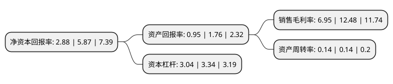

> 本页面由自动化程序生成于 2022年5月20日 01:14
> 内容可能存在错误，如有bug请提交issue至：https://github.com/Eroleice/doc-pi/issues
{.is-warning}

# 上市公司基本情况

## 基本资料

北京碧水源科技股份有限公司（以下简称“碧水源”）成立于2001年07月17日，北京市。于2010年04月21日在深交所创业板上市。

碧水源注册资本362,420.936万元，主营业务:专业从事环境保护领域，特别是污水处理与污水资源化技术开发，核心设备制造和应用，以及固废处理。主要采用先进的膜技术为客户一揽子提供建造污水处理厂或再生水厂的整体技术解决方案，包括技术方案设计，工程设计，技术实施与系统集成，运营技术支持和托管运营服务等，并制造和提供核心的膜组器系统和核心部件膜材料;另外公司研发，生产与销售净水器产品，并提供市政与给排水工程服务。以下是详细信息：

- 公司名称: 北京碧水源科技股份有限公司
- 股票代码: 300070.SZ
- 所在地: 北京 - 北京市
- 成立日期: 2001年07月17日
- 注册资本: 362,420.936万元
- 法定代表人: 文剑平
- 主营业务: 主营业务:专业从事环境保护领域，特别是污水处理与污水资源化技术开发，核心设备制造和应用，以及固废处理主要采用先进的膜技术为客户一揽子提供建造污水处理厂或再生水厂的整体技术解决方案，包括技术方案设计，工程设计，技术实施与系统集成，运营技术支持和托管运营服务等，并制造和提供核心的膜组器系统和核心部件膜材料;另外公司研发，生产与销售净水器产品，并提供市政与给排水工程服务
- 公司官网: www.originwater.com
- 公司介绍: 公司是一家集膜材料研发、膜设备制造、膜工艺应用于一体的高科技环保企业，已发展为全球一流的膜设备生产制造商和供应商之一。公司是专业从事环境保护领域，在水处理领域拥有全产业链，目前已形成市政污水和工业废水处理、自来水处理、海水淡化、民用净水、湿地保护与重建、海绵城市建设、河流综合治理、黑臭水体治理、市政景观建设、城市光环境设计建设、固废危废处理、生态农业和循环经济等全业务链的高科技环保企业。公司主要采用先进的膜技术为客户一揽子提供建造给水与污水处理厂或再生水厂与海水淡化厂及城市生态系统的整体技术解决方案，包括技术方案设计、工程设计、技术实施与系统集成、运营技术支持和运营服务等，并制造和提供核心的膜组器系统和核心部件膜材料；同时公司研发、生产与销售家用及商用净水器产品，并提供城市生态环境治理、市政与给排水的工程建设服务。公司曾获得国家科学技术进步奖二等奖，承担了国家科技重大专项水专项、“863计划”、“国家科技支撑计划”等国家课题，建有“院士专家工作站”、“博士后工作站”、美国工程院士-David Waite教授工作站、李锁定创新工作室、“国家工程技术中心”等。

## 股东及高管情况

上市公司第一大股东为中国城乡控股集团有限公司，持股790,375,092股，占比21.81%，**疑似为**上市公司实际控制人。

截至2022年05月05日，上市公司的前十大股东中，共有7名自然人股东，3名机构股东，其中5%以上大股东共有10名。上市公司前十大股东明细如下：

> 未能通过持股比例判定出上市公司实际控制人（持股30%以上）
> 可能存在通过间接持股、联合持股、协议控制等方式拥有实际控制权的主体，具体请参考上市公司定期公告！
{.is-warning}

> 截至2022年05月05日，上市公司前十大股东信息如下：

| 股东名称 | 持股数量（股） | 持股比例 |
| --- | --- | --- |
| 中国城乡控股集团有限公司 | 790,375,092 | 21.81% |
| 中国城乡控股集团有限公司 | 790,375,092 | 21.81% |
| 中国城乡控股集团有限公司 | 790,375,092 | 21.81% |
| 文剑平 | 464,235,808 | 12.81% |
| 文剑平 | 464,235,808 | 12.81% |
| 文剑平 | 461,895,808 | 12.7447% |
| 文剑平 | 426,725,808 | 11.7743% |
| 王雪芹 | 238,574,426 | 6.58% |
| 王雪芹 | 238,574,426 | 6.58% |
| 王雪芹 | 238,574,426 | 6.58% |

## 利润表分析

上市公司2021年总收入为95.48亿元，净利润为6.63亿元，实现盈利。

## 杜邦分析

> 数据列示周期：2021年 | 2020年 | 2019年
{.is-info}

上市公司的净资产收益率在近一年有所下降，下降幅度为-50.94%，其变化情况分解如下：
- 上市公司的销售毛利率在近一年下降了-44.31%，可能是生产效率的下降、商品原材料价格上涨或商品价格的下跌所致。
- 上市公司的资产周转率在近一年下降了0%，可能是源自于更慢的销售回款或库存管理效果下降。
- 上市公司的财务杠杆比率在近一年下降了-8.98%，可能是减少负债降低财务费用。

