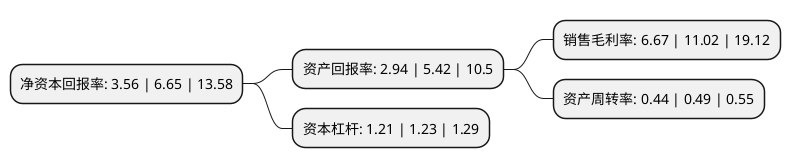

> 本页面由自动化程序生成于 2022年5月20日 01:15
> 内容可能存在错误，如有bug请提交issue至：https://github.com/Eroleice/doc-pi/issues
{.is-warning}

# 上市公司基本情况

## 基本资料

河北先河环保科技股份有限公司（以下简称“先河环保”）成立于1996年07月06日，石家庄市。于2010年11月05日在深交所创业板上市。

先河环保注册资本54,537.401万元，主营业务为高端环境监测仪器仪表研发，生产和销售，以及根据客户要求提供环境监测设施运营服务。主要产品包括:空气质量连续自动监测系统，水质连续自动监测系统，污水在线自动监测系统，烟气在线自动监测系统，酸雨自动监测系统等五大在线监测系统以及数字应急监测车等。以下是详细信息：

- 公司名称: 河北先河环保科技股份有限公司
- 股票代码: 300137.SZ
- 所在地: 河北 - 石家庄市
- 成立日期: 1996年07月06日
- 注册资本: 54,537.401万元
- 法定代表人: 李玉国
- 主营业务: 主营业务为高端环境监测仪器仪表研发，生产和销售，以及根据客户要求提供环境监测设施运营服务主要产品包括:空气质量连续自动监测系统，水质连续自动监测系统，污水在线自动监测系统，烟气在线自动监测系统，酸雨自动监测系统等五大在线监测系统以及数字应急监测车等
- 公司官网: www.sailhero.com
- 公司介绍: 公司是国内规模最大、产品线最全、创新能力最强的环境监测仪器专业生产企业之一。公司主要致力于为高端环境监测仪器仪表研发、生产和销售，以及根据客户要求提供环境监测设施运营服务。公司主要产品包括：空气质量连续自动监测系统、水质连续自动监测系统、污水在线自动监测系统、烟气在线自动监测系统、酸雨自动监测系统等五大在线监测系统以及数字应急监测车等。公司技术优势明显，拥有多项专利，软件产品，软件著作权，非专利技术；拥有广泛的营销网络，并与经销商、代理商建立起长期稳定的战略伙伴关系。

## 股东及高管情况

上市公司第一大股东为李玉国，持股68,658,409股，占比12.59%，**疑似为**上市公司实际控制人。

截至2022年03月31日，上市公司的前十大股东中，共有7名自然人股东，1名机构股东，2个产品账户，其中5%以上大股东共有1名。上市公司前十大股东明细如下：

> 未能通过持股比例判定出上市公司实际控制人（持股30%以上）
> 可能存在通过间接持股、联合持股、协议控制等方式拥有实际控制权的主体，具体请参考上市公司定期公告！
{.is-warning}

> 截至2022年03月31日，上市公司前十大股东信息如下：

| 股东名称 | 持股数量（股） | 持股比例 |
| --- | --- | --- |
| 李玉国 | 68,658,409 | 12.59% |
| 陈荣强 | 8,730,806 | 1.6% |
| 范朝 | 7,655,327 | 1.4% |
| 王关禹 | 7,240,000 | 1.33% |
| 蒋国梁 | 6,700,009 | 1.23% |
| 蒋丽娜 | 5,980,080 | 1.1% |
| 段桂山 | 4,758,968 | 0.87% |
| 广州市玄元投资管理有限公司-玄元科新256号私募证券投资基金 | 4,410,000 | 0.81% |
| 招商银行股份有限公司-银华创业板两年定期开放混合型证券投资基金 | 3,373,733 | 0.62% |
| 红塔创新投资股份有限公司 | 3,194,900 | 0.59% |

## 利润表分析

上市公司2021年总收入为11.11亿元，净利润为0.74亿元，实现盈利。

## 杜邦分析

> 数据列示周期：2021年 | 2020年 | 2019年
{.is-info}

上市公司的净资产收益率在近一年有所下降，下降幅度为-46.47%，其变化情况分解如下：
- 上市公司的销售毛利率在近一年下降了-39.47%，可能是生产效率的下降、商品原材料价格上涨或商品价格的下跌所致。
- 上市公司的资产周转率在近一年下降了-10.2%，可能是源自于更慢的销售回款或库存管理效果下降。
- 上市公司的财务杠杆比率在近一年下降了-1.63%，可能是减少负债降低财务费用。

