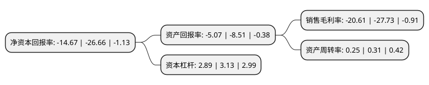

> 本页面由自动化程序生成于 2022年5月20日 01:15
> 内容可能存在错误，如有bug请提交issue至：https://github.com/Eroleice/doc-pi/issues
{.is-warning}

# 上市公司基本情况

## 基本资料

中节能环保装备股份有限公司（以下简称“中环装备”）成立于2001年03月28日，西安市。于2010年11月12日在深交所创业板上市。

中环装备注册资本42,724.405万元，主营业务:大气污染减排，电工专用装备，节能环保装备，环境能效监控与大数据服务。以下是详细信息：

- 公司名称: 中节能环保装备股份有限公司
- 股票代码: 300140.SZ
- 所在地: 陕西 - 西安市
- 成立日期: 2001年03月28日
- 注册资本: 42,724.405万元
- 法定代表人: 周康
- 主营业务: 主营业务:大气污染减排，电工专用装备，节能环保装备，环境能效监控与大数据服务
- 公司官网: www.zhzb.cecep.cn
- 公司介绍: 公司是以电工专用设备、高电压试验、检测设备以及高纯特种电子材料的研发、生产、销售、技术服务为主营业务的科技型公司，是国家级高新技术企业。主要产品有变压器专用装备、高压电气试验设备、蓄电池装备，公司硅钢片横剪线和散热器获得“西安市名牌产品”称号。公司已形成了一支技术覆盖全面、核心力量突出的技术研发队伍，公司核心技术人员具有丰富的行业经验，对行业的发展趋势具有良好的专业判断。通过多年努力，公司先后获得“企业信用评价AAA级信用企业”，“质量、环境、职业健康安全三体系认证”，“中国电器工业最具影响力品牌”等荣誉，秉承大国工匠产业报国的决心，致力于成为国际一流的节能环保装备制造与综合解决方案的提供商。公司拥有院士专家工作站、博士后培养基地、硕士联合培养基地、联合实验室科研平台，拥有强大的科研队伍及创新能力。主持参与制定数多项国家标准、行业标准和国家课题，多项产品荣获国家级、省部级科技进步奖。

## 股东及高管情况

上市公司第一大股东为中国节能环保集团有限公司，持股98,133,708股，占比22.97%，**疑似为**上市公司实际控制人。

截至2022年03月31日，上市公司的前十大股东中，共有2名自然人股东，7名机构股东，1名其他股东，其中5%以上大股东共有2名。上市公司前十大股东明细如下：

> 未能通过持股比例判定出上市公司实际控制人（持股30%以上）
> 可能存在通过间接持股、联合持股、协议控制等方式拥有实际控制权的主体，具体请参考上市公司定期公告！
{.is-warning}

> 截至2022年03月31日，上市公司前十大股东信息如下：

| 股东名称 | 持股数量（股） | 持股比例 |
| --- | --- | --- |
| 中国节能环保集团有限公司 | 98,133,708 | 22.97% |
| 中国启源工程设计研究院有限公司 | 51,352,665 | 12.02% |
| 中交西安筑路机械有限公司 | 20,000,000 | 4.68% |
| 中机国际(西安)技术发展有限公司 | 8,880,000 | 2.08% |
| 周兆华 | 7,516,454 | 1.76% |
| 北京天融环保设备中心 | 7,000,000 | 1.64% |
| 阿拉丁环保集团有限公司 | 5,000,000 | 1.17% |
| 中国华融资产管理股份有限公司 | 4,625,916 | 1.08% |
| 新余天融兴投资管理中心(有限合伙) | 2,577,283 | 0.6% |
| 孙莉玫 | 2,000,000 | 0.47% |

## 利润表分析

上市公司2021年总收入为11.34亿元，净利润为-2.34亿元，**未实现盈利**。

## 杜邦分析

> 数据列示周期：2021年 | 2020年 | 2019年
{.is-info}

上市公司的净资产收益率在近一年有所下降，下降幅度为-44.97%，其变化情况分解如下：
- 上市公司的销售毛利率在近一年下降了-25.68%，可能是生产效率的下降、商品原材料价格上涨或商品价格的下跌所致。
- 上市公司的资产周转率在近一年下降了-19.35%，可能是源自于更慢的销售回款或库存管理效果下降。
- 上市公司的财务杠杆比率在近一年下降了-7.67%，可能是减少负债降低财务费用。

