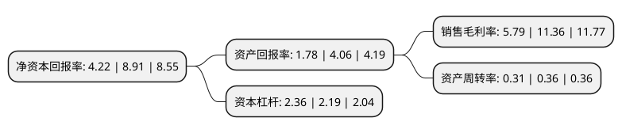

> 本页面由自动化程序生成于 2022年5月20日 01:15
> 内容可能存在错误，如有bug请提交issue至：https://github.com/Eroleice/doc-pi/issues
{.is-warning}

# 上市公司基本情况

## 基本资料

维尔利环保科技集团股份有限公司（以下简称“维尔利”）成立于2003年02月12日，常州市。于2011年03月16日在深交所创业板上市。

维尔利注册资本78,158.762万元，本集团专业从事环保设备的研发，生产，销售和环保工程的设计，承包，施工，安装及相关技术咨询服务。以下是详细信息：

- 公司名称: 维尔利环保科技集团股份有限公司
- 股票代码: 300190.SZ
- 所在地: 江苏 - 常州市
- 成立日期: 2003年02月12日
- 注册资本: 78,158.762万元
- 法定代表人: 李月中
- 主营业务: 本集团专业从事环保设备的研发，生产，销售和环保工程的设计，承包，施工，安装及相关技术咨询服务
- 公司官网: www.wellegroup.com
- 公司介绍: 公司主要从事城市污水及固体废弃物污染处置设施的投资、建设、运营业务。公司始终按照国家优化能源结构、改善生态环境、发展循环经济的产业发展思路，根据公司自身经营战略，坚持技术工艺的精益化与高品质，推动技术创新，积极借助各业务平台，开拓公司业务，不断提升公司的市场竞争力及品牌价值。作为专业从事生活垃圾和垃圾渗滤液处理领域的先行者，历经十多年的不断发展和壮大，已成为国内专业化企业，为客户提供垃圾渗滤液、餐厨垃圾、厨余及混合垃圾、生活垃圾焚烧发电、市政污水及污泥、沼气及生物天然气、烟气净化、土壤与水环境污染修复、VOC油气回收、节能减排等涵盖水、固、气在内的多领域技术和整体解决方案。公司坚持走引进、消化吸收和再创新的技术之路，将国内外城市建设和发展的成功经验，融合于工程建设的具体实践之中，拥有一系列适用中国国情的渗滤液处理和固体废弃物污染控制的核心技术和专利。

## 股东及高管情况

上市公司第一大股东为常州德泽实业投资有限公司，持股275,572,256股，占比35.26%，为上市公司实际控制人。

截至2022年03月31日，上市公司的前十大股东中，共有6名自然人股东，3名机构股东，1个产品账户，其中5%以上大股东共有1名。上市公司前十大股东明细如下：

> 截至2022年03月31日，上市公司前十大股东信息如下：

| 股东名称 | 持股数量（股） | 持股比例 |
| --- | --- | --- |
| 常州德泽实业投资有限公司 | 275,572,256 | 35.26% |
| 中国长城资产管理股份有限公司 | 33,120,000 | 4.24% |
| 常州产业投资集团有限公司 | 27,000,000 | 3.45% |
| 泰达宏利基金-民生银行-泰达宏利价值成长定向增发460号资产管理计划 | 21,600,000 | 2.76% |
| 陈卫祖 | 15,594,623 | 2% |
| 蔡昌达 | 7,533,194 | 0.96% |
| 浦燕新 | 6,718,841 | 0.86% |
| 蒋国良 | 5,897,512 | 0.75% |
| 刘建军 | 5,753,900 | 0.74% |
| 杨文杰 | 5,688,033 | 0.73% |

## 利润表分析

上市公司2021年总收入为31.53亿元，净利润为1.82亿元，实现盈利。

## 杜邦分析

> 数据列示周期：2021年 | 2020年 | 2019年
{.is-info}

上市公司的净资产收益率在近一年有所下降，下降幅度为-52.64%，其变化情况分解如下：
- 上市公司的销售毛利率在近一年下降了-49.03%，可能是生产效率的下降、商品原材料价格上涨或商品价格的下跌所致。
- 上市公司的资产周转率在近一年下降了-13.89%，可能是源自于更慢的销售回款或库存管理效果下降。
- 上市公司的财务杠杆比率在近一年上升了7.76%，可能是增加负债扩大生产规模。

