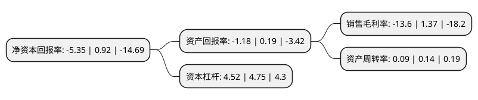

> 本页面由自动化程序生成于 2022年5月20日 01:15
> 内容可能存在错误，如有bug请提交issue至：https://github.com/Eroleice/doc-pi/issues
{.is-warning}

# 上市公司基本情况

## 基本资料

中节能铁汉生态环境股份有限公司（以下简称“节能铁汉”）成立于2001年08月07日，深圳市。于2011年03月29日在深交所创业板上市。

节能铁汉注册资本282,287.176万元，主营业务是生态环境建设工程施工。以下是详细信息：

- 公司名称: 中节能铁汉生态环境股份有限公司
- 股票代码: 300197.SZ
- 所在地: 广东 - 深圳市
- 成立日期: 2001年08月07日
- 注册资本: 282,287.176万元
- 法定代表人: 洪继元
- 主营业务: 主营业务是生态环境建设工程施工
- 公司官网: www.sztechand.com
- 公司介绍: 公司是集生态环境建设工程设计、技术研发、工程施工与养护、苗木种植、生物有机肥生产等产业链于一体的生态环境建设综合公司。公司主营业务涵盖生态环保、生态景观、生态旅游、生态农业四大方向，已形成了集策划、规划、设计、研发、融资、建设、生产、资源循环利用及运营等为一体的完整产业链，能够为客户提供一揽子生态环境建设与运营的整体解决方案。公司是国家级高新技术企业、中国环保产业骨干企业、中国生态修复和环境建设领军企业。公司及其下属子公司拥有水污染防治工程专项甲级、环保工程专业承包壹级、建筑工程施工总承包壹级、风景园林工程设计专项甲级，以及造林工程、旅游规划设计、污染防治工程、建筑工程等多项专业资质。公司曾获评“最佳社会责任上市公司”和“年度十佳景观设计机构”、“中国生态修复与环境工程最具综合实力行业领军品牌”、“创新中国·绿色发展典范企业”、“广东省企业500强”、“深圳知名品牌”等荣誉。

## 股东及高管情况

上市公司第一大股东为中国节能环保集团有限公司，持股706,103,084股，占比25.01%，**疑似为**上市公司实际控制人。

截至2022年03月31日，上市公司的前十大股东中，共有4名自然人股东，5名机构股东，1个产品账户，其中5%以上大股东共有2名。上市公司前十大股东明细如下：

> 未能通过持股比例判定出上市公司实际控制人（持股30%以上）
> 可能存在通过间接持股、联合持股、协议控制等方式拥有实际控制权的主体，具体请参考上市公司定期公告！
{.is-warning}

> 截至2022年03月31日，上市公司前十大股东信息如下：

| 股东名称 | 持股数量（股） | 持股比例 |
| --- | --- | --- |
| 中国节能环保集团有限公司 | 706,103,084 | 25.01% |
| 刘水 | 540,536,360 | 19.15% |
| 深圳市投控资本有限公司-深圳投控共赢股权投资基金合伙企业(有限合伙) | 117,271,500 | 4.15% |
| 深圳市投资控股有限公司 | 113,975,265 | 4.04% |
| 中节能资本控股有限公司 | 74,088,893 | 2.62% |
| 中信建投证券股份有限公司 | 34,414,900 | 1.22% |
| 浙江朱雀投资管理有限公司 | 28,694,510 | 1.02% |
| 邱小贞 | 14,084,600 | 0.5% |
| 张衡 | 11,050,000 | 0.39% |
| 孙军 | 9,276,600 | 0.33% |

## 利润表分析

上市公司2021年总收入为26.62亿元，净利润为-3.63亿元，**未实现盈利**。

## 杜邦分析

> 数据列示周期：2021年 | 2020年 | 2019年
{.is-info}

上市公司的净资产收益率在近一年有所下降，下降幅度为-681.52%，其变化情况分解如下：
- 上市公司的销售毛利率在近一年下降了-1092.7%，可能是生产效率的下降、商品原材料价格上涨或商品价格的下跌所致。
- 上市公司的资产周转率在近一年下降了-35.71%，可能是源自于更慢的销售回款或库存管理效果下降。
- 上市公司的财务杠杆比率在近一年下降了-4.84%，可能是减少负债降低财务费用。

