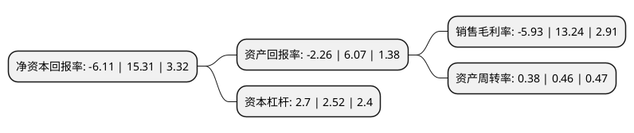

> 本页面由自动化程序生成于 2022年5月20日 01:15
> 内容可能存在错误，如有bug请提交issue至：https://github.com/Eroleice/doc-pi/issues
{.is-warning}

# 上市公司基本情况

## 基本资料

聚光科技(杭州)股份有限公司（以下简称“聚光科技”）成立于2002年01月04日，杭州市。于2011年04月15日在深交所创业板上市。

聚光科技注册资本45,251.74万元，主要产品:工业过程分析系统，实验室分析仪器和环境监测系统及运营维护服务等。主营业务:研发，生产和销售应用于环境监测，工业过程分析和安全监测领域的仪器仪表。以先进的检测，信息化软件技术和产品为核心，为环境保护，工业过程，公共安全和工业安全提供分析测量，信息化和运维服务的综合解决方案。以下是详细信息：

- 公司名称: 聚光科技(杭州)股份有限公司
- 股票代码: 300203.SZ
- 所在地: 浙江 - 杭州市
- 成立日期: 2002年01月04日
- 注册资本: 45,251.74万元
- 法定代表人: 顾海涛
- 主营业务: 主要产品:工业过程分析系统，实验室分析仪器和环境监测系统及运营维护服务等主营业务:研发，生产和销售应用于环境监测，工业过程分析和安全监测领域的仪器仪表以先进的检测，信息化软件技术和产品为核心，为环境保护，工业过程，公共安全和工业安全提供分析测量，信息化和运维服务的综合解决方案
- 公司官网: www.fpi-inc.com
- 公司介绍: 公司主营业务是研发、生产和销售应用于环境监测、工业过程分析和安全监测领域的仪器仪表。以先进的检测、信息化软件技术和产品为核心，为环境保护、工业过程、公共安全和工业安全提供分析测量、信息化和运维服务的综合解决方案。公司主要产品包括：激光在线气体分析系统、紫外在线气体分析系统、环境气体监测系统、环境水质监测系统、数字环保信息系统、近红外光谱分析系统等。公司先后被认定为“国家企业技术中心”、“国家环境保护监测仪器工程技术中心”、“城镇水体污染治理工程技术应用中心”、“环境与安全在线检测技术国家工程实验室”、“国家规划布局内重点软件企业”、“国家创新型企业”、“国家级博士后科研工作站”、“浙江省院士专家工作站”、“浙江省重点企业研究院”等。

## 股东及高管情况

上市公司第一大股东为浙江睿洋科技有限公司，持股85,449,908股，占比18.88%，**疑似为**上市公司实际控制人。

截至2022年04月11日，上市公司的前十大股东中，共有7名机构股东，2个产品账户，1个海外主体，其中5%以上大股东共有6名。上市公司前十大股东明细如下：

> 未能通过持股比例判定出上市公司实际控制人（持股30%以上）
> 可能存在通过间接持股、联合持股、协议控制等方式拥有实际控制权的主体，具体请参考上市公司定期公告！
{.is-warning}

> 截至2022年04月11日，上市公司前十大股东信息如下：

| 股东名称 | 持股数量（股） | 持股比例 |
| --- | --- | --- |
| 浙江睿洋科技有限公司 | 85,449,908 | 18.88% |
| 浙江睿洋科技有限公司 | 85,449,908 | 18.88% |
| 浙江睿洋科技有限公司 | 83,709,408 | 18.4986% |
| 浙江普渡科技有限公司 | 54,511,600 | 12.05% |
| 浙江普渡科技有限公司 | 54,511,600 | 12.05% |
| 浙江普渡科技有限公司 | 54,511,600 | 12.05% |
| ISLAND HONOUR LIMITED | 13,782,300 | 3.05% |
| 工银安盛人寿保险有限公司-传统2 | 9,162,960 | 2.02% |
| 中国农业银行股份有限公司-交银施罗德成长混合型证券投资基金 | 8,793,235 | 1.94% |
| 中国银行股份有限公司-广发医疗保健股票型证券投资基金 | 7,206,800 | 1.59% |

## 利润表分析

上市公司2021年总收入为37.5亿元，净利润为-2.23亿元，**未实现盈利**。

## 杜邦分析

> 数据列示周期：2021年 | 2020年 | 2019年
{.is-info}

上市公司的净资产收益率在近一年有所下降，下降幅度为-139.91%，其变化情况分解如下：
- 上市公司的销售毛利率在近一年下降了-144.79%，可能是生产效率的下降、商品原材料价格上涨或商品价格的下跌所致。
- 上市公司的资产周转率在近一年下降了-17.39%，可能是源自于更慢的销售回款或库存管理效果下降。
- 上市公司的财务杠杆比率在近一年上升了7.14%，可能是增加负债扩大生产规模。

