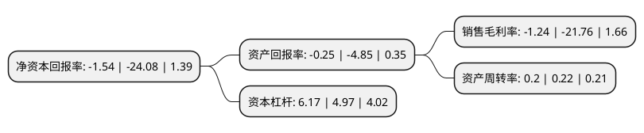

> 本页面由自动化程序生成于 2022年5月20日 01:16
> 内容可能存在错误，如有bug请提交issue至：https://github.com/Eroleice/doc-pi/issues
{.is-warning}

# 上市公司基本情况

## 基本资料

兴源环境科技股份有限公司（以下简称“兴源环境”）成立于1992年07月15日，杭州市。于2011年09月27日在深交所创业板上市。

兴源环境注册资本157,090.731万元，压滤机及其配件的制造和销售以下是详细信息：

- 公司名称: 兴源环境科技股份有限公司
- 股票代码: 300266.SZ
- 所在地: 浙江 - 杭州市
- 成立日期: 1992年07月15日
- 注册资本: 157,090.731万元
- 法定代表人: 李建雄
- 主营业务: 压滤机及其配件的制造和销售
- 公司官网: www.xingyuan.com
- 公司介绍: 公司是国家火炬计划重点高新技术企业，致力于成为“国内领先、国际知名的环境治理综合服务商”，始终坚持既定的发展战略，通过业务和技术的资源整合，不断拓展和巩固环保领域产业链，目前业务范围涵盖环保装备制造、江河湖库疏浚、流域综合治理、市政污水及工业废水治理、农村污水治理、生态环境建设、工业节能、智慧环保、水质监测等。公司是国家知识产权示范企业，建有浙江省省级企业研究院、省级企业技术中心、省级院士专家工作站和省级博士后工作站，承担了多项国家科技项目。公司拥有涵盖工程设计、设施运营、工程承包等一系列的环保资质，包括河湖整治工程专业承包壹级、航道工程专业承包贰级、省环境污染治理工程总承包及专项设计甲级、污染治理设施运行服务能力评价工业废水及生活污水处理一级、环境工程(水污染防治工程)专项设计甲级、市政公用工程施工总承包壹级等在内的多项资质，多项工程获得“中国水利工程优质(大禹)奖”、“中国人居环境范例奖”、“浙江省建设工程钱江杯奖(优质工程)”、“天府杯金奖”等省部级以上工程奖项。

## 股东及高管情况

上市公司第一大股东为新希望投资集团有限公司，持股369,205,729股，占比23.5%，**疑似为**上市公司实际控制人。

截至2022年03月31日，上市公司的前十大股东中，共有4名自然人股东，2名机构股东，4个产品账户，其中5%以上大股东共有2名。上市公司前十大股东明细如下：

> 未能通过持股比例判定出上市公司实际控制人（持股30%以上）
> 可能存在通过间接持股、联合持股、协议控制等方式拥有实际控制权的主体，具体请参考上市公司定期公告！
{.is-warning}

> 截至2022年03月31日，上市公司前十大股东信息如下：

| 股东名称 | 持股数量（股） | 持股比例 |
| --- | --- | --- |
| 新希望投资集团有限公司 | 369,205,729 | 23.5% |
| 兴源控股集团有限公司 | 158,005,112 | 10.06% |
| 百年人寿保险股份有限公司-万能保险产品 | 17,448,160 | 1.11% |
| 雍有红 | 13,000,000 | 0.83% |
| 刘好芬 | 11,724,745 | 0.75% |
| 百年人寿保险股份有限公司-分红保险产品 | 9,585,150 | 0.61% |
| 盛世金泉(天津)股权投资基金管理有限公司 | 8,043,700 | 0.51% |
| 韩肖芳 | 7,870,000 | 0.5% |
| 百年人寿保险股份有限公司-传统保险产品 | 7,241,928 | 0.46% |
| 张生良 | 6,372,807 | 0.41% |

## 利润表分析

上市公司2021年总收入为23.36亿元，净利润为-0.29亿元，**未实现盈利**。

## 杜邦分析

> 数据列示周期：2021年 | 2020年 | 2019年
{.is-info}

上市公司的净资产收益率在近一年有所下降，下降幅度为-93.6%，其变化情况分解如下：
- 上市公司的销售毛利率在近一年下降了-94.3%，可能是生产效率的下降、商品原材料价格上涨或商品价格的下跌所致。
- 上市公司的资产周转率在近一年下降了-9.09%，可能是源自于更慢的销售回款或库存管理效果下降。
- 上市公司的财务杠杆比率在近一年上升了24.14%，可能是增加负债扩大生产规模。

