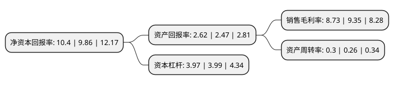

> 本页面由自动化程序生成于 2022年5月20日 01:17
> 内容可能存在错误，如有bug请提交issue至：https://github.com/Eroleice/doc-pi/issues
{.is-warning}

# 上市公司基本情况

## 基本资料

中节能国祯环保科技股份有限公司（以下简称“节能国祯”）成立于1997年02月25日，合肥市。于2014年08月01日在深交所创业板上市。

节能国祯注册资本69,896.19万元，主营业务:生活污水处理投资运营业务，环境工程EPC业务，污水处理设备生产销售业务。以下是详细信息：

- 公司名称: 中节能国祯环保科技股份有限公司
- 股票代码: 300388.SZ
- 所在地: 安徽 - 合肥市
- 成立日期: 1997年02月25日
- 注册资本: 69,896.19万元
- 法定代表人: 王堤
- 主营业务: 主营业务:生活污水处理投资运营业务，环境工程EPC业务，污水处理设备生产销售业务
- 公司官网: www.gzep.com.cn
- 公司介绍: 公司是市政污水处理领域较早提供“一站式六维服务”的专业公司，在市政污水领域市场影响力逐步提升的同时，公司积极拓展其他治理领域，逐渐形成了水环境治理综合服务、工业废水治理、小城镇环境治理三大业务领域。公司已建立和拥有完备的产业链优势，为客户提供环保领域的项目投资、科技研发、设计建造、设备制造与集成及项目运营服务。近年来，公司着力布局水环境综合治理、市政污水、村镇水环境综合整治及工业水系统综合服务。公司多次入选“中国水业十大影响力企业”及“中国水业优秀投资价值上市公司”殊荣，2016年入选英国传媒分析有限公司旗下的GWI(Global Water Intelligence)公司发布的“全球Top40水务公司”。公司持有环境工程(水污染防治工程)专项设计甲级证书、环保工程专业承包壹级资质、机电工程施工总承包壹级资质、工程设计市政行业排水工程乙级资质、生活污水乙级运营证书、工程咨询单位乙级资格证书。公司将秉承“致力民族水务，改善生态环境”的理念，心系地球、为人类创造清洁美丽、良好和谐的生活环境。

## 股东及高管情况

上市公司第一大股东为安徽国祯集团股份有限公司，持股116,988,133股，占比16.74%，**疑似为**上市公司实际控制人。

截至2022年03月31日，上市公司的前十大股东中，共有3名自然人股东，6名机构股东，1个产品账户，其中5%以上大股东共有5名。上市公司前十大股东明细如下：

> 未能通过持股比例判定出上市公司实际控制人（持股30%以上）
> 可能存在通过间接持股、联合持股、协议控制等方式拥有实际控制权的主体，具体请参考上市公司定期公告！
{.is-warning}

> 截至2022年03月31日，上市公司前十大股东信息如下：

| 股东名称 | 持股数量（股） | 持股比例 |
| --- | --- | --- |
| 安徽国祯集团股份有限公司 | 116,988,133 | 16.74% |
| 中国节能环保集团有限公司 | 100,588,051 | 14.39% |
| 安徽省铁路发展基金股份有限公司 | 70,985,625 | 10.16% |
| 中节能资本控股有限公司 | 58,275,058 | 8.34% |
| 三峡资本控股有限责任公司 | 40,130,343 | 5.74% |
| 长江生态环保集团有限公司 | 32,910,114 | 4.71% |
| 合肥高新建设投资集团公司 | 6,077,687 | 0.87% |
| 邱利华 | 3,418,916 | 0.49% |
| 陶文涛 | 3,105,600 | 0.44% |
| 潘东丽 | 2,253,700 | 0.32% |

## 利润表分析

上市公司2021年总收入为44.76亿元，净利润为3.9亿元，实现盈利。

## 杜邦分析

> 数据列示周期：2021年 | 2020年 | 2019年
{.is-info}

上市公司的净资产收益率在近一年有所上升，上升幅度为5.48%，其变化情况分解如下：
- 上市公司的销售毛利率在近一年下降了-6.63%，可能是生产效率的下降、商品原材料价格上涨或商品价格的下跌所致。
- 上市公司的资产周转率在近一年上升了15.38%，可能是源自于更快的销售回款或库存管理效果提升。
- 上市公司的财务杠杆比率在近一年下降了-0.5%，可能是减少负债降低财务费用。

