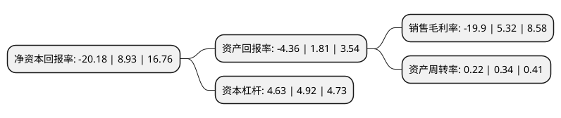

> 本页面由自动化程序生成于 2022年5月20日 01:17
> 内容可能存在错误，如有bug请提交issue至：https://github.com/Eroleice/doc-pi/issues
{.is-warning}

# 上市公司基本情况

## 基本资料

广西博世科环保科技股份有限公司（以下简称“博世科”）成立于1999年04月13日，南宁市。于2015年02月17日在深交所创业板上市。

博世科注册资本50,487.246万元，主营业务;致力于为客户提供系统方案设计，系统集成，关键设备设计制造，工程施工，项目管理及其他技术服务等，核心业务主要包括高浓度有机废水厌氧处理，难降解废水深度处理，重金属污染治理和制浆造纸清洁漂白二氧化氯制备等。以下是详细信息：

- 公司名称: 广西博世科环保科技股份有限公司
- 股票代码: 300422.SZ
- 所在地: 广西 - 南宁市
- 成立日期: 1999年04月13日
- 注册资本: 50,487.246万元
- 法定代表人: 张雪球
- 主营业务: 主营业务;致力于为客户提供系统方案设计，系统集成，关键设备设计制造，工程施工，项目管理及其他技术服务等，核心业务主要包括高浓度有机废水厌氧处理，难降解废水深度处理，重金属污染治理和制浆造纸清洁漂白二氧化氯制备等
- 公司官网: www.bossco.cc
- 公司介绍: 公司是国家科技部火炬计划重点高新技术企业、中国环境保护产业协会骨干企业及全国环保优秀品牌企业，是一家拥有持续创新能力、自主核心技术、国际化战略、成熟全产业链的综合环境服务提供商。公司以构建绿色生态环境为己任，环境服务业与环境实体业协同发展，服务范围覆盖咨询、设计、环评、检测、研究开发、设备制造、工程建设、设施运营、投融资一体化等环保全产业链。公司从事的核心业务包括以水污染治理、二氧化氯制备及清洁化生产、供水工程、土壤修复、固体废弃物处理等为主的综合环境治理业务；以设计、咨询、环境评价、环境检测、环保管家等为主的环保专业技术服务；以及环保运营业务等。公司设有“博士后科研工作站”；“院士专家企业工作站”，被授予省级“创新试点企业”，“环保设备研发人才小高地”等称号。

## 股东及高管情况

上市公司第一大股东为王双飞，持股44,991,970股，占比8.91%，**疑似为**上市公司实际控制人。

截至2022年03月31日，上市公司的前十大股东中，共有8名自然人股东，2名机构股东，其中5%以上大股东共有1名。上市公司前十大股东明细如下：

> 未能通过持股比例判定出上市公司实际控制人（持股30%以上）
> 可能存在通过间接持股、联合持股、协议控制等方式拥有实际控制权的主体，具体请参考上市公司定期公告！
{.is-warning}

> 上市公司第一大股东持股不超过10%，请检查是否存在公司控制权风险！
{.is-danger}

> 截至2022年03月31日，上市公司前十大股东信息如下：

| 股东名称 | 持股数量（股） | 持股比例 |
| --- | --- | --- |
| 王双飞 | 44,991,970 | 8.91% |
| 杨崎峰 | 9,286,218 | 1.84% |
| 宋海农 | 9,286,218 | 1.84% |
| 许开绍 | 9,286,218 | 1.84% |
| 西藏均讯信息科技有限责任公司 | 7,600,751 | 1.51% |
| 广西环保产业投资集团有限公司 | 5,477,595 | 1.08% |
| 陈琪 | 2,933,602 | 0.58% |
| 黄海师 | 2,735,000 | 0.54% |
| 高勇 | 2,051,800 | 0.41% |
| 陈竽伶 | 1,501,040 | 0.3% |

## 利润表分析

上市公司2021年总收入为26.56亿元，净利润为-5.29亿元，**未实现盈利**。

## 杜邦分析

> 数据列示周期：2021年 | 2020年 | 2019年
{.is-info}

上市公司的净资产收益率在近一年有所下降，下降幅度为-325.98%，其变化情况分解如下：
- 上市公司的销售毛利率在近一年下降了-474.06%，可能是生产效率的下降、商品原材料价格上涨或商品价格的下跌所致。
- 上市公司的资产周转率在近一年下降了-35.29%，可能是源自于更慢的销售回款或库存管理效果下降。
- 上市公司的财务杠杆比率在近一年下降了-5.89%，可能是减少负债降低财务费用。

