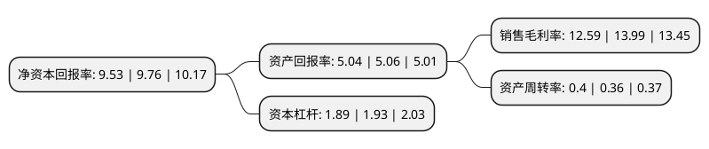

> 本页面由自动化程序生成于 2022年5月20日 01:17
> 内容可能存在错误，如有bug请提交issue至：https://github.com/Eroleice/doc-pi/issues
{.is-warning}

# 上市公司基本情况

## 基本资料

中建环能科技股份有限公司（以下简称“中建环能”）成立于2002年05月24日，成都市。于2015年02月16日在深交所创业板上市。

中建环能注册资本67,570.879万元，主营业务为环境技术产品与解决方案提供商以下是详细信息：

- 公司名称: 中建环能科技股份有限公司
- 股票代码: 300425.SZ
- 所在地: 四川 - 成都市
- 成立日期: 2002年05月24日
- 注册资本: 67,570.879万元
- 法定代表人: 佟庆远
- 主营业务: 主营业务为环境技术产品与解决方案提供商
- 公司官网: www.scimee.com
- 公司介绍: 公司自创立以来始终以提供优质的水环境服务，改善水环境质量为己任，致力于成为世界先进的环境技术产品与解决方案提供商。公司秉承上善治水之理念，坚持研产销一体化发展。在市政、流域及村镇水环境治理，钢铁、煤炭等工业水处理，工业过程及固废处理处置等领域，为客户提供感动人心的技术产品和服务。立足以西南、华北、华东、华南、华中为核心的区域市场布局，快速响应客户需求。

## 股东及高管情况

上市公司第一大股东为北京中建启明企业管理有限公司，持股182,809,171股，占比27.05%，**疑似为**上市公司实际控制人。

截至2022年03月31日，上市公司的前十大股东中，共有7名自然人股东，3名机构股东，其中5%以上大股东共有2名。上市公司前十大股东明细如下：

> 未能通过持股比例判定出上市公司实际控制人（持股30%以上）
> 可能存在通过间接持股、联合持股、协议控制等方式拥有实际控制权的主体，具体请参考上市公司定期公告！
{.is-warning}

> 截至2022年03月31日，上市公司前十大股东信息如下：

| 股东名称 | 持股数量（股） | 持股比例 |
| --- | --- | --- |
| 北京中建启明企业管理有限公司 | 182,809,171 | 27.05% |
| 成都环能德美投资有限公司 | 83,668,832 | 12.38% |
| 倪明君 | 17,220,967 | 2.55% |
| 周勉 | 11,730,903 | 1.74% |
| 汤志钢 | 9,990,038 | 1.48% |
| 广东宝新资产管理有限公司 | 9,445,370 | 1.4% |
| 潘涛 | 8,680,000 | 1.28% |
| 李喻萍 | 7,820,602 | 1.16% |
| 施耿明 | 5,242,043 | 0.78% |
| 吴忠燕 | 5,210,490 | 0.77% |

## 利润表分析

上市公司2021年总收入为14.61亿元，净利润为1.84亿元，实现盈利。

## 杜邦分析

> 数据列示周期：2021年 | 2020年 | 2019年
{.is-info}

上市公司的净资产收益率在近一年有所下降，下降幅度为-2.36%，其变化情况分解如下：
- 上市公司的销售毛利率在近一年下降了-10.01%，可能是生产效率的下降、商品原材料价格上涨或商品价格的下跌所致。
- 上市公司的资产周转率在近一年上升了11.11%，可能是源自于更快的销售回款或库存管理效果提升。
- 上市公司的财务杠杆比率在近一年下降了-2.07%，可能是减少负债降低财务费用。

