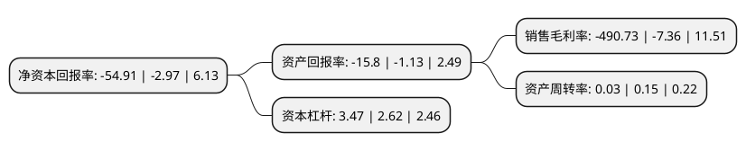

> 本页面由自动化程序生成于 2022年5月20日 01:18
> 内容可能存在错误，如有bug请提交issue至：https://github.com/Eroleice/doc-pi/issues
{.is-warning}

# 上市公司基本情况

## 基本资料

美尚生态景观股份有限公司（以下简称“*ST美尚”）成立于2001年12月28日，无锡市。于2015年12月22日在深交所创业板上市。

*ST美尚注册资本67,427.949万元，主营业务为生态景观建设，目前主要从事生态景观工程施工，包括生态修复与重构和园林景观两大类别。以下是详细信息：

- 公司名称: 美尚生态景观股份有限公司
- 股票代码: 300495.SZ
- 所在地: 江苏 - 无锡市
- 成立日期: 2001年12月28日
- 注册资本: 67,427.949万元
- 法定代表人: 王迎燕
- 主营业务: 主营业务为生态景观建设，目前主要从事生态景观工程施工，包括生态修复与重构和园林景观两大类别
- 公司官网: www.misho.com.cn
- 公司介绍: 公司主营业务涵盖生态修复、生态景观、生态旅游三大方向以及资源循环利用、农产品开发等领域。目前已形成集策划、规划、设计、研发、融资、建设、生产以及旅游运营为一体的完整产业链，能够为客户提供生态环境建设与运营的整体解决方案，并且具有极强的金融创新能力。公司拥有风景园林工程设计专项甲级、国家城市园林绿化企业一级资质、市政公用工程施工总承包二级、古建筑工程专业承包二级资质，是全国少数拥有风景园林设计和施工“双甲”资质的企业。公司以“大美无言·至尚天成”的理念修复、重构自然生态环境，并通过技术研发与工程创新，跻身国家高新技术企业之列，成为中国生态修复和环境建设领军企业。美尚生态以“建设美丽中国”为己任，致力于推动山水林田湖草的系统治理，创建和谐人居环境，力求为全人类的生态安全做出贡献。

## 股东及高管情况

上市公司第一大股东为王迎燕，持股201,176,914股，占比29.84%，**疑似为**上市公司实际控制人。

截至2022年03月31日，上市公司的前十大股东中，共有9名自然人股东，1名机构股东，其中5%以上大股东共有1名。上市公司前十大股东明细如下：

> 未能通过持股比例判定出上市公司实际控制人（持股30%以上）
> 可能存在通过间接持股、联合持股、协议控制等方式拥有实际控制权的主体，具体请参考上市公司定期公告！
{.is-warning}

> 截至2022年03月31日，上市公司前十大股东信息如下：

| 股东名称 | 持股数量（股） | 持股比例 |
| --- | --- | --- |
| 王迎燕 | 201,176,914 | 29.84% |
| 无锡文旅一期产业投资中心(有限合伙) | 26,495,726 | 3.93% |
| 徐晶 | 15,338,446 | 2.27% |
| 闫常樱 | 9,520,000 | 1.41% |
| 杜月姣 | 8,732,900 | 1.3% |
| 张祥林 | 6,820,500 | 1.01% |
| 杨桦 | 6,700,000 | 0.99% |
| 陆兵 | 3,633,544 | 0.54% |
| 吕日旭 | 2,920,300 | 0.43% |
| 王齐玉 | 2,330,000 | 0.35% |

## 利润表分析

上市公司2021年总收入为2.13亿元，净利润为-10.5亿元，**未实现盈利**。

## 杜邦分析

> 数据列示周期：2021年 | 2020年 | 2019年
{.is-info}

上市公司的净资产收益率在近一年有所上升，上升幅度为1748.82%，其变化情况分解如下：
- 上市公司的销售毛利率在近一年上升了6567.53%，可能是生产效率的提升、商品原材料价格下跌或商品价格的上涨所致。
- 上市公司的资产周转率在近一年下降了-80%，可能是源自于更慢的销售回款或库存管理效果下降。
- 上市公司的财务杠杆比率在近一年上升了32.44%，可能是增加负债扩大生产规模。

