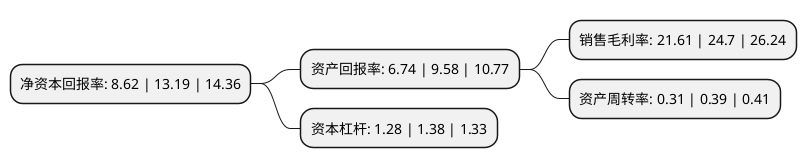

> 本页面由自动化程序生成于 2022年5月20日 01:19
> 内容可能存在错误，如有bug请提交issue至：https://github.com/Eroleice/doc-pi/issues
{.is-warning}

# 上市公司基本情况

## 基本资料

河南百川畅银环保能源股份有限公司（以下简称“百川畅银”）成立于2009年04月02日，郑州市。于2021年05月25日在深交所创业板上市。

百川畅银注册资本16,043.447万元，垃圾填埋气发电以下是详细信息：

- 公司名称: 河南百川畅银环保能源股份有限公司
- 股票代码: 300614.SZ
- 所在地: 河南 - 郑州市
- 成立日期: 2009年04月02日
- 注册资本: 16,043.447万元
- 法定代表人: 陈功海
- 主营业务: 垃圾填埋气发电
- 公司官网: www.bccynewpower.com
- 公司介绍: 公司是国内第三方提供垃圾填埋气治理的主要服务商之一,主营业务为垃圾填埋气治理项目的投资、建设与运营，公司奉行“倡导低碳经济，贡献清洁能源”的宗旨，公司在垃圾填埋气治理方面具有深厚的技术积累和大量成功经验。公司通过外部引进与自主创新相结合，形成了多项核心技术，拥有31项专利，并参与制订了《生活垃圾填埋场填埋气体收集处理及利用工程技术规范》的行业标准；并已成功在河南、广东、湖北、安徽、广西、浙江等20多个省份开发了90多个填埋气发电项目，取得了良好的社会示范效应。公司已通过ISO9001、ISO14001、ISO18001的认证。公司荣获河南省节能减排科技创新示范企业、国家973计划课题《垃圾填埋场沼气收集系统优化调控技术》示范基地、国家863课题《垃圾填埋场污染物远程在线监测系统》研究应用示范基地。

## 股东及高管情况

上市公司第一大股东为上海百川畅银实业有限公司，持股56,226,000股，占比35.05%，为上市公司实际控制人。

截至2022年03月31日，上市公司的前十大股东中，共有2名自然人股东，7名机构股东，1个产品账户，其中5%以上大股东共有2名。上市公司前十大股东明细如下：

> 截至2022年03月31日，上市公司前十大股东信息如下：

| 股东名称 | 持股数量（股） | 持股比例 |
| --- | --- | --- |
| 上海百川畅银实业有限公司 | 56,226,000 | 35.05% |
| 北京红杉铭德股权投资中心(有限合伙) | 9,024,353 | 5.62% |
| 光控郑州国投新产业投资基金合伙企业(有限合伙) | 7,400,000 | 4.61% |
| 郑州知了创业企业管理咨询有限公司 | 6,615,638 | 4.12% |
| 李娜 | 5,956,766 | 3.71% |
| 上海建新创业投资中心(有限合伙) | 4,093,781 | 2.55% |
| 钟永利 | 3,658,858 | 2.28% |
| 上海澎望投资管理中心(有限合伙) | 2,839,609 | 1.77% |
| 广州力鼎恒益投资有限合伙企业(有限合伙) | 2,046,891 | 1.28% |
| 宿迁钟山天翊力鼎创业投资中心(有限合伙) | 2,046,891 | 1.28% |

## 利润表分析

上市公司2021年总收入为4.99亿元，净利润为1.07亿元，实现盈利。

## 杜邦分析

> 数据列示周期：2021年 | 2020年 | 2019年
{.is-info}

上市公司的净资产收益率在近一年有所下降，下降幅度为-34.65%，其变化情况分解如下：
- 上市公司的销售毛利率在近一年下降了-12.51%，可能是生产效率的下降、商品原材料价格上涨或商品价格的下跌所致。
- 上市公司的资产周转率在近一年下降了-20.51%，可能是源自于更慢的销售回款或库存管理效果下降。
- 上市公司的财务杠杆比率在近一年下降了-7.25%，可能是减少负债降低财务费用。

