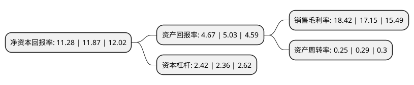

> 本页面由自动化程序生成于 2022年5月20日 01:19
> 内容可能存在错误，如有bug请提交issue至：https://github.com/Eroleice/doc-pi/issues
{.is-warning}

# 上市公司基本情况

## 基本资料

安徽中环环保科技股份有限公司（以下简称“中环环保”）成立于2011年12月14日，合肥市。于2017年08月21日在深交所创业板上市。

中环环保注册资本42,375.044万元，主营业务:主要从事污水处理业务及环境工程业务。主要产品:主要提供污水处理相关环境工程设计，工程施工，设备采购及集成，安装调试，试运行等阶段的服务。以下是详细信息：

- 公司名称: 安徽中环环保科技股份有限公司
- 股票代码: 300692.SZ
- 所在地: 安徽 - 合肥市
- 成立日期: 2011年12月14日
- 注册资本: 42,375.044万元
- 法定代表人: 张伯中
- 主营业务: 主营业务:主要从事污水处理业务及环境工程业务主要产品:主要提供污水处理相关环境工程设计，工程施工，设备采购及集成，安装调试，试运行等阶段的服务
- 公司官网: www.ahzhhb.cn
- 公司介绍: 公司主要从事污水处理业务和环境工程业务，可提供包括污水处理相关技术工艺和产品的研究开发、设计咨询、工程建设、投资与运营等全系统服务。公司污水处理业务按进水性质分为城市污水处理业务和工业废水处理业务；按照运营方式分为投资运营业务和委托运营业务。环境工程业务以工业废水治理工程为主，致力于攻克高难度工业废水。目前，公司已在医疗废水、高浓度有机废水等领域均取得了较好的成果。未来公司将以污水处理业务为主要驱动力，带动环境工程业务全方位发展，并向水生态修复等相关业务延伸，力争将公司打造成为全国性整体解决方案综合服务商。公司技术力量雄厚，拥有多名硕士、高级工程师等环保专业人才队伍，并取得环保工程设计、施工及运营等多顶环保资质，掌握了多项核心技术。公司多次荣获安徽省环境保护产业协会颁发的包括“安徽省环保产业优秀企业”、“安徽省环保产业骨干企业”、“安徽省十佳环境污染治理企业”等各项荣誉称号。

## 股东及高管情况

上市公司第一大股东为张伯中，持股65,565,434股，占比15.47%，**疑似为**上市公司实际控制人。

截至2022年03月31日，上市公司的前十大股东中，共有1名自然人股东，3名机构股东，6个产品账户，其中5%以上大股东共有2名。上市公司前十大股东明细如下：

> 未能通过持股比例判定出上市公司实际控制人（持股30%以上）
> 可能存在通过间接持股、联合持股、协议控制等方式拥有实际控制权的主体，具体请参考上市公司定期公告！
{.is-warning}

> 截至2022年03月31日，上市公司前十大股东信息如下：

| 股东名称 | 持股数量（股） | 持股比例 |
| --- | --- | --- |
| 张伯中 | 65,565,434 | 15.47% |
| 安徽中辰投资控股有限公司 | 54,150,000 | 12.78% |
| 安徽高新金通安益股权投资基金(有限合伙) | 17,198,300 | 4.06% |
| 苏州九邦环保科技有限公司 | 12,669,766 | 2.99% |
| 深圳市平石资产管理有限公司-平石T5对冲基金 | 11,069,970 | 2.61% |
| 黄山高新毅达新安江专精特新创业投资基金(有限合伙) | 8,363,902 | 1.97% |
| 安徽明泽投资管理有限公司-明泽环保优选私募证券投资基金壹号 | 6,080,000 | 1.43% |
| 安徽明泽投资管理有限公司-明泽环保优选私募证券投资基金贰号 | 6,080,000 | 1.43% |
| 上海漓沁资产管理合伙企业(有限合伙) | 3,769,560 | 0.89% |
| 华安证券-浙商银行-华安证券臻赢2号混合型集合资产管理计划 | 1,861,685 | 0.44% |

## 利润表分析

上市公司2021年总收入为11.65亿元，净利润为2.14亿元，实现盈利。

## 杜邦分析

> 数据列示周期：2021年 | 2020年 | 2019年
{.is-info}

上市公司的净资产收益率在近一年有所下降，下降幅度为-4.97%，其变化情况分解如下：
- 上市公司的销售毛利率在近一年上升了7.41%，可能是生产效率的提升、商品原材料价格下跌或商品价格的上涨所致。
- 上市公司的资产周转率在近一年下降了-13.79%，可能是源自于更慢的销售回款或库存管理效果下降。
- 上市公司的财务杠杆比率在近一年上升了2.54%，可能是增加负债扩大生产规模。

