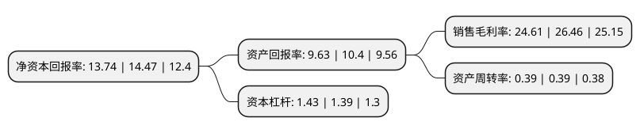

> 本页面由自动化程序生成于 2022年5月20日 01:20
> 内容可能存在错误，如有bug请提交issue至：https://github.com/Eroleice/doc-pi/issues
{.is-warning}

# 上市公司基本情况

## 基本资料

倍杰特集团股份有限公司（以下简称“倍杰特”）成立于2004年10月12日，北京市。于2021年08月04日在深交所创业板上市。

倍杰特注册资本40,876.366万元，基于工业联动市政污水零排放战略，致力于依靠自主研发的技术能力成为国内领先的水处理综合服务商，在业内开创了工业与市政联动治理的新模式，以“用得起的零排放”技术实现了污水的资源化及循环利用。以下是详细信息：

- 公司名称: 倍杰特集团股份有限公司
- 股票代码: 300774.SZ
- 所在地: 北京 - 北京市
- 成立日期: 2004年10月12日
- 注册资本: 40,876.366万元
- 法定代表人: 权秋红
- 主营业务: 基于工业联动市政污水零排放战略，致力于依靠自主研发的技术能力成为国内领先的水处理综合服务商，在业内开创了工业与市政联动治理的新模式，以“用得起的零排放”技术实现了污水的资源化及循环利用
- 公司官网: www.bgtwater.com
- 公司介绍: 公司是集水处理系统设计、设备制造、安装调试及技术服务于一体的专业化公司，拥有行业内先进的标准化生产基地，生产各种规格与型号的水处理设备及系统，承担各类环保EPC、BOT、DBO和专业运营服务项目。公司自成立以来，累计服务客户数百家，并累积了包括中国石化、中沙石化、中天合创、中煤集团、中海油、神华集团、大唐集团、国家电投、中铝、延长石油、威立雅、农夫山泉等众多高端客户资源，公司目前为国内工业领域领先的水处理整体解决方案提供商。倍杰特参与了包括大型煤化工分盐结晶项目“中煤远兴鄂尔多斯纳林河工业园区综合水处理二期工程”、“中天合创项目”中的“污水处理及回用项目、化学水处理及凝结水回用项目”和“实现高盐水双膜回用率92%”的宁能化项目在内的多个业内标志性项目的建设。近年来，凭借优异的市场表现和客户评价，公司先后获得新华网颁发的“2015中国能源绿色环保杰出企业”和“最佳绿色环保奖”、中国绿色产业峰会颁发的“中国绿色环保产业品牌企业”等多项荣誉。

## 股东及高管情况

上市公司第一大股东为权秋红，持股177,338,104股，占比43.38%，为上市公司实际控制人。

截至2022年03月31日，上市公司的前十大股东中，共有3名自然人股东，6名机构股东，1个产品账户，其中5%以上大股东共有3名。上市公司前十大股东明细如下：

> 截至2022年03月31日，上市公司前十大股东信息如下：

| 股东名称 | 持股数量（股） | 持股比例 |
| --- | --- | --- |
| 权秋红 | 177,338,104 | 43.38% |
| 张建飞 | 61,035,422 | 14.93% |
| 权思影 | 46,639,109 | 11.41% |
| 千牛环保(宁夏)股权投资合伙企业(有限合伙) | 19,277,978 | 4.72% |
| 天津仁爱智恒企业管理有限公司 | 18,050,500 | 4.42% |
| 国投创合(杭州)创业投资管理有限公司-杭州创合精选创业投资合伙企业(有限合伙) | 7,220,200 | 1.77% |
| 武汉光谷人才创新投资合伙企业(有限合伙) | 6,642,600 | 1.63% |
| 广东广垦太证股权投资基金管理有限公司-北京广垦太证投资中心(有限合伙) | 3,898,900 | 0.95% |
| 北京丰图投资有限责任公司-宁波丰图汇锦投资中心(有限合伙) | 3,610,100 | 0.88% |
| 天津润达国际贸易有限公司 | 3,610,100 | 0.88% |

## 利润表分析

上市公司2021年总收入为7.12亿元，净利润为1.75亿元，实现盈利。

## 杜邦分析

> 数据列示周期：2021年 | 2020年 | 2019年
{.is-info}

上市公司的净资产收益率在近一年有所下降，下降幅度为-5.04%，其变化情况分解如下：
- 上市公司的销售毛利率在近一年下降了-6.99%，可能是生产效率的下降、商品原材料价格上涨或商品价格的下跌所致。
- 上市公司的资产周转率在近一年下降了0%，可能是源自于更慢的销售回款或库存管理效果下降。
- 上市公司的财务杠杆比率在近一年上升了2.88%，可能是增加负债扩大生产规模。

