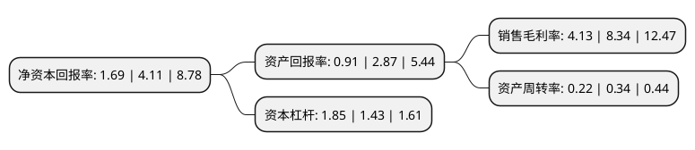

> 本页面由自动化程序生成于 2022年5月20日 01:20
> 内容可能存在错误，如有bug请提交issue至：https://github.com/Eroleice/doc-pi/issues
{.is-warning}

# 上市公司基本情况

## 基本资料

青岛惠城环保科技股份有限公司（以下简称“惠城环保”）成立于2006年02月27日，青岛市。于2019年05月22日在深交所创业板上市。

惠城环保注册资本10,000万元，为炼油企业提供废催化剂处理处置服务，研发，生产，销售FCC催化剂(新剂)，复活催化剂，再生平衡剂等资源化综合利用产品。以下是详细信息：

- 公司名称: 青岛惠城环保科技股份有限公司
- 股票代码: 300779.SZ
- 所在地: 山东 - 青岛市
- 成立日期: 2006年02月27日
- 注册资本: 10,000万元
- 法定代表人: 张新功
- 主营业务: 为炼油企业提供废催化剂处理处置服务，研发，生产，销售FCC催化剂(新剂)，复活催化剂，再生平衡剂等资源化综合利用产品
- 公司官网: www.hcpect.com
- 公司介绍: 公司是一家为炼油企业提供废催化剂处理处置的高新技术企业，公司始终坚持以有效彻底的资源综合利用方式处理处置石油化工行业危险废物，从而实现致力绿色环保、引领循环经济的发展目标。公司通过自主研发的核心技术，实现对废催化剂的循环利用，变废为宝，物尽其用。相对于其他危废处置企业传统的填埋处置方式，公司依据废催化剂的污染程度、结构破坏程度等指标鉴别分类，经过物理分离、化学处理等过程，对废催化剂进行完全资源化处置，不会对环境造成二次污染。发行人对废催化剂的资源化处理处置方式具有循环化、资源化、清洁化的显著特点。在行业内自创了“废催化剂处理处置+废催化剂资源化生产再利用+资源化催化剂销售”一条龙服务业务模式，目前已成为国内极少数有能力为客户提供专业定制化催化剂产品和废催化剂处理处置的资源化循环模式全产业链企业。

## 股东及高管情况

上市公司第一大股东为张新功，持股17,060,250股，占比17.06%，**疑似为**上市公司实际控制人。

截至2022年03月31日，上市公司的前十大股东中，共有7名自然人股东，3名机构股东，其中5%以上大股东共有3名。上市公司前十大股东明细如下：

> 未能通过持股比例判定出上市公司实际控制人（持股30%以上）
> 可能存在通过间接持股、联合持股、协议控制等方式拥有实际控制权的主体，具体请参考上市公司定期公告！
{.is-warning}

> 截至2022年03月31日，上市公司前十大股东信息如下：

| 股东名称 | 持股数量（股） | 持股比例 |
| --- | --- | --- |
| 张新功 | 17,060,250 | 17.06% |
| 道博嘉美有限公司 | 10,907,450 | 10.91% |
| 青岛惠城信德投资有限公司 | 10,828,500 | 10.83% |
| 山东省高新技术创业投资有限公司 | 2,725,000 | 2.72% |
| 徐贵山 | 1,822,921 | 1.82% |
| 刘胜贵 | 1,138,300 | 1.14% |
| 李国赞 | 1,131,950 | 1.13% |
| 钟江波 | 1,079,000 | 1.08% |
| 汪攸 | 875,800 | 0.88% |
| 吕绪尧 | 832,950 | 0.83% |

## 利润表分析

上市公司2021年总收入为2.84亿元，净利润为0.11亿元，实现盈利。

## 杜邦分析

> 数据列示周期：2021年 | 2020年 | 2019年
{.is-info}

上市公司的净资产收益率在近一年有所下降，下降幅度为-58.88%，其变化情况分解如下：
- 上市公司的销售毛利率在近一年下降了-50.48%，可能是生产效率的下降、商品原材料价格上涨或商品价格的下跌所致。
- 上市公司的资产周转率在近一年下降了-35.29%，可能是源自于更慢的销售回款或库存管理效果下降。
- 上市公司的财务杠杆比率在近一年上升了29.37%，可能是增加负债扩大生产规模。

