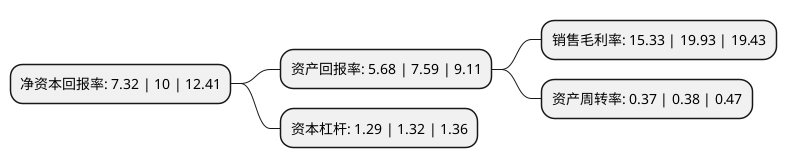

> 本页面由自动化程序生成于 2022年5月20日 01:20
> 内容可能存在错误，如有bug请提交issue至：https://github.com/Eroleice/doc-pi/issues
{.is-warning}

# 上市公司基本情况

## 基本资料

青岛国林环保科技股份有限公司（以下简称“国林科技”）成立于1994年12月13日，青岛市。于2019年07月23日在深交所创业板上市。

国林科技注册资本10,223.104万元，主营业务:专业从事臭氧产生机理研究，臭氧设备设计与制造，臭氧应用工程方案设计与臭氧系统设备安装，调试，运行及维护等业务。公司主要产品为臭氧系统设备。以下是详细信息：

- 公司名称: 青岛国林环保科技股份有限公司
- 股票代码: 300786.SZ
- 所在地: 山东 - 青岛市
- 成立日期: 1994年12月13日
- 注册资本: 10,223.104万元
- 法定代表人: 丁香鹏
- 主营业务: 主营业务:专业从事臭氧产生机理研究，臭氧设备设计与制造，臭氧应用工程方案设计与臭氧系统设备安装，调试，运行及维护等业务公司主要产品为臭氧系统设备
- 公司官网: www.china-guolin.com
- 公司介绍: 公司专业从事臭氧产生机理研究、臭氧设备设计与制造、臭氧应用工程方案设计与臭氧系统设备安装、调试、运行及维护，是国内臭氧行业的代表企业，臭氧系统设备制造技术居国内同行业领先水平，2004年，公司研制的国内首台单机产量最大的“20kg/h大型臭氧发生器”通过建设部科技成果鉴定，填补了我国大型臭氧发生器的制造空白，该产品各项性能指标均达到国际先进水平，被列为“2005年国家火炬计划项目”；2012年6月，公司“大型(120kg/h)臭氧发生器的研制”项目通过住建部科技发展促进中心科技成果评估，是国内进行评估的首个臭氧产量突破120kg/h的项目，填补了国内空白，性能指标达到国际先进水平，公司产品的竞争水平继续保持在行业前列。

## 股东及高管情况

上市公司第一大股东为丁香鹏，持股29,369,600股，占比28.73%，**疑似为**上市公司实际控制人。

截至2022年03月31日，上市公司的前十大股东中，共有7名自然人股东，1名机构股东，2个产品账户，其中5%以上大股东共有1名。上市公司前十大股东明细如下：

> 未能通过持股比例判定出上市公司实际控制人（持股30%以上）
> 可能存在通过间接持股、联合持股、协议控制等方式拥有实际控制权的主体，具体请参考上市公司定期公告！
{.is-warning}

> 截至2022年03月31日，上市公司前十大股东信息如下：

| 股东名称 | 持股数量（股） | 持股比例 |
| --- | --- | --- |
| 丁香鹏 | 29,369,600 | 28.73% |
| 王海燕 | 2,604,651 | 2.55% |
| 青岛国铸资产管理有限公司-青岛汇铸新未来战兴产业定增专项基金合伙企业(有限合伙) | 2,447,248 | 2.39% |
| 王承宝 | 1,806,500 | 1.77% |
| 徐国新 | 1,770,362 | 1.73% |
| 张磊 | 1,726,500 | 1.69% |
| 青岛高创澳海股权投资管理有限公司-青岛高创壹号产业投资基金合伙企业(有限合伙) | 1,399,253 | 1.37% |
| 朱若英 | 1,336,910 | 1.31% |
| 黎丽 | 1,235,600 | 1.21% |
| 济南微融民间资本管理股份有限公司 | 1,194,000 | 1.17% |

## 利润表分析

上市公司2021年总收入为4.95亿元，净利润为0.75亿元，实现盈利。

## 杜邦分析

> 数据列示周期：2021年 | 2020年 | 2019年
{.is-info}

上市公司的净资产收益率在近一年有所下降，下降幅度为-26.8%，其变化情况分解如下：
- 上市公司的销售毛利率在近一年下降了-23.08%，可能是生产效率的下降、商品原材料价格上涨或商品价格的下跌所致。
- 上市公司的资产周转率在近一年下降了-2.63%，可能是源自于更慢的销售回款或库存管理效果下降。
- 上市公司的财务杠杆比率在近一年下降了-2.27%，可能是减少负债降低财务费用。

