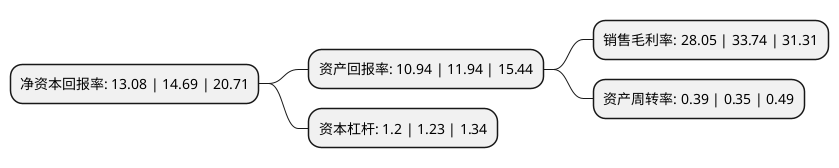

> 本页面由自动化程序生成于 2022年5月20日 01:20
> 内容可能存在错误，如有bug请提交issue至：https://github.com/Eroleice/doc-pi/issues
{.is-warning}

# 上市公司基本情况

## 基本资料

力合科技(湖南)股份有限公司（以下简称“力合科技”）成立于1997年05月29日，长沙市。于2019年11月06日在深交所创业板上市。

力合科技注册资本23,840万元，公司主营业务为环境监测系统研发，生产和销售及运营服务，公司主营产品包括水质监测系统，空气/烟气监测系统和环境监测信息管理系统，并为客户提供环境监测系统的运营服务，目前以水质监测系统及运营服务为主。以下是详细信息：

- 公司名称: 力合科技(湖南)股份有限公司
- 股票代码: 300800.SZ
- 所在地: 湖南 - 长沙市
- 成立日期: 1997年05月29日
- 注册资本: 23,840万元
- 法定代表人: 张广胜
- 主营业务: 公司主营业务为环境监测系统研发，生产和销售及运营服务，公司主营产品包括水质监测系统，空气/烟气监测系统和环境监测信息管理系统，并为客户提供环境监测系统的运营服务，目前以水质监测系统及运营服务为主
- 公司官网: www.lihero.com
- 公司介绍: 公司是一家先进的环境监测仪器制造商，公司以自主研发生产的环境监测仪器为核心，采用自动化控制与系统集成技术，为客户提供自动化、智能化的环境监测系统及运营服务。公司主营产品包括水质监测系统、空气/烟气监测系统和环境监测信息管理系统，并为客户提供环境监测系统的运营服务，目前以水质监测系统及运营服务为主。公司产品广泛应用于环保、市政、水利等具有环境监测需求的政府部门或事业单位及受环保部门重点监管的污染源企业的环境监测。作为一家科技创新型企业，公司掌握环境监测仪器生产及环境监测系统集成的核心技术，在环境监测设备行业，尤其是在水质监测设备领域具有突出的市场竞争优势。公司主持或参与了多项重大国家科研课题，拥有两百余项专利技术，多种环境监测产品获得国家重点新产品认证；获得国家发改委批复牵头建设“水环境污染监测先进技术与装备国家工程实验室”，是大气环境污染监测先进技术与装备国家工程实验室共建单位；获得国家环境保护部颁发的“2016年度环境保护科学技术奖一等奖”；“填埋场地下水污染系统防控与强化修复关键技术及应用”研发项目获得国务院颁发的“2017年度国家科学技术进步奖二等奖”。

## 股东及高管情况

上市公司第一大股东为张广胜，持股93,600,000股，占比39.26%，为上市公司实际控制人。

截至2022年04月25日，上市公司的前十大股东中，共有5名自然人股东，2名机构股东，1个产品账户，2名其他股东，其中5%以上大股东共有6名。上市公司前十大股东明细如下：

> 截至2022年04月25日，上市公司前十大股东信息如下：

| 股东名称 | 持股数量（股） | 持股比例 |
| --- | --- | --- |
| 张广胜 | 93,600,000 | 39.26% |
| 张广胜 | 93,600,000 | 39.26% |
| 左颂明 | 20,700,000 | 8.6829% |
| 国科瑞华创业投资企业 | 18,975,000 | 7.96% |
| 国科瑞华创业投资企业 | 18,975,000 | 7.96% |
| 长沙旺合投资咨询合伙企业(有限合伙) | 14,400,000 | 6.04% |
| 三峡资本控股有限责任公司 | 11,486,850 | 4.82% |
| 黄家宽 | 2,635,750 | 1.11% |
| 孙悦 | 1,930,000 | 0.81% |
| 中国农业银行股份有限公司-交银施罗德定期支付双息平衡混合型证券投资基金 | 1,282,937 | 0.54% |

## 利润表分析

上市公司2021年总收入为9.07亿元，净利润为2.54亿元，实现盈利。

## 杜邦分析

> 数据列示周期：2021年 | 2020年 | 2019年
{.is-info}

上市公司的净资产收益率在近一年有所下降，下降幅度为-10.96%，其变化情况分解如下：
- 上市公司的销售毛利率在近一年下降了-16.86%，可能是生产效率的下降、商品原材料价格上涨或商品价格的下跌所致。
- 上市公司的资产周转率在近一年上升了11.43%，可能是源自于更快的销售回款或库存管理效果提升。
- 上市公司的财务杠杆比率在近一年下降了-2.44%，可能是减少负债降低财务费用。

