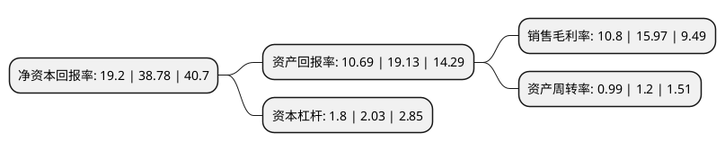

> 本页面由自动化程序生成于 2022年5月20日 01:20
> 内容可能存在错误，如有bug请提交issue至：https://github.com/Eroleice/doc-pi/issues
{.is-warning}

# 上市公司基本情况

## 基本资料

玉禾田环境发展集团股份有限公司（以下简称“玉禾田”）成立于2010年04月13日，安庆市。于2020年01月23日在深交所创业板上市。

玉禾田注册资本27,680万元，物业清洁，市政环卫，绿化养护，有害生物防治，二次供水设施清洗消毒等综合环境服务，主营业务为物业清洁和市政环卫以下是详细信息：

- 公司名称: 玉禾田环境发展集团股份有限公司
- 股票代码: 300815.SZ
- 所在地: 安徽 - 安庆市
- 成立日期: 2010年04月13日
- 注册资本: 27,680万元
- 法定代表人: 鲍江勇
- 主营业务: 物业清洁，市政环卫，绿化养护，有害生物防治，二次供水设施清洗消毒等综合环境服务，主营业务为物业清洁和市政环卫
- 公司官网: www.eit-sz.com
- 公司介绍: 公司成立于2010年，集团拥有城市生活垃圾经营性清扫、收集、运输服务许可证、城市园林绿化企业一级资质证书、中国清洁行业一级资质证书、卫生消杀除“四害”许可证、二次供水设施消毒清洁许可证，并于2000年12月我集团通过了ISO9002国际标准化质量管理认证，2006年9月通过深圳市环通质量认证中心GB/ISO14001-OHSAS18001环境与职业健康安全管理审核，并获得三套体系合一的质量认证，目前集团为1000多家客户提供长期服务，服务面积超过9000万平方米，其中95%的客户与我司建立起了长期良好的合作伙伴关系。集团先后被评为广东省著名商标企业、广东省环卫二十强企业、深圳市总部型企业、重合同守信用企业、高新技术企业、深圳市高技能人才培训基地、福田区纳税先进单位、福田区大学生实习基地等。

## 股东及高管情况

上市公司第一大股东为西藏天之润投资管理有限公司，持股132,629,584股，占比47.92%，为上市公司实际控制人。

截至2022年03月31日，上市公司的前十大股东中，共有1名自然人股东，4名机构股东，5个产品账户，其中5%以上大股东共有3名。上市公司前十大股东明细如下：

> 截至2022年03月31日，上市公司前十大股东信息如下：

| 股东名称 | 持股数量（股） | 持股比例 |
| --- | --- | --- |
| 西藏天之润投资管理有限公司 | 132,629,584 | 47.92% |
| 金昌高能时代材料技术有限公司 | 40,000,000 | 14.45% |
| 深圳市鑫宏泰投资管理有限公司 | 17,600,000 | 6.36% |
| 王东焱 | 8,000,000 | 2.89% |
| 广发基金管理有限公司-社保基金四二零组合 | 3,056,454 | 1.1% |
| 天津海立方舟投资管理有限公司 | 3,000,608 | 1.08% |
| 中国银行股份有限公司-招商丰盈积极配置混合型证券投资基金 | 2,897,894 | 1.05% |
| 安庆市同安产业招商投资基金(有限合伙) | 1,842,604 | 0.67% |
| 杭州城和股权投资基金合伙企业(有限合伙) | 1,721,600 | 0.62% |
| 基本养老保险基金一六零四一组合 | 1,675,784 | 0.61% |

## 利润表分析

上市公司2021年总收入为48.33亿元，净利润为5.22亿元，实现盈利。

## 杜邦分析

> 数据列示周期：2021年 | 2020年 | 2019年
{.is-info}

上市公司的净资产收益率在近一年有所下降，下降幅度为-50.49%，其变化情况分解如下：
- 上市公司的销售毛利率在近一年下降了-32.37%，可能是生产效率的下降、商品原材料价格上涨或商品价格的下跌所致。
- 上市公司的资产周转率在近一年下降了-17.5%，可能是源自于更慢的销售回款或库存管理效果下降。
- 上市公司的财务杠杆比率在近一年下降了-11.33%，可能是减少负债降低财务费用。

