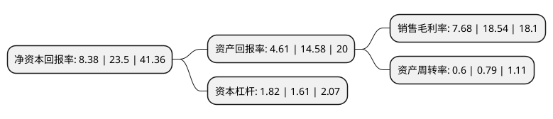

> 本页面由自动化程序生成于 2022年5月20日 01:20
> 内容可能存在错误，如有bug请提交issue至：https://github.com/Eroleice/doc-pi/issues
{.is-warning}

# 上市公司基本情况

## 基本资料

安徽艾可蓝环保股份有限公司（以下简称“艾可蓝”）成立于2009年01月21日，池州市。于2020年02月10日在深交所创业板上市。

艾可蓝注册资本8,036.75万元，主要产品包括柴油机选择性催化还原器型产品(SCR)，柴油机颗粒捕集器型产品(DPF)，汽油机三元催化剂/器(TWC)等产品，主营业务为发动机尾气后处理产品的研发，生产和销售以下是详细信息：

- 公司名称: 安徽艾可蓝环保股份有限公司
- 股票代码: 300816.SZ
- 所在地: 安徽 - 池州市
- 成立日期: 2009年01月21日
- 注册资本: 8,036.75万元
- 法定代表人: 刘屹
- 主营业务: 主要产品包括柴油机选择性催化还原器型产品(SCR)，柴油机颗粒捕集器型产品(DPF)，汽油机三元催化剂/器(TWC)等产品，主营业务为发动机尾气后处理产品的研发，生产和销售
- 公司官网: www.act-blue.com
- 公司介绍: 公司是一家由北美归国博士团队创立的科技创新型企业，2009年1月作为安徽省重点“招商引资，招才引智”项目引进，专业从事柴油机和汽油机尾气后处理产品的研发与产业化，适用于汽车、摩托车、通机、工程机械、船用动力、发电机组、农业机械等，并配套后装市场。自成立以来，一直将技术研发作为公司发展的源动力，通过自主研发积累了多项核心技术。公司注重产学研相结合，与中国科学院生态环境研究中心、合肥工业大学等高校保持良好的合作关系，研发实力提升显著。公司是安徽省科技厅、安徽省财政厅、安徽省国税局、安徽省地税局四部门认定的高新技术企业，公司研发和技术优势显著。

## 股东及高管情况

上市公司第一大股东为刘屹，持股32,468,572股，占比40.4%，为上市公司实际控制人。

截至2022年03月31日，上市公司的前十大股东中，共有2名自然人股东，2名机构股东，5个产品账户，1个海外主体，其中5%以上大股东共有2名。上市公司前十大股东明细如下：

> 截至2022年03月31日，上市公司前十大股东信息如下：

| 股东名称 | 持股数量（股） | 持股比例 |
| --- | --- | --- |
| 刘屹 | 32,468,572 | 40.4% |
| ZHU QING | 11,067,924 | 13.77% |
| 池州南鑫商务咨询企业(有限合伙) | 3,391,420 | 4.22% |
| 广发证券股份有限公司 | 3,207,260 | 3.99% |
| 交通银行股份有限公司-汇丰晋信智造先锋股票型证券投资基金 | 2,928,026 | 3.64% |
| 中国工商银行股份有限公司-东方主题精选混合型证券投资基金 | 2,684,560 | 3.34% |
| 朱弢 | 1,693,620 | 2.11% |
| 中信银行股份有限公司-交银施罗德新生活力灵活配置混合型证券投资基金 | 1,000,900 | 1.25% |
| 中国农业银行股份有限公司-交银施罗德瑞思三年封闭运作混合型证券投资基金 | 707,518 | 0.88% |
| 交通银行股份有限公司-汇丰晋信核心成长混合型证券投资基金 | 615,220 | 0.77% |

## 利润表分析

上市公司2021年总收入为8.66亿元，净利润为0.66亿元，实现盈利。

## 杜邦分析

> 数据列示周期：2021年 | 2020年 | 2019年
{.is-info}

上市公司的净资产收益率在近一年有所下降，下降幅度为-64.34%，其变化情况分解如下：
- 上市公司的销售毛利率在近一年下降了-58.58%，可能是生产效率的下降、商品原材料价格上涨或商品价格的下跌所致。
- 上市公司的资产周转率在近一年下降了-24.05%，可能是源自于更慢的销售回款或库存管理效果下降。
- 上市公司的财务杠杆比率在近一年上升了13.04%，可能是增加负债扩大生产规模。

