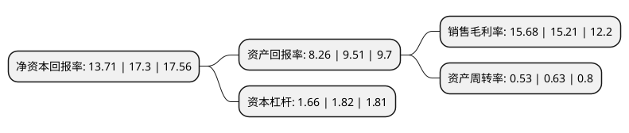

> 本页面由自动化程序生成于 2022年5月20日 01:21
> 内容可能存在错误，如有bug请提交issue至：https://github.com/Eroleice/doc-pi/issues
{.is-warning}

# 上市公司基本情况

## 基本资料

中兰环保科技股份有限公司（以下简称“中兰环保”）成立于2001年11月12日，深圳市。于2021年09月16日在深交所创业板上市。

中兰环保注册资本9,909.4万元，专业从事固废污染防治技术研发并应用于污染防治系统构建和运营业务。以下是详细信息：

- 公司名称: 中兰环保科技股份有限公司
- 股票代码: 300854.SZ
- 所在地: 广东 - 深圳市
- 成立日期: 2001年11月12日
- 注册资本: 9,909.4万元
- 法定代表人: 葛芳
- 主营业务: 专业从事固废污染防治技术研发并应用于污染防治系统构建和运营业务
- 公司官网: www.gad.net.cn
- 公司介绍: 公司成立于2001年，自成立以来，中兰环保在固体废弃物及工业废弃物处理领域一直开拓进取，重点在市政垃圾场、危险废物处理、煤化工、矿业、石化行业的环保污染防治领域积累了丰富的经验，承建了近500个环保项目，为政府和大企业客户提供创新技术和环境治理方案，是目前国内最知名最具实力的环境治理企业之一。中兰环保务实创新，结合社会环境特点及需求，在环保污染防治、污泥处理、污水处理、污染修复等领域提供采购-施工(PC)一体化模式、工程总承包EPC模式、建造-运营-移交BOT模式、公共部门与私人企业合作(PPP)等全方位服务合作方式。中兰环保是中国城市环境卫生协会常务理事单位、中国化工施工企业协会理事单位、国际土工合成材料施工协会(IAGI)会员单位、中国环境保护产业协会会员单位及中国石油和化学工业联合会会员单位，多次被省级工商部门评为“守合同重信用”单位，连续4年获得环境企业竞争力大奖，多项工程获得省市优质工程奖。

## 股东及高管情况

上市公司第一大股东为葛芳，持股22,847,500股，占比23.06%，**疑似为**上市公司实际控制人。

截至2022年03月31日，上市公司的前十大股东中，共有4名自然人股东，5名机构股东，1个产品账户，其中5%以上大股东共有3名。上市公司前十大股东明细如下：

> 未能通过持股比例判定出上市公司实际控制人（持股30%以上）
> 可能存在通过间接持股、联合持股、协议控制等方式拥有实际控制权的主体，具体请参考上市公司定期公告！
{.is-warning}

> 截至2022年03月31日，上市公司前十大股东信息如下：

| 股东名称 | 持股数量（股） | 持股比例 |
| --- | --- | --- |
| 葛芳 | 22,847,500 | 23.06% |
| 孔熊君 | 13,601,500 | 13.73% |
| 刘青松 | 11,550,000 | 11.66% |
| 深圳市创新投资集团有限公司 | 3,847,849 | 3.88% |
| 深圳市中兰福通投资合伙企业(有限合伙) | 3,002,500 | 3.03% |
| 北京青山正石投资管理中心(有限合伙) | 3,000,000 | 3.03% |
| 孔丽君 | 2,750,000 | 2.78% |
| 中小企业发展基金(深圳有限合伙) | 2,690,000 | 2.71% |
| 深圳市罗湖红土创业投资管理有限公司-深圳市罗湖红土创业投资有限公司 | 2,352,151 | 2.37% |
| 深圳鼎青创业投资合伙企业(有限合伙) | 2,208,500 | 2.23% |

## 利润表分析

上市公司2021年总收入为6.98亿元，净利润为1.09亿元，实现盈利。

## 杜邦分析

> 数据列示周期：2021年 | 2020年 | 2019年
{.is-info}

上市公司的净资产收益率在近一年有所下降，下降幅度为-20.75%，其变化情况分解如下：
- 上市公司的销售毛利率在近一年上升了3.09%，可能是生产效率的提升、商品原材料价格下跌或商品价格的上涨所致。
- 上市公司的资产周转率在近一年下降了-15.87%，可能是源自于更慢的销售回款或库存管理效果下降。
- 上市公司的财务杠杆比率在近一年下降了-8.79%，可能是减少负债降低财务费用。

