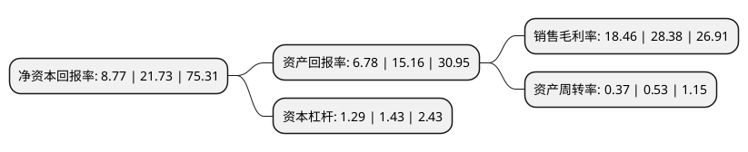

> 本页面由自动化程序生成于 2022年5月20日 01:21
> 内容可能存在错误，如有bug请提交issue至：https://github.com/Eroleice/doc-pi/issues
{.is-warning}

# 上市公司基本情况

## 基本资料

南京大学环境规划设计研究院集团股份公司（以下简称“南大环境”）成立于2012年08月03日，南京市。于2020年08月24日在深交所创业板上市。

南大环境注册资本9,120万元，致力于为政府客户和企业客户提供高效，科学，整体的环境解决方案，主要服务包括环境调查与鉴定，建设项目环评，环境研究与规划，环境工程承包，环境工程设计与监理以及环境污染第三方治理等。以下是详细信息：

- 公司名称: 南京大学环境规划设计研究院集团股份公司
- 股票代码: 300864.SZ
- 所在地: 江苏 - 南京市
- 成立日期: 2012年08月03日
- 注册资本: 9,120万元
- 法定代表人: 陆朝阳
- 主营业务: 致力于为政府客户和企业客户提供高效，科学，整体的环境解决方案，主要服务包括环境调查与鉴定，建设项目环评，环境研究与规划，环境工程承包，环境工程设计与监理以及环境污染第三方治理等
- 公司官网: www.njuae.cn
- 公司介绍: 公司定位为专业的环境服务商，致力于为政府客户和企业客户提供高效、科学、整体的环境解决方案，主要服务包括环境调查与鉴定、建设项目环评、环境研究与规划、环境工程承包、环境工程设计与监理以及环境污染第三方治理等。公司为南京大学控股的国家级高新技术企业，经营和核心技术团队均为该领域的行业专家，在环境科学与技术领域拥有深厚的积累与沉淀。目前，公司已建有江苏省区域流域环境综合治理工程技术研究中心、南京市挥发性有机废气工程研究中心和“国家级博士后工作站”分站等高水平研发平台，在环境综合治理、污染控制、环境修复等领域拥有多项自主知识产权。同时，作为科技型环境服务类企业，公司高度重视技术研发和人才培养，经过多年的技术研发、业务实践应用积累，培养出了一批行业内优质人才，并打造了基于自身业务案例和项目经验形成的成熟的行业案例数据库，具有较强的竞争优势。

## 股东及高管情况

上市公司第一大股东为南京大学资本运营有限公司，持股27,360,000股，占比30%，**疑似为**上市公司实际控制人。

截至2022年03月31日，上市公司的前十大股东中，共有5名自然人股东，4名机构股东，1个产品账户，其中5%以上大股东共有4名。上市公司前十大股东明细如下：

> 截至2022年03月31日，上市公司前十大股东信息如下：

| 股东名称 | 持股数量（股） | 持股比例 |
| --- | --- | --- |
| 南京大学资本运营有限公司 | 27,360,000 | 30% |
| 南京国环投资管理有限公司 | 24,565,161 | 26.94% |
| 南京南高管理咨询中心(有限合伙) | 8,384,516 | 9.19% |
| 南京两江管理咨询中心(有限合伙) | 8,090,323 | 8.87% |
| 中国工商银行股份有限公司-汇添富中证环境治理指数型证券投资基金(LOF) | 296,827 | 0.33% |
| 华志宽 | 122,000 | 0.13% |
| 俞娥 | 119,500 | 0.13% |
| 吕华平 | 117,700 | 0.13% |
| 胡君 | 115,520 | 0.13% |
| 余风华 | 110,690 | 0.12% |

## 利润表分析

上市公司2021年总收入为5.18亿元，净利润为0.95亿元，实现盈利。

## 杜邦分析

> 数据列示周期：2021年 | 2020年 | 2019年
{.is-info}

上市公司的净资产收益率在近一年有所下降，下降幅度为-59.64%，其变化情况分解如下：
- 上市公司的销售毛利率在近一年下降了-34.95%，可能是生产效率的下降、商品原材料价格上涨或商品价格的下跌所致。
- 上市公司的资产周转率在近一年下降了-30.19%，可能是源自于更慢的销售回款或库存管理效果下降。
- 上市公司的财务杠杆比率在近一年下降了-9.79%，可能是减少负债降低财务费用。

