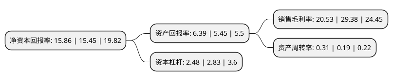

> 本页面由自动化程序生成于 2022年5月20日 01:21
> 内容可能存在错误，如有bug请提交issue至：https://github.com/Eroleice/doc-pi/issues
{.is-warning}

# 上市公司基本情况

## 基本资料

圣元环保股份有限公司（以下简称“圣元环保”）成立于1997年10月09日，厦门市。于2020年08月24日在深交所创业板上市。

圣元环保注册资本27,174.105万元，公司主营业务为经营城镇固液废专业化处理，主要包括生活垃圾焚烧发电和生活污水处理等，公司主要通过取得特许经营权的方式负责生活垃圾焚烧发电厂和生活污水处理厂的投资建设，运营管理及维护。以下是详细信息：

- 公司名称: 圣元环保股份有限公司
- 股票代码: 300867.SZ
- 所在地: 福建 - 厦门市
- 成立日期: 1997年10月09日
- 注册资本: 27,174.105万元
- 法定代表人: 朱煜煊
- 主营业务: 公司主营业务为经营城镇固液废专业化处理，主要包括生活垃圾焚烧发电和生活污水处理等，公司主要通过取得特许经营权的方式负责生活垃圾焚烧发电厂和生活污水处理厂的投资建设，运营管理及维护
- 公司官网: www.chinasyep.com
- 公司介绍: 公司创立之初主要从事贸易业务，自2004年，公司开始涉入环保行业，主营业务变更为生活污水处理业务，2006年，公司涉入生活垃圾焚烧发电领域，并逐渐形成生活垃圾焚烧发电和生活污水处理的城镇固液废专业化处理经营格局。公司生活垃圾焚烧发电项目采用了国际通用、成熟先进的机械炉排炉技术，在烟气处理环节采用了SNCR脱硝+半干式反应塔+活性炭喷射器+袋式除尘器组合的处理技术，有效保证生活垃圾得到充分燃烧和污染物的处理。莆田圣元垃圾焚烧发电厂于2018年被中国环保产业协会评为“国家重点环境保护实用技术及示范工程”。

## 股东及高管情况

上市公司第一大股东为朱恒冰，持股67,943,152股，占比25%，**疑似为**上市公司实际控制人。

截至2022年03月31日，上市公司的前十大股东中，共有6名自然人股东，2名机构股东，2个产品账户，其中5%以上大股东共有2名。上市公司前十大股东明细如下：

> 未能通过持股比例判定出上市公司实际控制人（持股30%以上）
> 可能存在通过间接持股、联合持股、协议控制等方式拥有实际控制权的主体，具体请参考上市公司定期公告！
{.is-warning}

> 截至2022年03月31日，上市公司前十大股东信息如下：

| 股东名称 | 持股数量（股） | 持股比例 |
| --- | --- | --- |
| 朱恒冰 | 67,943,152 | 25% |
| 朱煜煊 | 33,161,946 | 12.2% |
| 许锦清 | 8,588,231 | 3.16% |
| 朱萍华 | 7,428,864 | 2.73% |
| 浙江红土创业投资有限公司 | 5,857,176 | 2.16% |
| 深圳市创新投资集团有限公司 | 5,759,328 | 2.12% |
| 北京银行股份有限公司-广发盛锦混合型证券投资基金 | 5,179,583 | 1.91% |
| 福建丹金恒信资产管理有限公司-丹金新能源1号私募证券投资基金 | 4,794,300 | 1.76% |
| 钟长民 | 4,480,000 | 1.65% |
| 朱惠华 | 3,559,664 | 1.31% |

## 利润表分析

上市公司2021年总收入为22.95亿元，净利润为4.71亿元，实现盈利。

## 杜邦分析

> 数据列示周期：2021年 | 2020年 | 2019年
{.is-info}

上市公司的净资产收益率在近一年有所上升，上升幅度为2.65%，其变化情况分解如下：
- 上市公司的销售毛利率在近一年下降了-30.12%，可能是生产效率的下降、商品原材料价格上涨或商品价格的下跌所致。
- 上市公司的资产周转率在近一年上升了63.16%，可能是源自于更快的销售回款或库存管理效果提升。
- 上市公司的财务杠杆比率在近一年下降了-12.37%，可能是减少负债降低财务费用。

