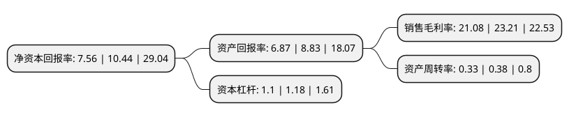

> 本页面由自动化程序生成于 2022年5月20日 01:21
> 内容可能存在错误，如有bug请提交issue至：https://github.com/Eroleice/doc-pi/issues
{.is-warning}

# 上市公司基本情况

## 基本资料

上海凯鑫分离技术股份有限公司（以下简称“上海凯鑫”）成立于2011年07月25日，上海市。于2020年10月16日在深交所创业板上市。

上海凯鑫注册资本6,378.347万元，主营业务是膜分离技术的研究与开发，为工业客户优化生产工艺，提供减排降耗和废弃物资源化综合利用的整体解决方案。以下是详细信息：

- 公司名称: 上海凯鑫分离技术股份有限公司
- 股票代码: 300899.SZ
- 所在地: 上海 - 上海市
- 成立日期: 2011年07月25日
- 注册资本: 6,378.347万元
- 法定代表人: 葛文越
- 主营业务: 主营业务是膜分离技术的研究与开发，为工业客户优化生产工艺，提供减排降耗和废弃物资源化综合利用的整体解决方案
- 公司官网: www.keysino.cn
- 公司介绍: 公司为一家专注于工业流体特种分离业务的技术型环保公司，主营业务是膜分离技术的研究与开发，为工业客户优化生产工艺，提供减排降耗和废弃物资源化综合利用的整体解决方案。具体来说，公司根据工业客户在工业流体分离、废水处理领域的差异化需求，依托众多自主研发的膜分离应用技术，通过向其提供包括清洁生产技术方案设计与实施、膜分离装备集成、运营技术支持和售后服务在内的定制化膜分离技术应用整体解决方案，帮助客户提高资源利用效率，降低生产成本，减少污染物排放，达到“分清离浊、物尽其用”的目的，从而实现客户经济效益、社会环保效益与公司经济利益的“互利多赢”。近年来，公司的技术、产品与业务受到了政府部门、行业组织及客户的高度认可，获得诸多荣誉。公司先后被认定为高新技术企业，上海市科技小巨人培育企业，上海市“专精特新”企业，上海市专利试点单位。

## 股东及高管情况

上市公司第一大股东为葛文越，持股14,339,200股，占比22.48%，**疑似为**上市公司实际控制人。

截至2022年03月31日，上市公司的前十大股东中，共有6名自然人股东，4名机构股东，其中5%以上大股东共有5名。上市公司前十大股东明细如下：

> 未能通过持股比例判定出上市公司实际控制人（持股30%以上）
> 可能存在通过间接持股、联合持股、协议控制等方式拥有实际控制权的主体，具体请参考上市公司定期公告！
{.is-warning}

> 截至2022年03月31日，上市公司前十大股东信息如下：

| 股东名称 | 持股数量（股） | 持股比例 |
| --- | --- | --- |
| 葛文越 | 14,339,200 | 22.48% |
| 杨旗 | 3,384,800 | 5.31% |
| 邵蔚 | 3,384,800 | 5.31% |
| 申雅维 | 3,384,800 | 5.31% |
| 刘峰 | 3,384,800 | 5.31% |
| 杨昊鹏 | 2,584,800 | 4.05% |
| 浙江红土创业投资有限公司 | 1,538,000 | 2.41% |
| 上海济谦投资管理合伙企业(有限合伙) | 1,502,564 | 2.36% |
| 苏州启明融合创业投资合伙企业(有限合伙) | 1,480,531 | 2.32% |
| 深圳市架桥富凯股权投资企业(有限合伙) | 1,162,809 | 1.82% |

## 利润表分析

上市公司2021年总收入为2.27亿元，净利润为0.48亿元，实现盈利。

## 杜邦分析

> 数据列示周期：2021年 | 2020年 | 2019年
{.is-info}

上市公司的净资产收益率在近一年有所下降，下降幅度为-27.59%，其变化情况分解如下：
- 上市公司的销售毛利率在近一年下降了-9.18%，可能是生产效率的下降、商品原材料价格上涨或商品价格的下跌所致。
- 上市公司的资产周转率在近一年下降了-13.16%，可能是源自于更慢的销售回款或库存管理效果下降。
- 上市公司的财务杠杆比率在近一年下降了-6.78%，可能是减少负债降低财务费用。

