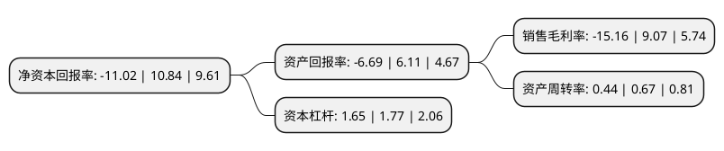

> 本页面由自动化程序生成于 2022年5月20日 01:21
> 内容可能存在错误，如有bug请提交issue至：https://github.com/Eroleice/doc-pi/issues
{.is-warning}

# 上市公司基本情况

## 基本资料

凯龙高科技股份有限公司（以下简称“凯龙高科”）成立于2001年12月12日，无锡市。于2020年12月07日在深交所创业板上市。

凯龙高科注册资本11,196.8万元，主要产品包括柴油机选择性催化还原系统(SCR系统)，柴油机颗粒捕集系统(DOC+DPF，DPF)，气体机尾气后处理系统等三大类300多个品种，专注于内燃机尾气污染治理，减少有害气体排放的环保装备供应商，主要从事内燃机尾气污染治理装备的研发，生产和销售。主要研发生产销售运用于内燃机机外的尾气污染治理装备。以下是详细信息：

- 公司名称: 凯龙高科技股份有限公司
- 股票代码: 300912.SZ
- 所在地: 江苏 - 无锡市
- 成立日期: 2001年12月12日
- 注册资本: 11,196.8万元
- 法定代表人: 臧志成
- 主营业务: 主要产品包括柴油机选择性催化还原系统(SCR系统)，柴油机颗粒捕集系统(DOC+DPF，DPF)，气体机尾气后处理系统等三大类300多个品种，专注于内燃机尾气污染治理，减少有害气体排放的环保装备供应商，主要从事内燃机尾气污染治理装备的研发，生产和销售主要研发生产销售运用于内燃机机外的尾气污染治理装备
- 公司官网: www.kailongtec.com
- 公司介绍: 公司系一家专注于内燃机尾气污染治理、减少有害气体排放的环保装备供应商，是以内燃机尾气污染治理装备的研发、生产和销售为核心业务的高新技术企业，拥有十多项具有自主知识产权、总体处于国内领先水平的核心技术。主导产品包括柴油机SCR尾气后处理系统、柴油机颗粒捕集系统、气体机尾气后处理系统等三大类300多个品种，可广泛运用于我国道路车辆、非道路移动机械、船舶用内燃机的尾气污染治理及工业污染治理。公司设立了技术研究院，建有江苏省柴油发动机尾气后处理与热能再利用工程中心，为第一批“江苏省重点企业研发机构”、“江苏省省级工程技术研究中心”、“江苏省省级企业技术中心”，并于2016年8月经中国机械工业联合会批准建设“机械工业内燃机氮氧化物和细微颗粒物排放控制及处理工程技术研究中心”；设立了博士后科研工作站。建有发动机试验室、三自由度振动试验室等20多个试验室，拥有10个发动机测试台架，配有AVL电力测功机、排放仪、颗粒分析仪和颗粒计数器等先进的研发试验设备。

## 股东及高管情况

上市公司第一大股东为臧志成，持股36,030,000股，占比32.18%，为上市公司实际控制人。

截至2022年03月31日，上市公司的前十大股东中，共有4名自然人股东，4名机构股东，2个产品账户，其中5%以上大股东共有2名。上市公司前十大股东明细如下：

> 截至2022年03月31日，上市公司前十大股东信息如下：

| 股东名称 | 持股数量（股） | 持股比例 |
| --- | --- | --- |
| 臧志成 | 36,030,000 | 32.18% |
| 无锡市凯成投资合伙企业(有限合伙) | 6,500,000 | 5.81% |
| 天津力合创赢股权投资基金合伙企业(有限合伙) | 3,587,000 | 3.2% |
| 交通银行股份有限公司-汇丰晋信智造先锋股票型证券投资基金 | 3,530,175 | 3.15% |
| 臧梦蝶 | 3,120,000 | 2.79% |
| 常州力合华富创业投资有限公司 | 2,845,000 | 2.54% |
| 无锡金投控股有限公司 | 2,009,300 | 1.79% |
| 臧小妹 | 1,950,000 | 1.74% |
| 臧雨芬 | 1,950,000 | 1.74% |
| 苏州新联科创业投资有限公司 | 1,903,800 | 1.7% |

## 利润表分析

上市公司2021年总收入为8.28亿元，净利润为-1.26亿元，**未实现盈利**。

## 杜邦分析

> 数据列示周期：2021年 | 2020年 | 2019年
{.is-info}

上市公司的净资产收益率在近一年有所下降，下降幅度为-201.66%，其变化情况分解如下：
- 上市公司的销售毛利率在近一年下降了-267.14%，可能是生产效率的下降、商品原材料价格上涨或商品价格的下跌所致。
- 上市公司的资产周转率在近一年下降了-34.33%，可能是源自于更慢的销售回款或库存管理效果下降。
- 上市公司的财务杠杆比率在近一年下降了-6.78%，可能是减少负债降低财务费用。

