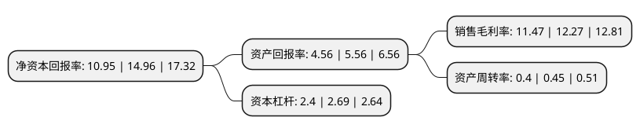

> 本页面由自动化程序生成于 2022年5月20日 01:21
> 内容可能存在错误，如有bug请提交issue至：https://github.com/Eroleice/doc-pi/issues
{.is-warning}

# 上市公司基本情况

## 基本资料

安徽华骐环保科技股份有限公司（以下简称“华骐环保”）成立于2002年04月27日，马鞍山市。于2021年01月20日在深交所创业板上市。

华骐环保注册资本8,258.31万元，主营业务:致力于水环境治理综合服务。主要产品和服务:包括BAF工艺核心产品，污水处理设备集成，污水处理系统EPC，环保设施投资运营等。以下是详细信息：

- 公司名称: 安徽华骐环保科技股份有限公司
- 股票代码: 300929.SZ
- 所在地: 安徽 - 马鞍山市
- 成立日期: 2002年04月27日
- 注册资本: 8,258.31万元
- 法定代表人: 王健
- 主营业务: 主营业务:致力于水环境治理综合服务主要产品和服务:包括BAF工艺核心产品，污水处理设备集成，污水处理系统EPC，环保设施投资运营等
- 公司官网: www.hqhb.com
- 公司介绍: 公司是国内专业从事曝气生物滤池污水处理、中水回用工艺技术及配套产品研制、生产，环保工程设计、环保工程总包、污染治理设施托管运营及BOT投资的高新技术企业。企业定位于以曝气生物滤池为核心的系列新工艺技术、新产品的研发生产和推广应用，拥有了一批具有自主知识产权的核心技术。在曝气生物滤池污水处理行业中占有重要的地位，成为了国内曝气生物滤池工艺研发的领军企业。

## 股东及高管情况

上市公司第一大股东为马鞍山市安工大资产经营有限责任公司，持股11,645,205股，占比14.1%，**疑似为**上市公司实际控制人。

截至2022年03月31日，上市公司的前十大股东中，共有6名自然人股东，4名机构股东，其中5%以上大股东共有2名。上市公司前十大股东明细如下：

> 未能通过持股比例判定出上市公司实际控制人（持股30%以上）
> 可能存在通过间接持股、联合持股、协议控制等方式拥有实际控制权的主体，具体请参考上市公司定期公告！
{.is-warning}

> 截至2022年03月31日，上市公司前十大股东信息如下：

| 股东名称 | 持股数量（股） | 持股比例 |
| --- | --- | --- |
| 马鞍山市安工大资产经营有限责任公司 | 11,645,205 | 14.1% |
| 深圳市山鹰时代伯乐股权投资合伙企业(有限合伙) | 9,756,098 | 11.81% |
| 李明河 | 2,311,675 | 2.8% |
| 郑俊 | 2,310,000 | 2.8% |
| 王爱斌 | 2,256,514 | 2.73% |
| 刘光春 | 2,091,516 | 2.53% |
| 郑杰 | 2,068,000 | 2.5% |
| 国元股权投资有限公司 | 1,946,172 | 2.36% |
| 马鞍山经济技术开发区创业投资有限公司 | 1,650,000 | 2% |
| 李小英 | 1,603,600 | 1.94% |

## 利润表分析

上市公司2021年总收入为6.34亿元，净利润为0.72亿元，实现盈利。

## 杜邦分析

> 数据列示周期：2021年 | 2020年 | 2019年
{.is-info}

上市公司的净资产收益率在近一年有所下降，下降幅度为-26.8%，其变化情况分解如下：
- 上市公司的销售毛利率在近一年下降了-6.52%，可能是生产效率的下降、商品原材料价格上涨或商品价格的下跌所致。
- 上市公司的资产周转率在近一年下降了-11.11%，可能是源自于更慢的销售回款或库存管理效果下降。
- 上市公司的财务杠杆比率在近一年下降了-10.78%，可能是减少负债降低财务费用。

