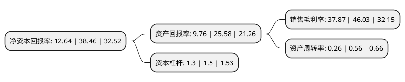

> 本页面由自动化程序生成于 2022年5月20日 01:22
> 内容可能存在错误，如有bug请提交issue至：https://github.com/Eroleice/doc-pi/issues
{.is-warning}

# 上市公司基本情况

## 基本资料

安徽超越环保科技股份有限公司（以下简称“超越科技”）成立于2009年07月28日，滁州市。于2021年08月24日在深交所创业板上市。

超越科技注册资本9,425.333万元，公司主要向工业企业，医疗机构等客户提供危险废物处置服务。以下是详细信息：

- 公司名称: 安徽超越环保科技股份有限公司
- 股票代码: 301049.SZ
- 所在地: 安徽 - 滁州市
- 成立日期: 2009年07月28日
- 注册资本: 9,425.333万元
- 法定代表人: 高志江
- 主营业务: 公司主要向工业企业，医疗机构等客户提供危险废物处置服务
- 公司官网: www.ah-cy.cn
- 公司介绍: 公司是专业性处理固体废物并进行资源化利用的综合型环保企业。公司自成立起即致力于节能环保行业。公司目前阶段主要提供的服务为工业危险废物和医疗废物处置服务以及废弃电器电子产品拆解服务，主要生产的产品为部分工业危险废物资源化利用产品和废弃电器电子产品拆解产物。在工业危险废物处置方面，公司的处理能力和经营范围较安徽省内其他同行业公司具有一定优势，处置能力排名省内前列，属于区域龙头之一。在医疗废物处置方面，公司是滁州市唯一的医疗废物集中处置机构。在废弃电器电子产品拆解方面，公司是安徽省仅有的6家纳入国家废弃电器电子产品处理基金补贴名单的企业之一，是滁州市唯一一家纳入该名单的企业。公司持续进行技术和工艺创新，公司2016年起，获得并保持国家高新技术企业的称号。

## 股东及高管情况

上市公司第一大股东为高志江，持股27,427,720股，占比29.1%，**疑似为**上市公司实际控制人。

截至2022年03月31日，上市公司的前十大股东中，共有7名自然人股东，3名机构股东，其中5%以上大股东共有3名。上市公司前十大股东明细如下：

> 未能通过持股比例判定出上市公司实际控制人（持股30%以上）
> 可能存在通过间接持股、联合持股、协议控制等方式拥有实际控制权的主体，具体请参考上市公司定期公告！
{.is-warning}

> 截至2022年03月31日，上市公司前十大股东信息如下：

| 股东名称 | 持股数量（股） | 持股比例 |
| --- | --- | --- |
| 高志江 | 27,427,720 | 29.1% |
| 李光荣 | 27,427,720 | 29.1% |
| 高德堃 | 13,713,860 | 14.55% |
| 滁州市德宁企业管理中心(有限合伙) | 2,120,700 | 2.25% |
| 赵建平 | 800,000 | 0.85% |
| 李霞 | 660,000 | 0.7% |
| 中国国际金融香港资产管理有限公司-客户资金2 | 286,597 | 0.3% |
| 董凯宁 | 273,052 | 0.29% |
| 华泰证券股份有限公司 | 244,632 | 0.26% |
| 胡家喜 | 202,900 | 0.22% |

## 利润表分析

上市公司2021年总收入为2.26亿元，净利润为0.85亿元，实现盈利。

## 杜邦分析

> 数据列示周期：2021年 | 2020年 | 2019年
{.is-info}

上市公司的净资产收益率在近一年有所下降，下降幅度为-67.13%，其变化情况分解如下：
- 上市公司的销售毛利率在近一年下降了-17.73%，可能是生产效率的下降、商品原材料价格上涨或商品价格的下跌所致。
- 上市公司的资产周转率在近一年下降了-53.57%，可能是源自于更慢的销售回款或库存管理效果下降。
- 上市公司的财务杠杆比率在近一年下降了-13.33%，可能是减少负债降低财务费用。

