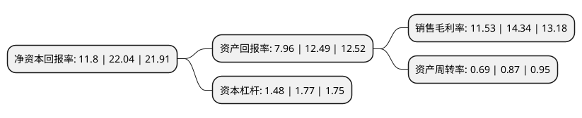

> 本页面由自动化程序生成于 2022年5月20日 01:22
> 内容可能存在错误，如有bug请提交issue至：https://github.com/Eroleice/doc-pi/issues
{.is-warning}

# 上市公司基本情况

## 基本资料

浙江严牌过滤技术股份有限公司（以下简称“严牌股份”）成立于2014年05月28日，台州市。于2021年10月20日在深交所创业板上市。

严牌股份注册资本17,067万元，公司专注于环保过滤材料的研发，生产和销售业务，主要产品为多种型号和用途的过滤布和过滤袋等产品。以下是详细信息：

- 公司名称: 浙江严牌过滤技术股份有限公司
- 股票代码: 301081.SZ
- 所在地: 浙江 - 台州市
- 成立日期: 2014年05月28日
- 注册资本: 17,067万元
- 法定代表人: 孙尚泽
- 主营业务: 公司专注于环保过滤材料的研发，生产和销售业务，主要产品为多种型号和用途的过滤布和过滤袋等产品
- 公司官网: www.yanpai.com
- 公司介绍: 公司专注于在全球范围提供环保用过滤布和袋等工业过滤关键部件和材料，是我国“过滤分离”材料的主要供应商之一，产品广泛应用于火电、水泥、化工、冶金、采矿、钢铁、垃圾焚烧、食品、医药、环境保护等各行业的工业除尘、废水处理、工业生产过滤纯化等领域。经过多年的发展和积累，公司具备了为客户提供高品质、定制化、全系列工业用固气分离和固液分离过滤材料的产品设计及生产能力，形成了针对不同行业、不同过滤要求和不同工况环境提供高度贴合的产品方案的核心竞争力，通过促进客户过滤设备或其他应用设备最佳性能的发挥，有效提升客户环保处理能力、生产效率或促进成本节约。

## 股东及高管情况

上市公司第一大股东为天台西南投资管理有限公司，持股60,000,000股，占比35.16%，为上市公司实际控制人。

截至2022年03月31日，上市公司的前十大股东中，共有3名自然人股东，6名机构股东，1个产品账户，其中5%以上大股东共有4名。上市公司前十大股东明细如下：

> 截至2022年03月31日，上市公司前十大股东信息如下：

| 股东名称 | 持股数量（股） | 持股比例 |
| --- | --- | --- |
| 天台西南投资管理有限公司 | 60,000,000 | 35.16% |
| 天台友凤投资咨询管理有限公司 | 18,000,000 | 10.55% |
| 孙世严 | 10,000,000 | 5.86% |
| 孙尚泽 | 10,000,000 | 5.86% |
| 上海祥禾涌原股权投资合伙企业(有限合伙) | 5,800,000 | 3.4% |
| 杭州九鹄投资管理合伙企业(有限合伙) | 5,200,000 | 3.05% |
| 虞樟星 | 5,000,000 | 2.93% |
| 天台凤玺投资合伙企业(有限合伙) | 4,800,000 | 2.81% |
| 浙江银轮机械股份有限公司 | 4,000,000 | 2.34% |
| 招商证券资管-招商银行-招商资管严牌股份员工参与创业板战略配售集合资产管理计划 | 3,113,153 | 1.82% |

## 利润表分析

上市公司2021年总收入为7.08亿元，净利润为0.81亿元，实现盈利。

## 杜邦分析

> 数据列示周期：2021年 | 2020年 | 2019年
{.is-info}

上市公司的净资产收益率在近一年有所下降，下降幅度为-46.46%，其变化情况分解如下：
- 上市公司的销售毛利率在近一年下降了-19.6%，可能是生产效率的下降、商品原材料价格上涨或商品价格的下跌所致。
- 上市公司的资产周转率在近一年下降了-20.69%，可能是源自于更慢的销售回款或库存管理效果下降。
- 上市公司的财务杠杆比率在近一年下降了-16.38%，可能是减少负债降低财务费用。

