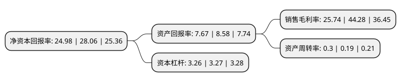

> 本页面由自动化程序生成于 2022年5月20日 01:23
> 内容可能存在错误，如有bug请提交issue至：https://github.com/Eroleice/doc-pi/issues
{.is-warning}

# 上市公司基本情况

## 基本资料

湖南军信环保股份有限公司（以下简称“军信股份”）成立于2011年09月22日，长沙市。于2022年04月13日在深交所创业板上市。

军信股份注册资本20,500万元，发行人的主营业务包括垃圾焚烧发电，污泥处置，渗沥液(污水)处理，垃圾填埋和灰渣处理处置等业务。以下是详细信息：

- 公司名称: 湖南军信环保股份有限公司
- 股票代码: 301109.SZ
- 所在地: 湖南 - 长沙市
- 成立日期: 2011年09月22日
- 注册资本: 20,500万元
- 法定代表人: 戴道国
- 主营业务: 发行人的主营业务包括垃圾焚烧发电，污泥处置，渗沥液(污水)处理，垃圾填埋和灰渣处理处置等业务
- 公司官网: www.junxinep.com
- 公司介绍: 公司成立于2011年，以提供优质的城市生活垃圾、垃圾渗沥液及市政污泥处置、处置运营服务为使命，积极致力于提高污染物处理水平、整合治污资源、提倡节能减排，以促进城市循环经济发展和生态文明建设。公司结合自身优势，采用BOT为主的特许经营业务方式，为长沙市量身定制适合其特点的城市生活垃圾及副产物处理综合解决方案，为其提供多元化、专业化、集约化的生活垃圾、渗沥液和市政污泥为一体的污染物处理设施投资、建设、运营服务。公司自成立以来，主营业务未发生重大变化。

## 股东及高管情况

上市公司第一大股东为湖南军信环保集团有限公司，持股170,103,478股，占比62.23%，为上市公司实际控制人。

截至2022年04月13日，上市公司的前十大股东中，共有4名自然人股东，5名机构股东，1个产品账户，其中5%以上大股东共有1名。上市公司前十大股东明细如下：

> 截至2022年04月13日，上市公司前十大股东信息如下：

| 股东名称 | 持股数量（股） | 持股比例 |
| --- | --- | --- |
| 湖南军信环保集团有限公司 | 170,103,478 | 62.23% |
| 戴道国 | 12,664,587 | 4.63% |
| 何英品 | 10,361,935 | 3.79% |
| 湖南道信投资咨询合伙企业(有限合伙) | 4,827,500 | 1.77% |
| 中信证券军信股份员工参与创业板战略配售集合资产管理计划 | 4,448,434 | 1.63% |
| 湖南湘江中盈投资管理有限公司 | 2,298,190 | 0.84% |
| 冷朝强 | 1,635,000 | 0.6% |
| 长沙先导产业投资有限公司 | 1,436,368 | 0.53% |
| 何俊 | 1,404,000 | 0.51% |
| 湖南品信投资咨询合伙企业(有限合伙) | 1,012,500 | 0.37% |

## 利润表分析

上市公司2021年总收入为20.63亿元，净利润为5.39亿元，实现盈利。

## 杜邦分析

> 数据列示周期：2021年 | 2020年 | 2019年
{.is-info}

上市公司的净资产收益率在近一年有所下降，下降幅度为-10.98%，其变化情况分解如下：
- 上市公司的销售毛利率在近一年下降了-41.87%，可能是生产效率的下降、商品原材料价格上涨或商品价格的下跌所致。
- 上市公司的资产周转率在近一年上升了57.89%，可能是源自于更快的销售回款或库存管理效果提升。
- 上市公司的财务杠杆比率在近一年下降了-0.31%，可能是减少负债降低财务费用。

