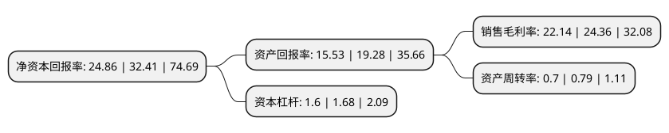

> 本页面由自动化程序生成于 2022年5月20日 01:23
> 内容可能存在错误，如有bug请提交issue至：https://github.com/Eroleice/doc-pi/issues
{.is-warning}

## 股东及高管情况

上市公司第一大股东为蒋林煜，持股31,360,000股，占比26.92%，**疑似为**上市公司实际控制人。

截至2022年04月21日，上市公司的前十大股东中，共有4名自然人股东，3名机构股东，3个产品账户，其中5%以上大股东共有3名。上市公司前十大股东明细如下：

> 未能通过持股比例判定出上市公司实际控制人（持股30%以上）
> 可能存在通过间接持股、联合持股、协议控制等方式拥有实际控制权的主体，具体请参考上市公司定期公告！
{.is-warning}

> 截至2022年04月21日，上市公司前十大股东信息如下：

| 股东名称 | 持股数量（股） | 持股比例 |
| --- | --- | --- |
| 蒋林煜 | 31,360,000 | 26.92% |
| 董正军 | 22,736,000 | 19.52% |
| 王如顺 | 22,736,000 | 19.52% |
| 厦门嘉戎盛美企业管理咨询合伙企业(有限合伙) | 2,696,400 | 2.31% |
| 军民融合发展产业投资基金(有限合伙) | 2,604,845 | 2.24% |
| 鼎新二期股权投资基金(平潭)合伙企业(有限合伙) | 1,978,200 | 1.7% |
| 厦门泛荣高技术服务业创业投资合伙企业(有限合伙) | 1,582,560 | 1.36% |
| 苏国金 | 1,568,000 | 1.35% |
| 安信资管嘉戎技术高管参与创业板战略配售集合资产管理计划 | 1,501,693 | 1.29% |
| 厦门高新科创天使创业投资有限公司 | 1,186,920 | 1.02% |

## 利润表分析

上市公司2021年总收入为6.75亿元，净利润为1.49亿元，实现盈利。

## 杜邦分析

> 数据列示周期：2021年 | 2020年 | 2019年
{.is-info}

上市公司的净资产收益率在近一年有所下降，下降幅度为-23.3%，其变化情况分解如下：
- 上市公司的销售毛利率在近一年下降了-9.11%，可能是生产效率的下降、商品原材料价格上涨或商品价格的下跌所致。
- 上市公司的资产周转率在近一年下降了-11.39%，可能是源自于更慢的销售回款或库存管理效果下降。
- 上市公司的财务杠杆比率在近一年下降了-4.76%，可能是减少负债降低财务费用。

