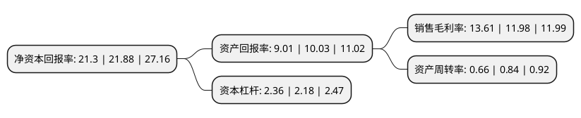

> 本页面由自动化程序生成于 2022年5月20日 01:23
> 内容可能存在错误，如有bug请提交issue至：https://github.com/Eroleice/doc-pi/issues
{.is-warning}

## 股东及高管情况

上市公司第一大股东为钟儒波，持股37,050,000股，占比30.88%，为上市公司实际控制人。

截至2022年04月26日，上市公司的前十大股东中，共有9名自然人股东，1名机构股东，其中5%以上大股东共有3名。上市公司前十大股东明细如下：

> 截至2022年04月26日，上市公司前十大股东信息如下：

| 股东名称 | 持股数量（股） | 持股比例 |
| --- | --- | --- |
| 钟儒波 | 37,050,000 | 30.88% |
| 游建军 | 28,350,000 | 23.63% |
| 麻军 | 6,450,000 | 5.38% |
| 长沙蓝方企业管理合伙企业(有限合伙) | 4,200,000 | 3.5% |
| 邓朝晖 | 4,050,000 | 3.38% |
| 熊燕 | 3,750,000 | 3.13% |
| 幸三生 | 2,250,000 | 1.88% |
| 喻宇汉 | 1,650,000 | 1.38% |
| 吴学愚 | 750,000 | 0.63% |
| 陈铁儒 | 750,000 | 0.63% |

## 利润表分析

上市公司2021年总收入为5.21亿元，净利润为0.71亿元，实现盈利。

## 杜邦分析

> 数据列示周期：2021年 | 2020年 | 2019年
{.is-info}

上市公司的净资产收益率在近一年有所下降，下降幅度为-2.65%，其变化情况分解如下：
- 上市公司的销售毛利率在近一年上升了13.61%，可能是生产效率的提升、商品原材料价格下跌或商品价格的上涨所致。
- 上市公司的资产周转率在近一年下降了-21.43%，可能是源自于更慢的销售回款或库存管理效果下降。
- 上市公司的财务杠杆比率在近一年上升了8.26%，可能是增加负债扩大生产规模。

