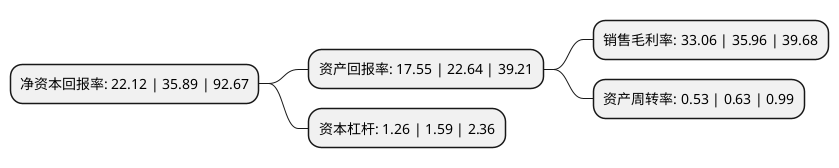

> 本页面由自动化程序生成于 2022年5月20日 01:23
> 内容可能存在错误，如有bug请提交issue至：https://github.com/Eroleice/doc-pi/issues
{.is-warning}

## 股东及高管情况

上市公司第一大股东为刘淑杰，持股19,577,796股，占比18.13%，**疑似为**上市公司实际控制人。

截至2022年04月22日，上市公司的前十大股东中，共有3名自然人股东，5名机构股东，2个产品账户，其中5%以上大股东共有6名。上市公司前十大股东明细如下：

> 未能通过持股比例判定出上市公司实际控制人（持股30%以上）
> 可能存在通过间接持股、联合持股、协议控制等方式拥有实际控制权的主体，具体请参考上市公司定期公告！
{.is-warning}

> 截至2022年04月22日，上市公司前十大股东信息如下：

| 股东名称 | 持股数量（股） | 持股比例 |
| --- | --- | --- |
| 刘淑杰 | 19,577,796 | 18.13% |
| 陈福明 | 16,772,903 | 15.53% |
| 深圳市根深投资发展合伙企业(有限合伙) | 10,402,592 | 9.63% |
| 深圳市行之投资发展合伙企业(有限合伙) | 7,529,924 | 6.97% |
| 深圳市力合创业投资有限公司 | 6,776,930 | 6.27% |
| 深圳清研创业投资有限公司 | 6,099,238 | 5.65% |
| 刘旭 | 3,516,473 | 3.26% |
| 深圳市迦之南投资发展有限公司 | 3,117,388 | 2.89% |
| 深圳市人才创新创业一号股权投资基金(有限合伙) | 3,084,305 | 2.86% |
| 中信建投清研环境2号战略配售集合资产管理计划 | 1,259,717 | 1.17% |

## 利润表分析

上市公司2021年总收入为2.14亿元，净利润为0.7亿元，实现盈利。

## 杜邦分析

> 数据列示周期：2021年 | 2020年 | 2019年
{.is-info}

上市公司的净资产收益率在近一年有所下降，下降幅度为-38.37%，其变化情况分解如下：
- 上市公司的销售毛利率在近一年下降了-8.06%，可能是生产效率的下降、商品原材料价格上涨或商品价格的下跌所致。
- 上市公司的资产周转率在近一年下降了-15.87%，可能是源自于更慢的销售回款或库存管理效果下降。
- 上市公司的财务杠杆比率在近一年下降了-20.75%，可能是减少负债降低财务费用。

