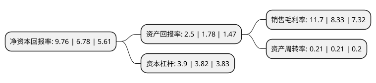

> 本页面由自动化程序生成于 2022年5月20日 01:23
> 内容可能存在错误，如有bug请提交issue至：https://github.com/Eroleice/doc-pi/issues
{.is-warning}

# 上市公司基本情况

## 基本资料

北京首创生态环保集团股份有限公司（以下简称“首创环保”）成立于1999年08月31日，北京市。于2000年04月27日在上交所主板上市。

首创环保注册资本734,059.068万元，供水，污水处理等城镇水务业务，以及固废处理，海绵城市，黑臭水体治理，村镇水环境治理等综合环境治理业务以下是详细信息：

- 公司名称: 北京首创生态环保集团股份有限公司
- 股票代码: 600008.SH
- 所在地: 北京 - 北京市
- 成立日期: 1999年08月31日
- 注册资本: 734,059.068万元
- 法定代表人: 刘永政
- 主营业务: 供水，污水处理等城镇水务业务，以及固废处理，海绵城市，黑臭水体治理，村镇水环境治理等综合环境治理业务
- 公司官网: www.capitalwater.cn
- 公司介绍: 公司是北京首都创业集团旗下国有控股环保旗舰企业。公司主要从事环境综合服务业务，业务范围包括供水、污水处理等城镇水务业务，以及固废处理、海绵城市、黑臭水体治理、村镇水环境治理等综合环境治理业务，并逐步延伸至绿色资源循环利用业务(包括污泥处理、绿色供热、再生水等)。目前公司拥有的项目类型包括供水、城市污水处理、村镇污水处理、固废处理、海绵城市、黑臭水体治理、再生水、污泥处理等。

## 股东及高管情况

上市公司第一大股东为北京首都创业集团有限公司，持股3,404,158,443股，占比46.37%，为上市公司实际控制人。

截至2022年03月31日，上市公司的前十大股东中，共有2名自然人股东，1名机构股东，6个产品账户，1个海外主体，其中5%以上大股东共有1名。上市公司前十大股东明细如下：

> 截至2022年03月31日，上市公司前十大股东信息如下：

| 股东名称 | 持股数量（股） | 持股比例 |
| --- | --- | --- |
| 北京首都创业集团有限公司 | 3,404,158,443 | 46.37% |
| 香港中央结算有限公司(陆股通) | 146,190,481 | 1.99% |
| 汇祥(天津)资产管理有限公司-汇祥资产鼎盛2号私募投资基金 | 47,708,518 | 0.65% |
| 中国农业银行股份有限公司-富国中证500指数增强型证券投资基金(LOF) | 23,345,855 | 0.32% |
| 林庄喜 | 21,797,900 | 0.3% |
| 中国农业银行股份有限公司-中证500交易型开放式指数证券投资基金 | 21,091,413 | 0.29% |
| 全国社保基金四一二组合 | 19,682,642 | 0.27% |
| 基本养老保险基金九零二组合 | 17,876,600 | 0.24% |
| 中国农业银行股份有限公司-南方中证长江保护主题交易型开放式指数证券投资基金 | 15,822,000 | 0.22% |
| 汪四信 | 15,726,700 | 0.21% |

## 利润表分析

上市公司2021年总收入为222.32亿元，净利润为26.01亿元，实现盈利。

## 杜邦分析

> 数据列示周期：2021年 | 2020年 | 2019年
{.is-info}

上市公司的净资产收益率在近一年有所上升，上升幅度为43.95%，其变化情况分解如下：
- 上市公司的销售毛利率在近一年上升了40.46%，可能是生产效率的提升、商品原材料价格下跌或商品价格的上涨所致。
- 上市公司的资产周转率在近一年下降了0%，可能是源自于更慢的销售回款或库存管理效果下降。
- 上市公司的财务杠杆比率在近一年上升了2.09%，可能是增加负债扩大生产规模。

