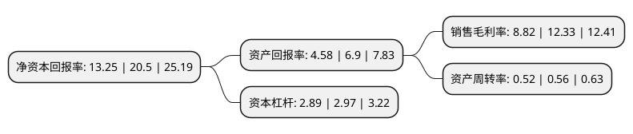

> 本页面由自动化程序生成于 2022年5月20日 01:25
> 内容可能存在错误，如有bug请提交issue至：https://github.com/Eroleice/doc-pi/issues
{.is-warning}

# 上市公司基本情况

## 基本资料

中再资源环境股份有限公司（以下简称“中再资环”）成立于1996年11月06日，铜川市。于1999年12月16日在上交所主板上市。

中再资环注册资本138,865.978万元，主要业务:废弃电器电子产品的回收与拆解处理。以下是详细信息：

- 公司名称: 中再资源环境股份有限公司
- 股票代码: 600217.SH
- 所在地: 陕西 - 铜川市
- 成立日期: 1996年11月06日
- 注册资本: 138,865.978万元
- 法定代表人: 徐如奎
- 主营业务: 废弃电器电子产品的回收与拆解处理
- 公司官网: www.zhongzaizihuan.com
- 公司介绍: 公司是中华全国供销合作总社旗下中国再生资源开发有限公司的控股公司，公司遵循“生态环保”、“服务社会”的企业宗旨，秉承“网络、资源、环保、品牌”的经营理念，致力于成为国际一流的资源和环境服务商。公司主营业务为废弃电器电子产品的回收与拆解处理。公司通过回收废弃电器电子产品进行拆解、分拣和部分深加工，将其中可用二次资源出售获取部分收入；所属子(孙)公司拥有国家废弃电器电子产品处理资格，均入列国家财政部、环境保护部、发展改革委、工业和信息化部共同公布的废弃电器电子产品处理基金补贴企业名单。公司严格遵守国家规定，大力推广行业标准，努力推动诚信体系的建立，不断为社会挖掘出新的价值。

## 股东及高管情况

上市公司第一大股东为中国再生资源开发有限公司，持股358,891,083股，占比25.84%，**疑似为**上市公司实际控制人。

截至2022年03月31日，上市公司的前十大股东中，共有9名机构股东，1名其他股东，其中5%以上大股东共有3名。上市公司前十大股东明细如下：

> 未能通过持股比例判定出上市公司实际控制人（持股30%以上）
> 可能存在通过间接持股、联合持股、协议控制等方式拥有实际控制权的主体，具体请参考上市公司定期公告！
{.is-warning}

> 截至2022年03月31日，上市公司前十大股东信息如下：

| 股东名称 | 持股数量（股） | 持股比例 |
| --- | --- | --- |
| 中国再生资源开发有限公司 | 358,891,083 | 25.84% |
| 中再资源再生开发有限公司 | 104,667,052 | 7.54% |
| 黑龙江省中再生资源开发有限公司 | 99,355,457 | 7.15% |
| 广东华清再生资源有限公司 | 62,549,685 | 4.5% |
| 中再生投资控股有限公司 | 53,394,635 | 3.85% |
| 陕西省耀县水泥厂 | 22,170,710 | 1.6% |
| 唐山市再生资源有限公司 | 21,651,695 | 1.56% |
| 湖北省再生资源集团有限公司 | 12,303,651 | 0.89% |
| 陕西省华原技术服务公司 | 11,088,015 | 0.8% |
| 河北君诚投资有限责任公司 | 8,677,404 | 0.62% |

## 利润表分析

上市公司2021年总收入为34.69亿元，净利润为3.05亿元，实现盈利。

## 杜邦分析

> 数据列示周期：2021年 | 2020年 | 2019年
{.is-info}

上市公司的净资产收益率在近一年有所下降，下降幅度为-35.37%，其变化情况分解如下：
- 上市公司的销售毛利率在近一年下降了-28.47%，可能是生产效率的下降、商品原材料价格上涨或商品价格的下跌所致。
- 上市公司的资产周转率在近一年下降了-7.14%，可能是源自于更慢的销售回款或库存管理效果下降。
- 上市公司的财务杠杆比率在近一年下降了-2.69%，可能是减少负债降低财务费用。

