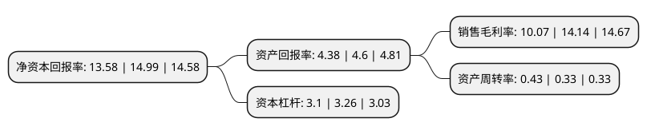

> 本页面由自动化程序生成于 2022年5月20日 01:25
> 内容可能存在错误，如有bug请提交issue至：https://github.com/Eroleice/doc-pi/issues
{.is-warning}

# 上市公司基本情况

## 基本资料

瀚蓝环境股份有限公司（以下简称“瀚蓝环境”）成立于1992年12月17日，佛山市。于2000年12月25日在上交所主板上市。

瀚蓝环境注册资本81,534.715万元，主要业务:自来水生产和供应。以下是详细信息：

- 公司名称: 瀚蓝环境股份有限公司
- 股票代码: 600323.SH
- 所在地: 广东 - 佛山市
- 成立日期: 1992年12月17日
- 注册资本: 81,534.715万元
- 法定代表人: 金铎
- 主营业务: 自来水生产和供应
- 公司官网: www.grandblue.cn
- 公司介绍: 公司是一家专注于环境服务产业的上市公司，致力为各地政府提供系统性环境服务方案，覆盖自来水供应、污水处理、固废处理全产业链。供水业务方面，公司目前拥有桂城水厂和南海第二水厂，控股佛山市南海九江自来水有限公司，供水水质一直达到并超过国家规定的水质标准。污水处理业务方面，公司通过BOT、TOT和委托运营等方式，拥有多个污水处理项目的特许经营权。固废处理业务方面，建设了南海固废处理环保产业园。产业园规划建设了固体废物全产业链处理系统，包括前端的垃圾集中压缩转运系统；中端的生活垃圾焚烧处理系统、污泥干化焚烧处理系统；以及末端的渗滤液处理系统、飞灰处理系统，形成了由源头到终端完整的固体废物处理产业链。南海固废处理环保产业园以系统的整体规划，国际领先的建设标准，优于欧盟标准的排放指标，与一墙之隔的大学城及高档生活社区融为一体，已成为破解垃圾围城困境的南海样本，成为国内同行业标杆和典范。

## 股东及高管情况

上市公司第一大股东为佛山市南海供水集团有限公司，持股139,810,227股，占比17.15%，**疑似为**上市公司实际控制人。

截至2022年05月12日，上市公司的前十大股东中，共有10名机构股东，其中5%以上大股东共有10名。上市公司前十大股东明细如下：

> 未能通过持股比例判定出上市公司实际控制人（持股30%以上）
> 可能存在通过间接持股、联合持股、协议控制等方式拥有实际控制权的主体，具体请参考上市公司定期公告！
{.is-warning}

> 截至2022年05月12日，上市公司前十大股东信息如下：

| 股东名称 | 持股数量（股） | 持股比例 |
| --- | --- | --- |
| 佛山市南海供水集团有限公司 | 139,810,227 | 17.15% |
| 佛山市南海供水集团有限公司 | 139,810,227 | 17.15% |
| 佛山市南海供水集团有限公司 | 139,810,227 | 17.15% |
| 广东南海控股集团有限公司 | 123,111,680 | 15.0993% |
| 广东南海控股投资有限公司 | 123,111,680 | 15.0993% |
| 广东南海控股投资有限公司 | 120,979,113 | 14.8377% |
| 国投电力控股股份有限公司 | 66,014,523 | 8.1% |
| 国投电力控股股份有限公司 | 66,014,523 | 8.1% |
| 国投电力控股股份有限公司 | 66,014,523 | 8.1% |
| 国投电力控股股份有限公司 | 66,014,523 | 8.1% |

## 利润表分析

上市公司2021年总收入为117.76亿元，净利润为11.86亿元，实现盈利。

## 杜邦分析

> 数据列示周期：2021年 | 2020年 | 2019年
{.is-info}

上市公司的净资产收益率在近一年有所下降，下降幅度为-9.41%，其变化情况分解如下：
- 上市公司的销售毛利率在近一年下降了-28.78%，可能是生产效率的下降、商品原材料价格上涨或商品价格的下跌所致。
- 上市公司的资产周转率在近一年上升了30.3%，可能是源自于更快的销售回款或库存管理效果提升。
- 上市公司的财务杠杆比率在近一年下降了-4.91%，可能是减少负债降低财务费用。

