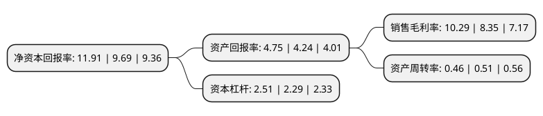

> 本页面由自动化程序生成于 2022年5月20日 01:26
> 内容可能存在错误，如有bug请提交issue至：https://github.com/Eroleice/doc-pi/issues
{.is-warning}

# 上市公司基本情况

## 基本资料

无锡华光环保能源集团股份有限公司（以下简称“华光环能”）成立于2000年12月26日，无锡市。于2003年07月21日在上交所主板上市。

华光环能注册资本72,682.637万元，主营业务与主要产品:节能高效发电设备，环保新能源发电设备，环境工程与服务，电站工程与服务，地方能源供应。以下是详细信息：

- 公司名称: 无锡华光环保能源集团股份有限公司
- 股票代码: 600475.SH
- 所在地: 江苏 - 无锡市
- 成立日期: 2000年12月26日
- 注册资本: 72,682.637万元
- 法定代表人: 蒋志坚
- 主营业务: 主营业务与主要产品:节能高效发电设备，环保新能源发电设备，环境工程与服务，电站工程与服务，地方能源供应
- 公司官网: www.wxboiler.com/www.hghngroup.com
- 公司介绍: 公司为国家520家重点企业之一，是我国电站锅炉、工业锅炉、压力容器、烟气脱硫净化设备、燃气轮机余热锅炉(HRSG)、垃圾焚烧锅炉、特种锅炉和水处理设备专业制造公司，也是全国水处理设备科研中心和最大的制造基地。公司重点发展能源和环保两大产业，主要从事：燃煤、燃气、地热、余热等各类热电企业投资、建设、运营；海内外电站设计、设备成套、工程建设总承包及烟气治理；环保领域专业设计、工程建设及固体废弃物(生活垃圾、污泥)处置等业务，公司已形成集投资、设计咨询、设备制造、工程建设、运营管理的一体化的服务体系，主要业务包括锅炉设备制造、电站工程与服务(含光伏电站)、环境工程与服务、地方能源供应及地热资源开发与运营。

## 股东及高管情况

上市公司第一大股东为无锡市国联发展(集团)有限公司，持股524,424,678股，占比72.15%，为上市公司实际控制人。

截至2022年03月31日，上市公司的前十大股东中，共有5名自然人股东，3名机构股东，2个产品账户，其中5%以上大股东共有1名。上市公司前十大股东明细如下：

> 截至2022年03月31日，上市公司前十大股东信息如下：

| 股东名称 | 持股数量（股） | 持股比例 |
| --- | --- | --- |
| 无锡市国联发展(集团)有限公司 | 524,424,678 | 72.15% |
| 无锡华光锅炉股份有限公司-2016年员工持股计划 | 11,123,735 | 1.53% |
| 无锡国联金融投资集团有限公司 | 9,017,341 | 1.24% |
| 戴毅 | 2,635,030 | 0.36% |
| 中国工商银行股份有限公司-汇添富中证环境治理指数型证券投资基金(LOF) | 1,226,718 | 0.17% |
| 张海泉 | 1,085,001 | 0.15% |
| 钟妙琴 | 922,270 | 0.13% |
| 北京汉元永昌科技发展有限公司 | 910,000 | 0.13% |
| 李思油 | 879,421 | 0.12% |
| 陈浩桥 | 858,613 | 0.12% |

## 利润表分析

上市公司2021年总收入为83.76亿元，净利润为8.61亿元，实现盈利。

## 杜邦分析

> 数据列示周期：2021年 | 2020年 | 2019年
{.is-info}

上市公司的净资产收益率在近一年有所上升，上升幅度为22.91%，其变化情况分解如下：
- 上市公司的销售毛利率在近一年上升了23.23%，可能是生产效率的提升、商品原材料价格下跌或商品价格的上涨所致。
- 上市公司的资产周转率在近一年下降了-9.8%，可能是源自于更慢的销售回款或库存管理效果下降。
- 上市公司的财务杠杆比率在近一年上升了9.61%，可能是增加负债扩大生产规模。

