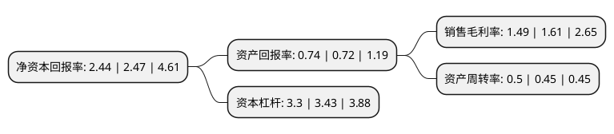

> 本页面由自动化程序生成于 2022年5月20日 01:27
> 内容可能存在错误，如有bug请提交issue至：https://github.com/Eroleice/doc-pi/issues
{.is-warning}

# 上市公司基本情况

## 基本资料

浙江菲达环保科技股份有限公司（以下简称“菲达环保”）成立于2000年04月30日，绍兴市。于2002年07月22日在上交所主板上市。

菲达环保注册资本54,740.467万元，主要产品:电除尘器产品，气力输送产品，安装业务，脱硫产品，电气配套件。以下是详细信息：

- 公司名称: 浙江菲达环保科技股份有限公司
- 股票代码: 600526.SH
- 所在地: 浙江 - 绍兴市
- 成立日期: 2000年04月30日
- 注册资本: 54,740.467万元
- 法定代表人: 吴东明
- 主营业务: 主要产品:电除尘器产品，气力输送产品，安装业务，脱硫产品，电气配套件
- 公司官网: www.feidaep.com
- 公司介绍: 公司是中国燃煤电站烟气净化的先行者，是在联合国开发计划署及各级政府扶持发展起来的全国环保行业的龙头企业，行业内一家国家重大技术装备国产化基地。主要从事燃煤电厂及工业锅炉烟气环保岛大成套，以及固废处置、水污染治理、土壤生态修复等EPC、BOT、PPP建设工程，是集研发、设计、制造、建设、运行服务全产业链的大型环保企业。多年来，公司坚守环保产业，坚持以用户需求为导向，在重大技术装备研制过程中，走引进、消化、吸收、创新、提高的路子，不断提升创新能力，使公司的技术产品均达到国内领先、国际先进水平。公司设有国家级企业技术中心、国家级工业设计中心、国家级院士专家工作站、国家级博士后科研工作站、燃煤污染物减排国家工程实验室除尘分实验室、省级环保装备研究院和下属多个研究所。

## 股东及高管情况

上市公司第一大股东为杭州钢铁集团有限公司，持股292,832,289股，占比41.85%，为上市公司实际控制人。

截至2022年05月17日，上市公司的前十大股东中，共有5名自然人股东，3名机构股东，2个产品账户，其中5%以上大股东共有3名。上市公司前十大股东明细如下：

> 截至2022年05月17日，上市公司前十大股东信息如下：

| 股东名称 | 持股数量（股） | 持股比例 |
| --- | --- | --- |
| 杭州钢铁集团有限公司 | 292,832,289 | 41.85% |
| 杭州钢铁集团有限公司 | 140,515,222 | 25.67% |
| 菲达集团有限公司 | 96,627,476 | 13.81% |
| 徐开东 | 1,824,500 | 0.33% |
| 濮玉祥 | 1,820,000 | 0.33% |
| 王树江 | 1,467,400 | 0.27% |
| 金浩 | 1,228,300 | 0.22% |
| 中国农业银行股份有限公司-南方中证长江保护主题交易型开放式指数证券投资基金 | 1,180,200 | 0.22% |
| 中信证券股份有限公司-易方达中证长江保护主题交易型开放式指数证券投资基金 | 1,163,100 | 0.21% |
| 韩立梅 | 1,104,500 | 0.2% |

## 利润表分析

上市公司2021年总收入为33.84亿元，净利润为0.5亿元，实现盈利。

## 杜邦分析

> 数据列示周期：2021年 | 2020年 | 2019年
{.is-info}

上市公司的净资产收益率在近一年有所下降，下降幅度为-1.21%，其变化情况分解如下：
- 上市公司的销售毛利率在近一年下降了-7.45%，可能是生产效率的下降、商品原材料价格上涨或商品价格的下跌所致。
- 上市公司的资产周转率在近一年上升了11.11%，可能是源自于更快的销售回款或库存管理效果提升。
- 上市公司的财务杠杆比率在近一年下降了-3.79%，可能是减少负债降低财务费用。

